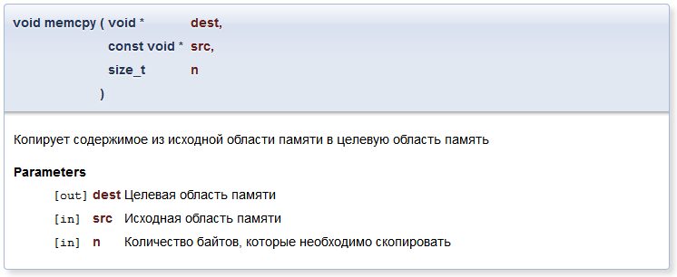

# Документируем код эффективно при помощи Doxygen

[Источник](https://habr.com/ru/articles/252101/)

Данная статья входит в получившийся цикл статей о системе документирования Doxygen:

1. [Документируем код эффективно при помощи Doxygen](https://habrahabr.ru/post/252101/)
2. [Оформление документации в Doxygen](https://habrahabr.ru/post/252443/)
3. [Построение диаграмм и графов в Doxygen](https://habrahabr.ru/post/253223/)

Это первая и основная статья из упомянутого цикла и она представляет собой введение в систему документирования исходных текстов [Doxygen](https://www.doxygen.nl/), которая на сегодняшний день, по имеющему основания заявлению разработчиков, стала фактически стандартом для документирования программного обеспечения, написанного на языке C++, а также получила пусть и менее широкое распространение и среди ряда других языков.

В этой статье мы сначала познакомимся с самой системой и её возможностями, затем разберёмся с её установкой и базовыми принципами работы, и, наконец, завершим знакомство рассмотрением различных примеров документации, примеров того, как следует документировать те или иные части кода. Словом, познакомимся со всем тем, что позволит вам освоиться и начать работать с этой замечательной системой.

## Введение

Вероятнее всего, каждый из нас сталкивался с результатами работы различных генераторов документации. Общий принцип их работы следующий: на вход такого генератора поступает специальным образом комментированный исходный код, а иногда и другие компоненты программы, а на выходе создаётся готовая документация для распространения и использования.

Рассматриваемая система Doxygen как раз и выполняет эту задачу: она позволяет генерировать на основе исходного кода, содержащего комментарии специального вида, красивую и удобную документацию, содержащую в себе ссылки, диаграммы классов, вызовов и т.п. в различных форматах: HTML, LaTeX, CHM, RTF, PostScript, PDF, man-страницы.

Для того, чтобы составить общее впечатление о системе, ниже представлены примеры различных документаций для API, созданных при помощи Doxygen (следует обратить внимание, что в последние примеры внесены заметные изменения в сравнении со стандартной документацией, которую генерирует данная система):

+ [Документация к API игрового движка CrystalSpace](http://www.crystalspace3d.org/docs/online/api-2.0/)
+ [Документация к Visualization Toolkit](http://www.vtk.org/doc/nightly/html/index.html)
+ [Документация к исходникам Abiword](http://www.abisource.com/doxygen/)
+ [Документация к API KDE](http://api.kde.org/)
+ [Документация к API Drupal](https://api.drupal.org/api/drupal)

Внимательный читатель наверняка обратил внимание на то, что в большинстве примеров Doxygen используется для документации программного обеспечения, написанного на языке C++, однако на самом деле данная система поддерживает гораздо большое число других языков: C, Objective-C, C#, PHP, Java, Python, IDL, Fortran, VHDL, Tcl, и частично D.

Впрочем, следуя сложившейся традиции, в примерах я буду использовать C++, однако это не должно смущать вас, если вы предпочитаете другой поддерживаемый язык, поскольку особой разницы на практике вы даже не заметите, и большинство сказанного далее будет справедливо и для вашего языка.

К слову, список проектов, использующих Doxygen имеется на [официальном сайте](https://www.doxygen.nl/projects.html), причём большинство из этих проектов свободные. Поэтому желающие могут скачать исходник того или иного проекта и посмотреть как там разработчики осуществляли документацию.

## Установка и настройка

Скачать последнюю версию Doxygen можно на [официальном сайте](https://www.doxygen.nl/download.html), дистрибутивы которой доступны для большинства популярных операционных систем, кроме того, вы можете воспользоваться вашим пакетным менеджером. Помимо этого для комфортной и полнофункциональной работы рекомендуется установить [Graphviz](http://www.graphviz.org/Download.php).

Далее работа с Doxygen весьма тривиальна: достаточно запустить программу, указав ей путь к файлу с настройками.

```sh
doxygen <config_file>
```

Но в этом файле и вся тонкость. Дело в том, что каждому проекту соответствует свой файл настроек, в котором может быть прописан путь до исходников проекта, путь, по которому должна быть создана документация, а также большое число других разнообразных опций, которые подробно описаны в [документации](https://www.doxygen.nl//manual/config.html), и которые позволяют максимально настроить документацию проекта под свои нужды.

В принципе, для редактирования данного файла и, вообще, работой с Doxygen, можно воспользоваться программой Doxywizard, которая чаще всего идёт вместе с Doxygen и которая позволяет чуть удобнее работать с файлом настроек (слева – Doxywizard; справа – файл открытый в текстовом редакторе):


Итак, приступим к созданию файла с настройками. Вообще, если вы используете Doxywizard, то он будет создан автоматически, в противном случае для создания этого файла необходимо запустить программу Doxygen с ключом -g (от generate):

```sh
doxygen -g <config_name>
```

Рассмотрим основные опции, которые могут вам пригодится, чтобы создать первую вашу документацию:

Тэг | Назначение | По умолчанию
-- | -- | --
DOXYFILE_ENCODING | Кодировка, которая используется для всех символов в данном файле настроек | UTF-8
OUTPUT_LANGUAGE | Устанавливает язык, на котором будет сгенерирована документация | English
PROJECT_NAME | Название проекта, которое может представлять собой единое слово или последовательность слов (если вы редактируете вне Doxywizard, последовательность слов необходимо поместить в двойные кавычки) | My Project
PROJECT_NUMBER | Данный тэг может быть использован для указания номера проекта или его версии | —
PROJECT_BRIEF | Краткое однострочное описание проекта, которое размещается сверху каждой страницы и даёт общее представление о назначении проекта | —
OUTPUT_DIRECTORY | Абсолютный или относительный путь, по которому будет сгенерирована документация | Текущая директория
INPUT | Список файлов и/или директорий, разделенных пробелом, которые содержат в себе исходные коды проекта | Текущая директория
RECURSIVE | Используется в том случае, если необходимо сканировать исходные коды в подпапках указанных директорий | NO

После того, как мы внесли необходимые изменения в файл с настройками (например, изменили язык, названия проекта и т.п.) необходимо сгенерировать документацию.

Для её генерации можно воспользоваться Doxywizard (для этого необходимо указать рабочую директорию, из которой будут браться исходные коды, перейти на вкладку «Run» и нажать «Run doxygen») или запустив программу Doxygen, указав ей в качестве параметра путь к файлу с настройками:

```sh
doxygen <config_file>
```

## Основы документирования на Doxygen

Теперь, когда мы разобрались с тем, как настраивать Doxygen и работать с ним, впору разобраться с тем, как необходимо документировать код, основными принципами и подходами.

Документация кода в Doxygen осуществляется при помощи документирующего блока. При этом существует два подхода к его размещению:

1. Он может быть размещён перед или после объявления или определения класса, члена класса, функции, пространства имён и т.д.;
2. Либо его можно располагать в произвольном месте (и даже другом файле), но для этого потребуется явно указать в нём, к какому элементу кода он относится. Мы не будет рассматривать этот подход, поскольку даже разработчики рекомендуют его избегать, но если интересно, то подробнее о нём можно прочитать в [документации](https://www.doxygen.nl/manual/docblocks.html).

Структурно, любой документирующий блок является комментарием, просто оформленным специальным образом, поэтому естественно, что его вид зависит от используемого языка (подробнее об этом можно прочитать в [соответствующем разделе документации](https://www.doxygen.nl/manual/docblocks.html#specialblock)). Поэтому далее мы остановимся на рассмотрении синтаксиса для C-подобных языков (C/C++/C#/Objective-C/PHP/Java).

Сразу отметим, что, вообще, всего существует два основных типа документирующих блоков: многострочный блок и однострочный блок.

Разница между ними чуть более сильная, чем между однострочным и многострочным комментарием. Дело в том, что текст, написанный в однострочном блоке относится к краткому описанию документируемого элемента (сродни заголовку), а текст, написанный в многострочном блоке относится к подробному описанию. Про эту разницу не следует забывать.

## Многострочный блок

Мы сказали, что любой блок – это комментарий, оформленный специальным образом. Поэтому необходимо определить каким таким «специальным образом». Вообще, существует целый ряд способов для описания многострочного блока, и выбор конкретного способа зависит от ваших предпочтений:

JavaDoc стиль (напоминает обычный C комментарий, но начинающийся с двух звездочек):

```java
/**
 * ... первая строчка ...
 * ... вторая строчка ...
 */
```

При этом звездочки не обязательно ставить на каждой строке. Такая запись будет эквивалентной:

```java
/**
 ... первая строчка ...
 ... вторая строчка ...
 */
```

Qt стиль, в котором в начале вместо второй звёздочки ставится восклицательный знак:

```cpp
/*!
 * ... первая строчка ...
 * ... вторая строчка ...
 */
```

Сказанное о необязательности промежуточных звездочек также остаётся справедливым. Помимо названных двух стилей есть ещё ряд, но на них пока мы не будем останавливаться.

При этом ещё раз обратите внимание на то, что текст написанный в таком комментарии относится к подробному описанию.

Для указания краткого описания может быть использована команда `\brief`. Указанный после команды текст, вплоть до конца параграфа будет относится к краткому описания, и для отделения подробного описания и краткого описания используется пустая строка.

```cpp
/*!
     \brief Краткое описание и
                 его продолжение.

      Подробное описание                  
 */
```

## Однострочный блок

Для описания однострочного блока опять же существует целый ряд способов оформления, рассмотрим два из них:

+ Можно использовать специальный комментарий в C++ стиле:

```cpp
/// Краткое описание
```

+ Можно использовать аналогичный предыдущему комментарий, только вместо дополнительного слеша в нем ставится восклицательный знак:

```cpp
//! Краткое описание
```

При этом хотелось бы обратить внимание на два момента:

+ Для указания подробного описания в однострочном документирующем блоке может быть использована команда `\details`:

```cpp
/// \details Подробное описание
```

+ Документирующие блоки, следующие друг за другом, объединяются в один (причем вне зависимости от используемого стиля и того, являются они многострочными или однострочными).

Например следующие два способа документирования дадут один и тот же результат:

```cpp
/// \brief Краткое описание
/// \details Подробное описание
```

```cpp
///Краткое описание
/*!
    Подробное описание
*/
```

Да, Doxygen крайне гибок в плане способов документирования, однако не стоит этим злоупотреблять, и в рамках одного проекта всегда придерживайтесь заранее оговоренного единообразного стиля

## Размещение документирующего блока после элемента

Во всех предыдущих примерах подразумевалось, что документирующий блок предварял документируемый элемент, но иногда бывают ситуации, когда удобнее разместить его после документируемого элемента. Для этого необходимо в блок добавить маркер "`<`", как в примере ниже:

```cpp
int variable; ///< Краткое описание
```

## Пример документации

Теперь рассмотрим то, как это будет выглядеть на практике. Ниже представлен документированный код некоторого класса в соответствии с теми правилами, которые мы рассматривали ранее.

```cpp
/*!
  \brief Родительский класс, не несущий никакой смысловой нагрузки

  Данный класс имеет только одну простую цель:
  проиллюстрировать то, как Doxygen 
  документирует наследование 
*/
class Parent {
  public:
    Parent();
    ~Parent();
};
```

В итоге Doxygen сформирует на основе данных комментариев следующую красиво оформленную страничку (здесь приведена вырезка из неё):


Теперь, когда мы научились основам, пришла пора познакомиться с тем, как можно детализировать документацию. Инструментом для этого являются команды.

## Команды

С несколькими из команд в Doxygen мы успели познакомиться (речь идёт о `\brief` и `\details`), однако на самом деле их значительно больше. Полный их список приведён [в официальной документации](https://www.doxygen.nl/manual/commands.html).

Вообще, любая команда в Doxygen представляет собой слово на английском языке предваренное символом "`\`" или "`@`" (обе записи тождественны) и таких команд очень много, порядка двухсот. Приведём для примера несколько таких команд:

Команда | Значение
-- | --
`\authors` | Указывает автора или авторов
`\version` | Используется для указания версии
`\date` | Предназначена для указания даты разработки
`\bug` | Перечисление известных ошибок
`\warning` | Предупреждение для использования
`\copyright` | Используемая лицензия
`\example` | Команда, добавляемая в комментарий для указания ссылки на исходник с примером (добавляется после команды)
`\todo` | Команда, используется для описания тех изменений, которые необходимо будет сделать (TODO).

Пример использования некоторых команд и результат приведены ниже:

```cpp
/*!
  \brief Дочерний класс
  \author Norserium
  \version 1.0
  \date Март 2015 года
  \warning Данный класс создан только в учебных целях

  Обычный дочерний класс, который отнаследован от ранее созданного класса Parent
*/
class Son : public Parent {
public:
  Son();
  ~Son();
};
```


Далее будут использоваться следующие обозначения при описании аргументов команды, когда будет приводиться её общий формат:

Обозначение | Значение
-- | --
<...> | Угловые скобки показывают, что аргумент представляет собой одно слово
(...) | Круглые скобки показывают, что аргументом является весь текст вплоть до конца строки, на которой размещена команда
{...} | Фигурные скобки показывают, что аргументом является весь текст вплоть до до следующего параграфа. Параграфы разделяются пустой строкой или [командой-разделителем](https://www.doxygen.nl/manual/commands.html#cmdattention)

Кроме того, обратите внимание на то, что вы можете создавать и собственные команды. Подробно об этом можно прочитать [в соответствующем разделе документации](https://www.doxygen.nl/manual/custcmd.html).

## Документирование основных элементов исходного кода

Теперь мы можем рассмотреть специфичные особенности документирования различных элементов исходного кода, начиная от файлов в целом и заканчивая классами, структурами, функциями и методами.

## Документирование файла

Хорошей практикой является добавление в начало файла документирующего блока, описывающегося его назначение. Для того, чтобы указать, что данный блок относится к файлу необходимо воспользоваться командой `\file` (причём в качестве параметра можно указать путь к файлу, к которому относится данный блок, но по умолчанию выбирается тот файл, в который блок добавляется, что, как правило, соответствует нашим нуждам).

```cpp
/*!
\file
\brief Заголовочный файл с описанием классов

Данный файл содержит в себе определения основных 
классов, используемых в демонстрационной программе
*/
#ifndef CLASSES_H
#define CLASSES_H

...

#endif // CLASSES_H
```

## Документирование функций и методов

При документировании функций и методов чаще всего необходимо указать входные параметры, возвращаемое функцией значение, а также возможные исключения. Рассмотрим последовательно соответствующие команды.

### Параметры

Для указания параметров необходимо использовать команду `\param` для каждого из параметров функции, при этом синтаксис команды имеет следующий вид:

```cpp
/*
\param [<направление>] <имя_параметра> {описание_параметра}
*/
```

Рассмотрим значение компонентов команды:

+ **Имя параметра** – это имя, под которым данный параметр известен в документируемом коде;
+ **Описание параметра** представляет собой простое текстовое описание используемого параметра..
+ **Направление** – это опциональный атрибут, который показывает назначение параметра и может иметь три значения "`[in]`", "`[out]`", "`[in,out]`";

Сразу же перейдём к примеру:

```cpp
/*!
Копирует содержимое из исходной области памяти в целевую область память
\param[out] dest Целевая область памяти
\param[in] src Исходная область памяти
\param[in] n Количество байтов, которые необходимо скопировать
*/
void memcpy(void *dest, const void *src, size_t n);
```

В результате мы получим такую вот аккуратную документацию функции:



### Возвращаемое значение

Для описание возвращаемого значения используется команда `\return` (или её аналог `\returns`). Её синтаксис имеет следующий вид:

```cpp
/*
\return {описание_возвращаемого_значения}
*/
```

Рассмотрим пример с описанием возвращаемого значения (при этом обратите внимание на то, что параметры описываются при помощи одной команды и в результате они в описании размещаются вместе):

```cpp
/*!
Находит сумму двух чисел
\param a,b Складываемые числа
\return Сумму двух чисел, переданных в качестве аргументов
*/
double sum(const double a, const double b);
```

Получаем следующий результат:


### Исключения

Для указания исключения используется команда `\throw` (или её синонимы: `\throws`, `\exception`), которая имеет следующий формат:

```cpp
/*
\throw <объект-исключение> {описание}
*/

Простейший пример приведён ниже:

```cpp
/*!
\throw std::bad_alloc В случае возникновения ошибки при выделении памяти
*/
```

## Документирование классов

Классы также могут быть задокументированы просто предварением их документирующим блоком. При этом огромное количество информации Doxygen получает автоматически, учитывая синтаксис языка, поэтому задача документирования классов значительно упрощается. Так при документировании Doxygen автоматические определяет методы и члены класса, уровни доступа к функциям, дружественные функции и т.п.

Если ваш язык не поддерживает явным образом определенные концепции, такие как например уровни доступа или создание методов, но их наличие подразумевается и его хотелось бы как-то выделить в документации, то существует ряд команд (например,

+ `\public`,
+ `\private`,
+ `\protected`,
+ `\memberof`),

которые позволяют указать явно о них Doxygen.

## Документирование перечислений

Документирование перечислений не сильно отличается от документирования других элементов. Рассмотрим пример, в котором иллюстрируется то, как можно удобно документировать их:

```cpp
/// Набор возможных состояний объекта
enum States {
         Disabled, ///< Указывает, что элемент недоступен для использования
         Undefined, ///< Указывает, что состояние элемента неопределенно
         Enabled, ///< Указывает, что элемент доступен для использования
}
```

То есть описание состояний указывается, собственно, после них самих при помощи краткого или подробного описания (в данном случае роли это не играет).

Результат будет иметь следующий вид:

<!-- TODO -->

## Модули

Отдельное внимание следует обратить на создание модулей в документации, поскольку это один из наиболее удобных способов навигации по ней и действенный инструмент её структуризации. Пример хорошей группировки по модулям можете посмотреть здесь.

Далее мы кратко рассмотрим основные моменты и приведём пример, однако если вы хотите разобраться во всех тонкостях, то тогда придётся обратиться [к соответствующему разделу документации](https://www.doxygen.nl/manual/grouping.html).

### Создание модуля

Для объявления модуля рекомендуется использовать команду `\defgroup`, которую необходимо заключить в документирующий блок:

```cpp
/*
\defgroup <идентификатор> (заголовок модуля)
*/
```

**Идентификатор модуля** представляет собой уникальное слово, написанное на латинице, который впоследствии будет использован для обращения к данному модулю;<br> **заголовок модуля** – это произвольное слово или предложение (желательно краткое) которое будет отображаться в документации.

Обратите внимание на то, что при описании модуля можно дополнить его кратким и подробным описанием, что позволяет раскрыть назначение того или иного модуля, например:

```cpp
/*! 
    \defgroup maze_generation Генерация лабиринтов
    \brief Данный модуль, предназначен для генерации лабиринтов.
    
     На данный момент он поддерживает следующие алгоритмы генерации лабиринтов: Eller's algorithm, randomized Kruskal's algorithm, cellular automaton algorithm, randomized Prim's algorithm.
*/
```

### Размещение документируемого элемента в модуле

Для того, чтобы отнести тот или иной документируемый элемент в модуль, существуют два подхода.

Первый подход – это использование команды `\ingroup`:

```cpp
/*
\ingroup <идентификатор> (заголовок модуля)
*/
```

Его недостатком является то, что данную команду надо добавлять в документирующие блоки каждого элемента исходного кода, поскольку их в рамках одного модуля может быть достаточно много.

Поэтому возникает необходимость в другом подходе, и второй подход состоит в использовании команд начала и конца группы: `@{` и `@}`.

Следует отметить, что они используются наряду с командами `\defgroup`, `\addtogroup` и `\weakgroup`.

Пример использования приведён ниже:

```cpp
/*! \defgroup <идентификатор> (заголовок модуля)
    @{
*/
  документируемые_элементы
/*! @} */

Смысл примера должен быть понятен: мы объявляем модуль, а затем добавляем к ней определенные документируемые элементы, которые обрамляются при помощи символов начала и конца модуля.

Однако, модуль должен определяться один раз, причём это объявление будет только в одном файле, а часто бывает так, что элементы одного модуля разнесены по разным файлам и потому возникает необходимость использования команды `\addtogroup`, которая не переопределяет группу, а добавляет к ней тот или иной элемент:

```cpp
/*! \addtogroup <идентификатор> [(заголовок модуля)]
    @{
*/
   документируемые_элементы
/*! @} */
```

Название модуля указывать необязательно. Дело в том, что данная команда может быть использована как аналог команды `\defgroup`, и если соответствующий модуль не был определена, то она будет создана с соответствующим названием и идентификатором.

Наконец, команда `\weakgroup` аналогична команде `\addtogroup`, отличие заключается в том, что она просто имеет меньший приоритет по сравнению с ней в случае если возникают конфликты, связанные с назначение одного и того же элемента к разным модулям.

### Создание подмодуля

Для создания подмодуля достаточно при его определении отнести его к тому или иному подмодулю, подобно любому другому документируемому элементу.

Пример приведён ниже:

```cpp
/*! \defgroup main_module Главный модуль */

/*! \defgroup second_module Вложенный модуль 
     \ingroup main_module
*/
```

### Пример создания нескольких модулей

Далее представлен подробный пример создания модуля:

**Файл generate_maze.h:**

```cpp
/*! 
    \defgroup generate_mazes Генерация лабиринтов
    \ingroup maze
    \brief Данный модуль, предназначен для генерации лабиринтов.
    
     На данный момент он поддерживает следующие алгоритмы генерации лабиринтов: Eller's algorithm, randomized Kruskal's algorithm, cellular automaton algorithm, randomized Prim's algorithm.
*/
///@{
    /*! \brief Функция генерации лабиринта на основе алгоритма Эллера
         \param width, height количество клеток в высоту и ширину в лабиринте
          \returns Лабиринт, представляющий собой экземпляр класса Maze с заданной шириной и высотой
    */
    Maze generateEller(int width, int height);

    /*! \brief Функция генерации лабиринта на основе вероятностного алгоритма Крускала
         \param width, height количество клеток в высоту и ширину в лабиринте
          \returns Лабиринт, представляющий собой экземпляр класса Maze с заданной шириной и высотой
    */
    Maze generateKruskal(int width, int height);

    /*! \brief Функция генерации лабиринта на основе вероятностного алгоритма Прима
         \param width, height количество клеток в высоту и ширину в лабиринте
          \returns Лабиринт, представляющий собой экземпляр класса Maze с заданной шириной и высотой
    */
    Maze generatePrim(int width, int height);

    /*! \brief Функция генерации лабиринта на основе клеточных автоматов
         \param width, height количество клеток в высоту и ширину в лабиринте
         \returns Лабиринт, представляющий собой экземпляр класса Maze с заданной шириной и высотой
    */
    Maze generateCellular(int width, int height);
///@}
```

**Файл maze.h:**

```cpp
/*! 
    \defgroup maze Лабиринт
    \brief Основной модуль, содержащей в себе описания лабиринтов и содержащий другие модули для работы с ними
*/
///@{
   class Maze {
       /* описание класса */
   };
///@}
```

## Оформления текста документации

Теперь, после того, как мы в общих чертах разобрались с тем как документировать основные элементы кода, рассмотрим то, как можно сделать документацию более наглядной, выразительной и полной.

### Код внутри документации

Зачастую внутри пояснения к документации необходимо для примера добавить какой-то код, например для иллюстрации работы функции.

### Команды `\code` и `\endcode`

Один из наиболее простых и универсальных способов сделать это – команды `\code` и `\endcode`, которые применяются следующим образом:

```cpp
/*
\code [ {<расширение>}]
     ...
\endcode
*/
```

Используемый язык определяется автоматически в зависимости от расширения файла, в котором располагается документирующий блок, однако в случае, если такое поведение не соответствует ожиданиям расширение можно указать явно.

Рассмотрим пример использования:

```cpp
/*!
     \brief Алгоритм Евклида
     \param a,b Два числа, чей наибольший делитель мы хотим найти

     Данная функция реализует алгоритм Евклида, при помощи которого
     находится наибольшее общее кратное у двух чисел.

     Код функции выглядит следующим образом:
     \code
     int gcd(int a, int b) {
            int r;
            while (b) {
                  r = a % b;
                  a = b;
                  b = r;
            }
            return r;
     }
     \endcode
*/
int gcd(int a, int b);
```

Результат будет иметь следующий вид:

<!-- TODO -->

### Примеры кода

Иногда удобнее приводить примеры использования кода хранить в отдельных файлах. Для этого эти файлы необходимо разместить в отдельной директории и прописать к ней путь в настройках:

```sh
EXAMPLE_PATH = путь_к_директории
```

Рассмотрим, некоторые способы того, как примеры кода могут быть использованы в документации.

#### Команда `\example`

Данная команда показывает, что документирующий блок относится к примеру кода.

```cpp
/*
\example <имя_файла>
*/
```

Текст исходного кода будет добавлен в раздел «примеры», а исходный код примера будет проверен на наличие документированных элементов, и если таковые будут найдены, то к ним в описание будет добавлена ссылка на пример.


**Файл gcd.h:**

```cpp
/*!
     \brief Алгоритм Евклида
     \param a,b Два числа, чей наибольший делитель мы хотим найти

     Данная функция реализует алгоритм Евклида, при помощи которого
     находится наибольшее общее кратное у двух чисел.
*/
int gcd(int a, int b);

/*! \example main.cpp
    Пример того, как использовать функцию
*/
```

**Файл examples/main.cpp:**

В данном примере, значение `EXAMPLE_PATH = examples`

```cpp
void main()
{
  int result = gcd(52,106);
}
```

### Команда `\include`

Для того, чтобы добавить в описание к документируемому элементу код примера используется команда `\include`, общий формат которой имеет следующий вид:

```cpp
/*
\include <имя_файла>
*/
```

Она полностью копирует содержимое файла и вставляет его в документацию как блок кода (аналогично оформлению кода в блок начинающийся командой `\code` и заканчивающийся командой `\endcode`).

### Команда `\snippet`

Команда `\snippet` аналогична предыдущей команде, однако она позволяет вставлять не весь файл, а его определенный фрагмент. Неудивительно, что её формат несколько другой:

```cpp
/*
\snippet <имя_файла> ( имя_фрагмента )
*/
```

Для выделения определенного фрагмента кода необходимо в начале и в конце его разместить документирующий блок с указанием имени фрагмента:

```cpp
/// [ имя_фрагмента ]
    ...
/// [ имя_фрагмента ]
```

### Автоматическое внедрение кода документируемого объекта

Наконец, Doxygen поддерживает возможность автоматической вставки тела функций, методов, классов, структур и т.п., в их подробное описание. Для этого используется следующая опция:

```sh
INLINE_SOURCES = YES
```

## Формулы с использованием LaTeX

Doxygen позволяет использовать TeX формулы прямо в документации, это очень удобно и результат получается весьма достойным. Однако стоит отметить, что при этом имеются ограничения: на данный момент формулы могут быть вставлены только в HTML и LaTeX документацию, но этого, как правило, вполне достаточно.

На данный момент существует два подхода к отображению формул:

+ Отображение формул при помощи [MathJax](http://www.mathjax.org/), для этого необходимо в файле настроек установить соответствующую опцию:

```sh
USE_MATHJAX  = YES
```

+ Генерация соответствующих изображений и вставка их в документацию. Всё это будет сделано автоматически, но вам потребуется следующие инструменты: `latex`, `dvips`, `gs`. По умолчанию формулы отображаются именно этим способом.

## Способы добавление формул в документацию

Существуют три способа добавления формул в документацию. Последовательно рассмотрим каждый из них [с примерами из документации](https://www.doxygen.nl/manual/formulas.html):

+ Использование строчных формул, которые обрамляются в начале и в конце при помощи команды "`\f$`". Пример представлен ниже:

```cpp
/*
  расстояние между \f$(x_1,y_1)\f$ и \f$(x_2,y_2)\f$ равно \f$\sqrt{(x_2-x_1)^2+(y_2-y_1)^2}\f$.
*/
```

Результатом будет строка следующего вида: расстояние между $(x_1,y_1)$ и $(x_2,y_2)$ равно $\sqrt{(x_2-x_1)^2+(y_2-y_1)^2}$

+ Использование выносных формул, которые начинаются на отдельной строке и центрируются. В отличие от предыдущих формул они обрамляются в начале командой "`\f[`", а в конце командой "`\f]`". Пример представлен ниже:

```cpp
/*
  \f[
    |I_2|=\left| \int_{0}^T \psi(t) 
             \left\{ 
                u(a,t)-
                \int_{\gamma(t)}^a 
                \frac{d\theta}{k(\theta,t)}
                \int_{a}^\theta c(\xi)u_t(\xi,t)\,d\xi
             \right\} dt
          \right|
  \f]
*/
```

Результатом будет строка следующего вида:

$|I_2|=\left| \int_{0}^T \psi(t)
         \left\{
            u(a,t)-
            \int_{\gamma(t)}^a
            \frac{d\theta}{k(\theta,t)}
            \int_{a}^\theta c(\xi)u_t(\xi,t)\,d\xi
         \right\} dt
      \right|$

+ Существует команда "`\f{environment}`", где **environment** – это название определенного окружения в LaTeX. Она позволяет использовать указанное окружение будто бы оно было указано в обычно LaTeX документе. Пример приведён ниже:

```cpp
/*
   \f{eqnarray*}{
        g &=& \frac{Gm_2}{r^2} \\ 
          &=& \frac{(6.673 \times 10^{-11}\,\mbox{m}^3\,\mbox{kg}^{-1}\,
              \mbox{s}^{-2})(5.9736 \times 10^{24}\,\mbox{kg})}{(6371.01\,\mbox{km})^2} \\ 
          &=& 9.82066032\,\mbox{m/s}^2
   \f}
*/
```

В итоге мы получим следующий результат (заметим, что окружение `eqnarray*` – это ненумерованное окружение для размещения нескольких формул):

<!-- TODO -->

## Пример внедрения формул в документацию

Рассмотрим конкретный пример документации с использованием формул LaTeX:

```cpp
/*!
     \brief Вычисление факториала числа \f$ n \f$
     \param n - число, чей факториал необходимо вычислить
     \return \f$ n! \f$

     Данная функция вычисляет значение факториала числа \f$ n \f$, определяемое по формуле:
     \f[
          n! = \prod_{i = 1}^n i
     \f]
*/
int factorial(int n);
```

Результат представлен ниже:

<!-- TODO -->

## Кратко о Markdown

Markdown – это облегчённый язык разметки (почитать о нём можно, например, [здесь](http://daringfireball.net/projects/markdown/syntax), а также [в специальном разделе в документации](https://www.doxygen.nl/manual/markdown.html)). Начиная с версии 1.8.0. Doxygen обеспечивает его пока ограниченную поддержку и он служит одним из способов оформить документацию (альтернативой могут быть, например, команды для оформления документации или HTML вставки, которые, впрочем, не универсальны).

Не хотелось бы сейчас расписывать подробности и принципы данного языка, поэтому ограничимся рассмотрением того, как данный язык позволяет «украсить» нашу документацию:

```cpp
/*!
Функция генерирующая псведослучайное число
------------------------------------------
Изначально планировалось реализовать в данной функции один из следующих методов генерации псевдослучайных чисел:
- Линейный конгруэнтный метод;
- Метод Фибоначчи;
- Линейный регистр сдвига с обратной связью;
- Вихрь Мерсенна.

Но разработчики вспомнили про одну замечательную цитату:
> Есть два способа создания дизайна программы. Один из них, это сделать его настолько простым, что в нем, очевидно, не будет недостатков. Другой способ — сделать его настолько запутанным, что в нем не будет очевидных недостатков.
> — C.A. R. Hoare

И выбрали первый путь.

*/
int getRandomNumber();
```

Результат представлен ниже:

<!-- TODO -->

## Подводя итоги

На этой ироничной ноте я решил остановиться. Я прекрасно понимаю, что ещё многое не было описано и затронуто, но, надеюсь, что главные свои цели статья выполнила: познакомить с понятием генератора документации, познакомиться с системой Doxygen, объяснить основные принципы и подходы к документации, а также мельком затронуть вопросы, связанные с её оформление и детализацией, подготовив задел для вашей дальнейшей работы.

Спасибо за внимание!

## Литература и ссылки для дальнейшего изучения

1. Основным источником, который был использован при написании статьи была [официальная документация](https://www.doxygen.nl/manual/index.html);
2. На большое количество вопросов, связанных с Doxygen, ответы были получены [здесь](http://stackoverflow.com/) (там есть и [создатель Doxygen](http://stackoverflow.com/users/784672/doxygen)).
3. Продолжение цикла: [оформление внешнего вида документации](http://habrahabr.ru/post/252443), [построение графов и диаграмм в Doxygen](http://habrahabr.ru/post/253223).
