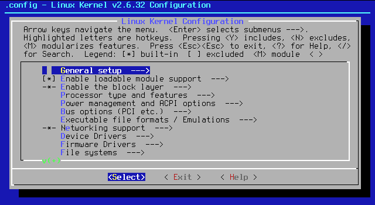
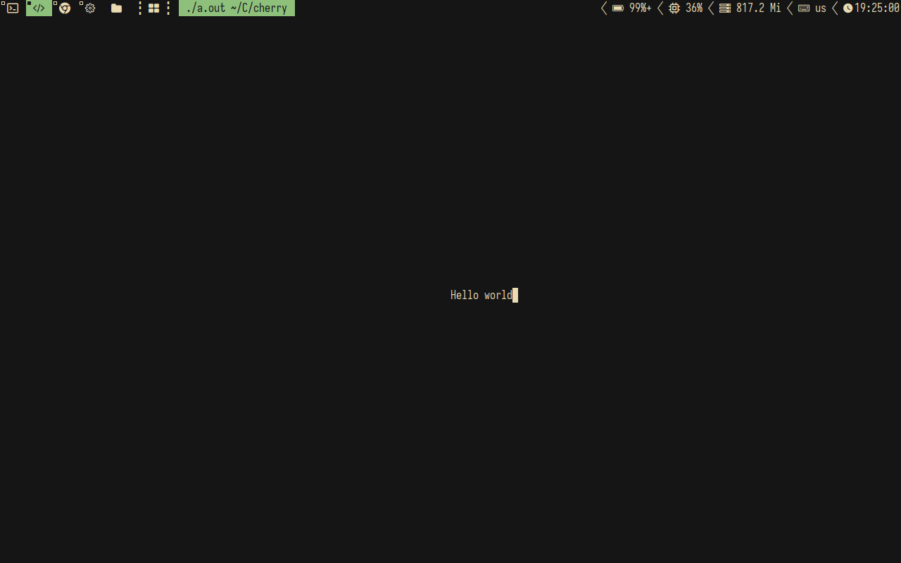
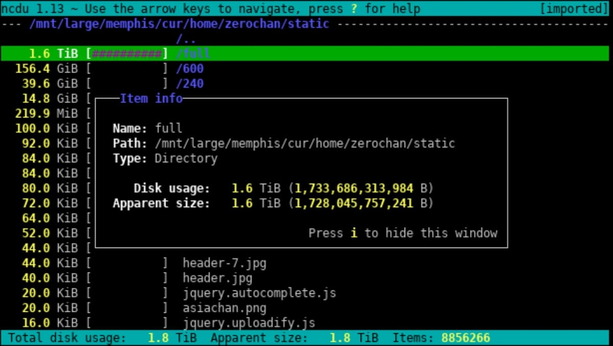

# Новые проклятия: руководство по ncurses

[Источник](https://habr.com/ru/articles/778040/)

Привет, хабр! Я часто пользуюсь библиотеку ncurses и C на Linux. Она простая, быстрая и функциональная.

На ней можно написать рогалик, консольный редактор текста, файловый менеджер и много чего еще.

**Ncurses** («new curses») — библиотека, написанная на языках Си и Ада, предназначенная для управления вводом-выводом на терминал, в числе прочего, библиотека позволяет задавать экранные координаты (в знакоместах) и цвет выводимых символов. Предоставляет программисту уровень абстракции, позволяющий не беспокоиться об аппаратных различиях терминалов и писать переносимый код.

Изначально была библиотека под названием curses (название произошло от сокращения «`cursor optimization`»). Эта библиотека работала напрямую с терминалом, используя API системы, и при этом позволяла разработчикам не заботиться о различных типах терминалов. Библиотека давала возможность приложению перемещать курсор, создавать окна (не GUI), управлять цветом, управлять мышью и т.д. без использования зависящих от системы управляющих символов.

**ncurses** — это клон оригинальной curses из System V Release 4.0 (SVr4), которая в свою очередь была улучшением классического curses из BSD (название произошло от  «new curses»)

Но **ncurses** это не только обёртка над зависимыми от системы управляющими символами, это так же и хороший фреймворк для создания красивого пользовательского интерфейса в текстовом режиме. Библиотека содержит функции управления окнами и меню, а так же «библиотеку-сестру» panel, управляющую панелями.

Вот пример приложения, основанного на ncurses:

*Программа для конфигурации ядра Linux, написанная на Ncurses*

Разумеется, это не все возможности, предоставляемые этой библиотекой.

Библиотека **ncurses** (аналог библиотеки **crt** в Pascal) предназначена для управления вводом выводом на терминал. Она позволяет программисту не беспокоиться об аппаратных различиях терминалов и писать достаточно переносимый код. Файлы библиотеки находятся в папке `/usr/include/curses/`, дополнительную информацию и примеры можно найти в `/usr/share/doc/ncurses-версия_библиотеки` и в `/usr/share/doc/ncurses-devel-версия_библиотеки`.

Библиотека **ncurses** построена на основе библиотеки **curses**. Есть и другие библиотеки, построенные на базе **curses**. Материал представленный здесь построен на общих функциях библиотек **ncurses** и **PDCurses** для создания максимально переносимых приложений.

## История

В стародавние времена все немногочисленные возможности терминалов ([телетайп](https://ru.wikipedia.org/wiki/Телетайп)-терминалов) поддерживались с помощью последовательностей байт. Эти управляющие последовательности, обычно называемые `escape`-последовательностями, начинались со специального символа `0x1B`. Отголоски того времени дошли и до нас. Сегодня мы можем сделать то же самое со своим терминалом (на самом деле с эмулятором терминала, но для краткости, здесь и далее, называемым терминалом), используя точно такую же технологию.

**NCURSES** (1993) — переписанный старый несвободный терминал **CURSES**, который был сделан для разработки игры Rogue (1980).

## Установка

Установить библиотеку **ncurses** просто, нам также нужен будет компилятор GCC и система сборки пакетов make.

```sh
# Arch
sudo pacman -Sy gcc ncurses make

# Debian
sudo apt install libncursesw5-dev gcc make
```

## Пример работы

```cpp
#include <ncurses.h> //подключаем библиотеку ncurses

main(int argc,char *argv[])
{
  // инициализация (должна быть выполнена 
  // перед использованием ncurses)
  initscr();

  // Измеряем размер экрана в рядах и колонках
  int row, col;
  getmaxyx(stdscr, row, col);
  
  // перемещение курсора в стандартном экране
  move(row / 2, col / 2);

  printw("Hello world"); // вывод строки
  refresh(); // обновить экран
  getch(); // ждём нажатия символа
  
  endwin(); // завершение работы с ncurses
}
```

Что нового Вы увидели в этом примере?

1. Чтобы Вы смогли воспользоваться любой библиотекой её нужно подключить. Для библиотеки ncurses это делается добавлением "`#include <ncurses.h>`" в начале программы.
2. Для того чтобы начать работу с библиотекой **ncurses** необходимо её проинициализировать. Для этого нужно вызвать функцию `initscr()`.
3. При завершении работы с библиотекой ncurses нужно вызвать `endwin()`.
4. `printw` и `getch` аналогичны `printf` и `getchar` из `<stdio.h>`
5. библиотека **ncurses** позволяет ускорить вывод на экран за счёт того, что она использует запись не непосредственно на экран, а в буфер в памяти и когда нужно отобразить все изменения при помощи функции `refresh()` выводится только изменившаяся часть экрана.

## Компиляция

Создаем Makefile со следующим содержимым:

```sh
# Компиляторы
CC=gcc
CC_FLAGS=-g -Wall -Wl,-O1 -pipe -O2 -flto=2 -fno-fat-lto-objects -fuse-linker-plugin -fPIC

# Цели
TARGET=example

# Директории
SRC_DIR=src
BIN_DIR=bin

# Исходные коды
SOURCES=$(SRC_DIR)/*.c

DEL_FILE      = rm -f
CHK_DIR_EXISTS= test -d
MKDIR         = mkdir -p
COPY          = cp -f
COPY_FILE     = cp -f
COPY_DIR      = cp -f -R
INSTALL_FILE  = install -m 644 -p
INSTALL_PROGRAM = install -m 755 -p
INSTALL_DIR   = cp -f -R
DEL_FILE      = rm -f
SYMLINK       = ln -f -s
DEL_DIR       = rmdir
MOVE          = mv -f
TAR           = tar -cf
COMPRESS      = gzip -9f
LIBS_DIRS     = -I./include/
LIBS          = $(LIBS_DIRS) -lncursesw
SED           = sed
STRIP         = strip

.PHONY: clean build
all: clean build

build: $(SOURCE)
    $(CC) $(CC_FLAGS) $(LIBS) $(SOURCES) -o $(BIN_DIR)/$(TARGET)

run:
    ./$(BIN_DIR)/$(TARGET)

clean:
    $(DEL_FILE) bin/*
```

Не буду углубляться в подробности составления Makefile, в сети есть информация об этом

И вводим команду `make .`

На выходе у нас получается следующее:

*Мы видим Hello World, который вводится с середине экрана*

### Вывод символа

```cpp
int addch(const chtype ch)
```

выводит символ `ch` в текущую позицию курсора и перемещает курсор на один символ вправо или в начало следующей строки, если курсор находится у правой границы экрана. (аналогична функции `putchar` из `<stdio.h>`) `chtype` тип символов с которыми работает ncurses (он включает в себя код символа, цвет и дополнительные атрибуты).

### Вставка символа

```cpp
int insch(chtype ch)
```

вставляет символ `ch` слева от курсора и все символы стоящие после курсора перемещаются на одну позицию вправо.

### Вывод строки с преобразованием по формату

```cpp
int printw(const char *fmt,...)
```

пример:

```cpp
...
i=1;
printw("Значение i=%d",i);
...
```

выведет Значение i=1(аналогична функции `printf()`)

### Вывод строки типа chtype*

```cpp
int addchnstr(const chtype *chstr, int n)
```

выводит первые `n` символов или всю строку символов `chstr`, если n=-1 в позицию, где расположен курсор.

### Вывод строки типа char*

```cpp
int addstr(const char *str)
```

выводит строку `str` в позицию, где расположен курсор.

### Вставка строки

```cpp
int insnstr(const char* str, int n)
```

вставляет первые `n` символов или всю строку символов `str`, если n=-1 в позицию, где расположен курсор. (положение курсора не изменяется, то что стояло справа от курсора сдвигается вправо)

### Вставка пустой строки

```cpp
int insertln()
```

вставляет пустую строку (строки стоящие ниже начиная с текущей сдвигаются вниз на одну строку)

## Режимы вывода

Для символов типа `chtype` можно устанавливать такие атрибуты, как мигание или цвет символа и фона. Для добавления символу атрибута мигания нужно включить флажок `A_BLINK`. Далается это так:

```cpp
chtype ch = 'w' | A_BLINK;
```

Теперь при выводе этого символа он будет мигать, если конечно это позволяет сделать терминал. (`A_DIM` - пониженная яркость, `A_BOLD` - повышенная яркость, `A_NORMAL` - нормальное отображение, `A_UNDERLINE` - подчёркнутый, `A_REVERSE` - инверсный)

С включением цвета немного сложнее. Перед использованием цветов нужно проинициализировать палитру. Палитра это структура, в которой определённой цифре соответствует определённый цвет. В нашем случае одной цифре соответствуют сразу два цвета символов и фона.

```cpp
...
chtype ch;
...
if (!has_colors())
{
  endwin();
  printf("Цвета не поддерживаются");
  exit(1);
}
start_color();
// 1 цвет в палитре - красные символы на чёрном фоне
init_pair(1, COLOR_RED, COLOR_BLACK);
// 2 цвет в палитре - зелёные символы на желтом фоне
init_pair(2, COLOR_GREEN, COLOR_YELLOW);
...
ch = 'w' | COLOR_PAIR(1); // символ с цветом 1 из палитры
```

Функция `has_colors()` позволяет узнать можно ли использовать цвета. Функция `start_color()` должна вызываться до задания палитры. Функция `init_pair()` нужна чтобы задать какой цифре какой цвет будет соответствовать от 1 до `COLOR_PAIRS-1` (0 зарезервирован для стандартного отображения). Для использования цвета в символе нужно включить флажок COLOR_PAIR(номер из палитры).Список цветов:

+ `COLOR_BLACK`,
+ `COLOR_RED`,
+ `COLOR_GREEN`,
+ `COLOR_YELLOW`,
+ `COLOR_BLUE`,
+ `COLOR_MAGENTA`,
+ `COLOR_CYAN`,
+ `COLOR_WHITE`

Следующие функции позволяют установить атрибуты вывода по умолчанию:

### Включение атрибутов

```cpp
int attron(int attrs)
```

включает атрибуты attrs. (Например attron(COLOR_PAIR(1)); устанавливает цвет 1 из палитры)

### Отключение атрибутов

```cpp
int attroff(int attrs)
```

отключает атрибуты attrs. (Например attroff(A_BLINK); отключает мигание)

### Установка атрибутов

```cpp
int attrset(int attrs)
```

Заменяет текущие атрибуты атрибутами attrs (Например attrset(A_NORMAL); заменяет текущие атрибуты на A_NORMAL)

### Установка атрибутов очистки

```cpp
void bkgdset(chtype ch)
```

Устанавливает атрибуты с которыми очищается экран такими функциями как clear(). (Например bkgdset(COLOR_PAIR(1)); очистка будет осуществляться цветом 1 из палитры)

### Ввод символа

```cpp
int getch()
```

возвращает введённый символ (аналогична функции getchar) Если включён режим обработки командных клавиш можно узнать о нажатии функциональных клавиш и клавиш управления курсором. Константы соответствующие кодам этих клавиш можно найти в файле `curses.h`.

Вот самые важные из них:

+ `KEY_DOWN`, `KEY_UP`, `KEY_LEFT`, `KEY_RIGHT` - клавиши стрелок
+ `KEY_F (n)` Функциональные клавиши n может принимать значения от 0 до 63
+ `KEY_BACKSPACE` Backspace
+ `KEY_DC` Delete
+ `KEY_IC` Insert
+ `KEY_HOME` Home
+ `KEY_END` End
+ `KEY_NPAGE` Page Down
+ `KEY_PPAGE` Page Up

### Ввод строки по формату

```cpp
int scanw(char *fmt,...)
```

(аналогична функции `scanf`) Например для ввода пользователем числа в переменную i вызов функции будет выглядеть так:

```cpp
scanw("%d", &i);
```

## Режимы ввода

### Автоматическое отображение при вводе

```cpp
int noecho() и int echo()
```

Функция `noecho` отключает автоматическое отображение при вводе. Это нужно, если программист сам хочет решать вывоить ему полученный символ или нет. Функция `echo` отменяет действие функции `noecho`.

### Установка времени ожидания

```cpp
int halfdelay(int tenths)
```

По умолчанию такие функции как `getch` ждут ввода до тех пор пока пользователь не нажмёт клавишу. Функция `halfdelay` устанавливает режим в котором ввод ожидается `tenths` десятых долей секунды, затем в `getch` возвращается `ERR`, если пользователь не нажимал клавиши. Отменить этот режим можно вызвав функцию `nocbreak()`.

### Обработка командных клавиш

```cpp
int keypad(WINDOW *win, bool bf)
```

По умолчанию обработку таких клавиш, как клавиши управления курсором и функциональные клавиши берёт на себя терминал. Чтобы установить режим обработки командных клавиш нужно вызвать функцию `keypad` с `TRUE` в качестве второго параметра. Первый параметр указывает для какого окна Вы хотите установить данный режим. Если Вы не используете окна можно указать `stdscr`. Для отключения нужно передать `FALSE` во втором параметре.

## Управление курсором

**!!! Внимание: Все координаты в ncurses отсчитываются от верхнего левого угла и начиная с 0. Таким образом верхний левый угол имеет координаты (0,0)!**

### Перемещение курсора

```cpp
int move(int y, int x)
```

устанавливает курсор в позицию x,y

### Получение текущих координат курсора

```cpp
void getyx(WINDOW *win, int y, int x)
```

В переменные x,y записываются текущие координаты окна win. Если Вы не используете окна в качестве первого параметра можно указать stdscr.

Получить размеры экрана можно вызвав функции getmaxx(stdscr) и getmaxy(stdscr) они возвращают максимальное значение x и y соответственно для данного экрана.

## Другие полезные функции

### Очистка экрана

```cpp
int clear()
```

заполняет весь экран пробелами

### Очистка от курсора до конца строки

```cpp
int clrtoeol()
```

заменяет пробелами интервал от курсора до конца строки

### Очистка от курсора до конца экрана

```cpp
int clrtobot()
```

заменяет пробелами интервал от курсора до конца экрана

### Вставка/удаление строк

```cpp
int insdelln(int n)
```

для положительного n вставляет n пустых строк для отрицательного удаляет n строк.

### Удаление символа

```cpp
int delch()
```

удаляет символ на котором стоит курсор (символы стоящие справа от курсора сдвигаются влево)

### Удаление строки

```cpp
int deleteln()
```

удаляет строку на которой стоит курсор (строки стоящие ниже сдвигаются вверх)

## Окна

**Окно** - прямоугольная область экрана с которой можно работать как с целым экраном (очищать, выводить текст и т.д.). То есть осуществлять вывод только в определённую прямоугольную область экрана.

После инициализации создаётся окно `stdscr` с максимально возможными для данного терминала размерами. Если окна не будут использоваться во всех функциях требующих окно можно указывать `stdscr`.

Внутри одного окна также можно создать окна которые будет называться подокнами

### Создание окна

```cpp
WINDOW *newwin(int nlines, int ncols, int begin_y, int begin_x)
```

создаёт окно в котором `nlines` строк и `ncols` столбцов (если `nlines` или `ncols` равны 0 то им будет присвоено `begin_y` или `begin_x`) с координатами левого верхнего угла (begin_x,begin_y). При вызове с нулевыми аргументами ф-ия создаст окно размером с экран.

### Создание подокна

```cpp
WINDOW *subwin(WINDOW *orig, int nlines, int ncols, int begin_y, int begin_x)
```

создаёт подокно в котором `nlines` строк и `ncols` столбцов (если `nlines` или `ncols` равны 0 то им будет присвоено `begin_y` или `begin_x`) с координатами левого верхнего угла (begin_x,begin_y) относительно всего экрана. `origwin` - родительское окно.

### Создание подокна 2

```cpp
WINDOW *derwin(WINDOW *orig, int nlines, int ncols, int begin_y, int begin_x)
```

делает то же самое что и `subwin`, за исключением того, что `begin_x` и `begin_y` координаты относительно окна родителя `origwin`.

### Удаление окна/подокна

```cpp
int delwin(WINDOW *win)
```

удаляет окно/подокно win.

### Перемещение окна

```cpp
int mvwin(WINDOW *win, int y, int x)
```

перемещает окно win в новую позицию (x,y) левого верхнего угла.

### Перемещение подокна

```cpp
int mvderwin(WINDOW *win, int par_y, int par_x)
```

перемещает подокно `win` в новую позицию (x,y) левого верхнего угла относительно родительского окна.

Окно играет роль ограничителя вывод на экран. При вводе-выводе в перекрывающиеся окна данные в одном окне могут быть затёрты данными выводимыми в другое окно в месте перекрытия окон. Если Вам нужно обеспечить вывод в перекрывающиеся окна так чтобы вывод в одно окно не повредил данные другого окна можно воспользоваться панелями.

## Панели

Под панелью в библиотеке ncurses понимается окно к которому добавляется глубина. Все панели заносятся в стек панелей. Глубина указывает в каком порядке располагаются панели на экране. Каждую панель можно переместить вверх или вниз всех остальных панелей. Можно скрыть и показать панель.

Для использования панелей нужно подключить библиотеку панелей:

```cpp
#include <panel.h>
```

Если вы используете `panel.h` можно не подключать библиотеку `ncurses.h` потому, что `panel.h` сама подключает `ncurses.h`.

Для компиляции программ использующих панели так же добавляется ключ `-lpanel`:

```sh
gcc имя_файла.c -o имя_файла -lpanel -lncurses
```

**!!! Внимание: при компиляции с библиотеками зависящими от ncurses (в данном случае panel) ключ подключения ncurses (-lncurses) должен всегда стоять последним.**

### Создание панели

```cpp
PANEL *new_panel(WINDOW *win)
```

Панель создаётся из уже созданного окна win. После создания панель перемещается в вершину стека панелей.

### Удаление панели

```cpp
int del_panel(PANEL *pan)
```

Удаляет панель pan. Окно связанное с панелью нужно удалять самостоятельно.

### Получение окна связанного с панелью

```cpp
WINDOW *panel_window(const PANEL *pan)
```

Возвращает указатель на окно связанное с панелью pan.

### Обновление панелей

```cpp
void update_panels()
```

Обновляет стек панелей. Для реального отображения на экране нужно вызвать функцию `doupdate()`.

### Скрытие панели

```cpp
int hide_panel(PANEL *pan)
```

Удаляет панель pan из стека панелей. Таким образом при обновлении экрана мы её не увидим.

### Отображение панели

```cpp
int show_panel(PANEL *pan)
```

Делает скрытую панель pan снова видимой размещая её при этом поверх остальных панелей.

### Перемещение панели поверх всех

```cpp
int top_panel(PANEL *pan)
```

Перемещает панель в стеке поверх всех оставшихся панелей.

### Перемещение панели ниже всех

```cpp
int bottom_panel(PANEL *pan)
```

Перемещает панель в стеке ниже всех оставшихся панелей.

### Перемещение панели

```cpp
int move_panel(PANEL *pan, int starty, int startx)
```

Перемещает панель pan так, чтобы его верхний левый угол оказался в точке (startx,starty). Положение в стеке панелей не изменяется.

### Замена окна

```cpp
int replace_panel(PANEL *pan, WINDOW *window)
```

Заменяет в панели pan текущее окно на окно window. Используется для таких операций как изменение размеров панели. Положение в стеке панелей не изменяется.

### Получение панели выше

```cpp
PANEL *panel_above(const PANEL *pan)
```

Позволяет узнать какая панель находится выше панели pan. Если 0 заничит выше pan нет панелей.

### Получение панели ниже

```cpp
PANEL *panel_below(const PANEL *pan)
```

Позволяет узнать какая панель находится ниже панели pan. Если 0 заничит ниже pan нет панелей.

### Установка указателя на пользовательские данные

```cpp
int set_panel_userptr(PANEL *pan, const void *ptr)
```

В каждой панели можно установить указатель на любую структуру. Данная функция позволяет установить этот указатель ptr для панели pan.

### Получение указателя на пользовательские данные

```cpp
int set_panel_userptr(PANEL *pan, const void *ptr)
```

Данная функция позволяет получить на заданный функцией `set_panel_userptr` указатель ptr для панели pan.



## Заключение

Имея эти знания, вы можете создавать установщики или конфигураторы, редакторы и файловые менеджеры. В общем, единственное ограничение - ваша фантазия.

## Полезные материалы (англ)

+ [Ncurses Programming Guide](https://jbwyatt.com/ncurses.html)
+ [Arch man Ncurses](https://man.archlinux.org/man/ncurses.3x.en)
+ [Using ncurses library with C](https://www.sbarjatiya.com/notes_wiki/index.php/Using_ncurses_library_with_C)
+ [Writing programs with ncurses](https://ufkapano.github.io/ncurses/download/ncurses-intro.html)
+ [BSD Workshop Ncursess](https://bsdworks.codeberg.page/c_programming/058_c_programming_ix/)
+ [NCURSES Programming HOWTO](https://tldp.org/HOWTO/NCURSES-Programming-HOWTO/)
