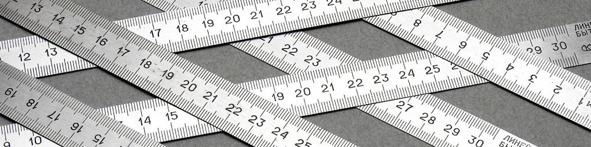

# Целые числа в си



## Содержание

+ [Целые типы фиксированного размера](#целые-типы-фиксированного-размера)

## Целые типы фиксированного размера

Часто необходимо работать не просто с какими-то целыми, а с числами известной, фиксированной длины. Работа с целыми числами одного типа, но разной длины сильно усложняет написание переносимого кода и приводит к массе ошибок. К счастью, в стандарте си предусмотрены типы с известными размерами.

**Целые типы фиксированной ширины:**

Название | Знак | Размер, бит | Размер, байт
-- | -- | -- | --
int8_t | signed | 8 | 1
uint8_t | unsigned | 8 | 1
int16_t | signed | 16 | 2
uint16_t | unsigned | 16 | 2
int32_t | signed | 32 | 4
uint32_t | unsigned | 32 | 4
int64_t | signed | 64 | 8
uint64_t | unsigned | 64 | 8

Эти типы имеют гарантированный непрерывный размер, если объявлены. К сожалению, по стандарту они могут и не существовать. Также иногда встречаются и более крупные по размеру типы, например `int128_t`, но это уже экзотика.

Эти типы объявлены в заголовочном файле `stdint.h`.

Кроме этих типов, есть ещё несколько важный.

**intmax_t** и **uintmaxt** – знаковые и беззнаковые целочисленные типы с максимальной поддерживаемой длиной на данной платформе. Для вывода на печать (с помощью функции `printf`) используется модификатор `j` и `ju`.

Более того, имеется ещё несколько специфических типов.

`uint_fast32_t` – тип, который может вмещать 32 бита, но на данной платформе работает максимально эффективно (например, 8 байтный на x64 архитектуре).

Также объявлены типы

+ `uint_fast8_t`
+ `uint_fast16_t`
+ `uint_fast32_t`
+ `uint_fast64_t`
+ `int_fast8_t`
+ `int_fast16_t`
+ `int_fast32_t`
+ `int_fast64_t`

`uint_least32_t` – Тип с самым маленьким размером, который гарантированно может вместить 32 бита (например, если на данном компьютере целые 64 бита, а 32-битных нет).

Также объявлены типы

+ `int_least8_t`
+ `int_least16_t`
+ `int_least32_t`
+ `int_least64_t`
+ `uint_least8_t`
+ `uint_least16_t`
+ `uint_least32_t`
+ `uint_least64_t`

Также, вместе с этими типами объявлены константы с соответствующими именами, которые помогают оперировать с числами. Например минимальные значения

+ `INT8_MIN`
+ `INT16_MIN`
+ `INT32_MIN`
+ `INT64_MIN`

И максимальные

+ `INT8_MAX`
+ `INT16_MAX`
+ `INT32_MAX`
+ `INT64_MAX`

Для `least` и `fast` объявлены соответствующие значения `INT_LEAST8_MAX` и `INT_FAST8_MAX` и т.п.

**Пример.** Пусть платформа `little endian` (а другой вы и найдёте). Пользователь вводит целое число, не более 8 байт длиной. Необходимо вывести, сколько в этом числе ненулевых байт. Для начала, просто выведем побайтно целое. Для этого считаем его в 8 байтное целое

```c
int64_t input;
scanf("%" SCNd64, &input);
```

`SCNd64` – это макрос, определённый в библиотеке `inttypes`. Он используется для ввода целых 64 битных чисел. Напомню, что в си строковые литералы, записанные рядом, конкатенируются.

Далее, если у нас есть адрес переменной, то мы можем пройти по каждому байту этой переменной. Для этого приведём её к типу указатель на `unsigned char` (то есть один байт), а потом будем работать с этим указателем как с массивом.

```c
for (i = 0; i < sizeof(input); i++) {
    byte = ((unsigned char*)(&input))[i];
    printf("%02X ", byte);
}
```

Вот весь код

```c
#define _CRT_SECURE_NO_WARNINGS
#include <stdio.h>
#include <conio.h>
#include <inttypes.h>
 
int main(void) {
    int64_t input;
    uint8_t i;
    unsigned char byte;
 
    scanf("%" SCNd64, &input);
 
    for (i = 0; i < sizeof(input); i++) {
        byte = ((unsigned char*)(&input))[i];
        printf("%02X ", byte);
    }
    _getch();
}
```

Теперь уже совсем просто узнать, сколько ненулевых байт в числе

```c
i = 0;
for (;;) {
if (!((unsigned char*)(&input))[i]) {
        break;
    }
    ++i;
};
printf("%" PRId8 " non-zero bytes", i);
```

Этот цикл можно переписать множеством разных способов.

---
[Содержание](#содержание)
