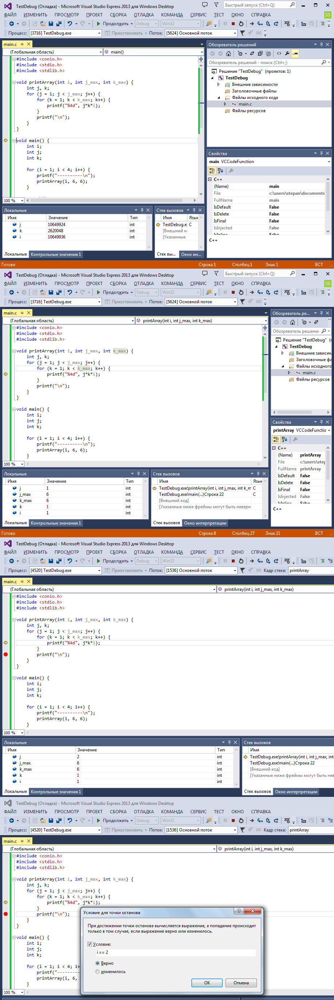
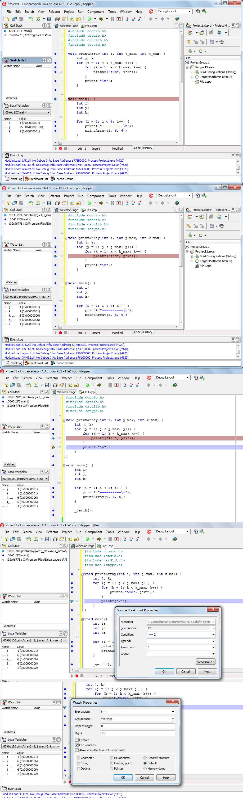

# Отладка программы


## Содержание

+ [Отладка программы](#отладка-программы-дебаггер)
+ [Visual Studio](#visual-studio)
+ [Borland, Code Gear, Embarcadero etc](#borland-code-gear-embarcadero-etc)

## Отладка программы (дебаггер)

Часто бывают ситуации, когда код скомпилировался, но работает не так, как предполагалось. Обнаружить ошибку просмотром кода не удалось и логгирование не особо помогает. Тогда можно воспользоваться дебаггером, пошагово пройти программу (благо, они у вас совсем небольшие), проследить состояние переменных и ход выполнения приложения или дизассемблировать код.

Пусть у нас имеется следующий код

```c
#include <conio.h>
#include <stdio.h>
#include <stdlib.h>
#include <ctype.h>

void printArray(int i, int j_max, int k_max) {
    int j, k;
    for (j = 1; j < j_max; j++) {
        for (k = 1; k < k_max; k++) {
            printf("%4d", j*k*i);
        }
        printf("\n");
    }
}

void main() {
    int i;
    int j;
    int k;

    for (i = 1; i < 4; i++) {
        printf("----------\n");
        printArray(i, 6, 6);
    }

    _getch();
}
```

Необходимо научиться работать с отладчиком: пошагово проходить весь код, устанавливать точки останова программы, просматривать значения переменных во время работы.

---
[Содержание](#содержание)

## Visual Studio

Выполните ОТЛАДКА | Шаг с обходом, или нажмите `F10`.

Вы получите примерно такую картину, как на рисунке. Жёлтая стрелка указывает, какой оператор будет выполнен.

Используя шаг с обходом (`F10`), шаг с заходом (`F11`) и шаг с выходом (`Shift + F11`) можно исполнять программу.

*Вызов отладчика на Visual Studio Express*

Шаг с обходом выполняет оператор, но не заходит в него. Например, если это вызов функции, то он будет произведён, но внутрь функции мы не попадём.

Шаг с заходом позволяет «зайти» в оператор, если он сложный. Например, перейти к функции, которая выполняется.

Шаг с выходом позволяет вернуться на уровень выше, если мы совершили шаг с заходом.

Окошко «Локальные» снизу показывает текущее значение локальных переменных. Во время захода в функцию в значениях хранится мусор.

Нажимая `F10`, дойдите до строки `23`, где происходит вызов функции `printArray`. Если вы нажмёте `F11`, то перейдёт внутрь функции `printArray`.

*Шаг с заходом позволяет перейти в функцию:*

Чтобы выйти из этой функции, можно нажать `Shift + F11`.

Если часть программы необходимо пропустить, то ставят точку останова (breakpoint, "бряк"). Для этого кликают по левому полю, рядом со строчкой, на которой необходимо остановиться, или нажимают `F9`. Останов можно осуществить только на операторе, нельзя остановиться, например, на определении переменной или пустой строке. В этом случае отладчик «скинет» точку останова до ближайшего валидного места.

*Когда выполнение программы доходит до оператора, рядом с которым стоит breakpoint, то происходит останов:*

После того, как точка останова выставлена, можно нажать F5. Программа будет выполняться до тех пор, пока не встретит точку останова. Это особенно удобно, когда нужно обойти ввод данных.

Точка останова может иметь ряд условий, например, число попаданий, фильтры, действие, которое выполняется при остановке и т.д. Для того, чтобы задать дополнительные свойства, кликните правой кнопкой мыши на точке и в выпадающем меню выберете нужный пункт.

*Останов выполнения программы может быть осуществлён по условию:*

Пусть, например, мы хотим остановить выполнение программы тогда, когда значение локальной переменной i внутри цикла в функции стало равно 2. Для этого напишем соответствующее условие

Теперь, если нажать на «Продолжить», то программа будет работать до тех пор, пока значение локальной переменной i внутри функции не станет равным 2.

---
[Содержание](#содержание)

## Borland, Code Gear, Embarcadero etc

Выполните `Run` `|` `Step over`, или нажмите `F8`. Вы получите примерно такую картину, как на рисунке. Синяя стрелка указывает, какой оператор будет выполнен. Используя шаг с обходом (`F8`), шаг с заходом (`F7`) можно исполнять программу. Кроме этого, имеются дополнительные возможности, например исполнение кода до курсора (`F4`), исполнение до тех пор, пока не будет осуществлён возврат (`Shift + F8`), просматривать состояние переменных и выражений `(Run | Inspect)`, изменять значение переменных (`Ctrl + F7`) и добавлять список отслеживаемых переменных и выражений (`Ctrl + F5`).



*Вызов отладчика на Embarcadero RAD Studio XE2:*

Шаг с обходом выполняет оператор, но не заходит в него. Например, если это вызов функции, то он будет произведён, но внутрь функции мы не попадём.

Шаг с заходом позволяет «зайти» в оператор, если он сложный. Например, перейти к функции, которая выполняется.

Шаг с выходом позволяет вернуться на уровень выше, если мы совершили шаг с заходом.

Окошко «Local Variables» слева снизу отображает текущее значение локальных переменных. Во время захода в функцию в значениях хранится мусор.

Нажимая F8, дойдите до строки 23, где происходит вызов функции printArray. Если вы нажмёте F7, то перейдёт внутрь функции printArray.

*Шаг с заходом позволяет перейти в функцию:*

Если часть программы необходимо пропустить, то ставят точку останова. Для этого кликают по левому полю, рядом со строчкой, на которой необходимо остановиться. Останов можно осуществить только на операторе, нельзя остановиться, например, на определении переменной или пустой строке. В этом случае отладчик отметит крестом нерабочую точку останова. Во время отладки все возможные точки останова выделены синим, если по ним кликнуть, то они становятся активными красными.

*Синие метки - возможные точки останова, красные - активные:*

После того, как точка останова выставлена, можно нажать F9. Программа будет выполняться до тех пор, пока не встретит точку останова. Это особенно удобно, когда нужно обойти ввод данных.

Точка останова может быть иметь ряд условий, например, число попаданий, фильтры, действие, которое выполняется при остановке и т.д. Для того, чтобы задать дополнительные свойства, кликните правой кнопкой мыши на точке и в выпадающем меню выберете Breakpoint Properties….

Пусть, например, мы хотим остановить выполнение программы тогда, когда значение локальной переменной i внутри цикла в функции стало равно 2. Для этого напишем соответствующее условие в поле condition

*Останов выполнения программы может быть осуществлён по условию:*

Теперь, если нажать на «Продолжить», то программа будет работать до тех пор, пока значение локальной переменной i внутри функции не станет равным 2.

Слева расположено окно Watchlist. Watchlist позволяет добавлять отслуживаемые переменные и выражения. Кликните два раза по полю и появится диалоговое окно. Пусть, например, мы хотим трассировать сумму переменных i и j. Запишем в watchlist сумму

*Watchlist позволяет отслеживать значения переменных и выражений во время отладки:*

---
[Содержание](#содержание)
