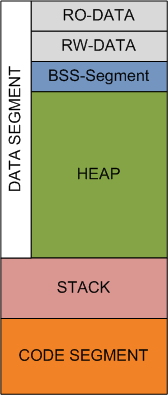

# Структура приложения на си


## Содержание

+ [Сегментация приложения на си](#сегментация-приложения-на-си)

## Сегментация приложения на си

В этой статье обобщенно описывается структура приложения, которую обычно можно встретить на практике. Стандарт языка си не определяет структуры приложения, поэтому неверно говорить, например, о том, что в приложении на си автоматические переменные располагаются на стеке, а статические в bss сегменте и т.п. Однако, реальные примеры помогают глубже понять поведение компилятора и программы.

Перед тем, как начать разговор о динамической работе с памятью, необходимо рассмотреть структуру приложения. В памяти компьютера программа организована следующим образом

Сегмент данных (Data, bss-сегмент и куча)<br>
Стек<br>
Сегмент кода



**Data** состоит из статических и глобальных переменных, которые явно инициализируются значениями. Этот сегмент может быть далее разбит на `ro-data` (**read only data**) – сегмент данных только для чтения, и `rw-data` (**read write data**) – сегмент данных для чтения и записи. Например, глобальные переменные

```c
s[] = "hello world"
int debug=1
```

Будут храниться в rw-области. Для выражения типа

```c
const char* string = "hello world"
```

указатель будет храниться в rw-области, а строкой литерал "hello world" в ro-области.

```c
static int i = 10
int i = 10
```

оба будут расположены в сегменте данных.

**BSS-сегмент** (block started by symbol) содержит неинициализированные глобальные переменные, или статические переменные без явной инициализации. Этот сегмент начинается непосредственно за data-сегментом. Обычно загрузчик программ инициализирует bss область при загрузке приложения нулями. Дело в том, что в data области переменные инициализированы – то есть затирают своими значениями выделенную область памяти. Так как переменные в bss области не инициализированы явно, то они теоретически могли бы иметь значение, которое ранее хранилось в этой области, а это уязвимость, которая предоставляет доступ до, возможно, приватных данных. Поэтому загрузчик вынужден обнулять все значения. За счёт этого и неинициализированные глобальные переменные, и статические переменные по умолчанию равны нулю.

**Куча** – начинается за BSS сегментом и начиная оттуда растёт, соответственно с увеличением адреса. Этот участок используется для выделения на нём памяти с использованием функции malloc (и прочих) и для очисти с помощью функции free.

Стек вызовов обычно растёт "навстречу" куче, то есть с увеличением стека адрес вершины стека уменьшается. Набор значений, которые кладутся на стек одной функцией, называются фреймом. После выхода из функции стек освобождается от фрейма. Один фрейм хранит как минимум одно значение - адрес возврата. Каждый раз, когда мы создаём локальные переменные, они располагаются на стеке. Как только мы выходим из функции, стек очищается и переменные исчезают. Вызов функций и передача параметров также происходит через стек.

Сегмент кода, или текстовый сегмент, или просто текст, содержит исполняемые инструкции. У него фиксированный размер и обычно он используется только для чтения, если же в него можно писать, то архитектура поддерживает самомодификацию. Сегмент кода располагается после начала стека, поэтому в случае роста он [стек] не перекрывает сегмент кода.

---
[Содержание](#содержание)
