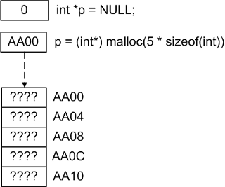
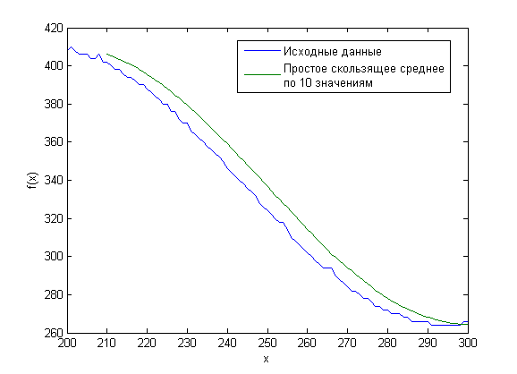

# Динамическое выделение памяти

## Содержание

+ [Функция malloc](#функция-malloc)
+ [Освобождение памяти с помощью free](#освобождение-памяти-с-помощью-free)
+ [Работа с двумерными и многомерными массивами](#работа-с-двумерными-и-многомерными-массивами)
+ [Функция calloc](#функция-calloc)
+ [Функция realloc](#функция-realloc)
+ [Типичные ошибки при динамической работе с памятью](#ошибки-при-выделении-памяти)
+ [Различные аргументы realloc и malloc](#различные-аргументы-realloc-и-malloc)

## Функция malloc

В предыдущей главе уже обсуждалось, что локальные переменные кладутся на стек и существую до тех пор, пока мы не вышли из функции. С одной стороны, это позволяет автоматически очищать память, с другой стороны, существует необходимость в переменных, время жизни которых мы можем контролировать самостоятельно. Кроме того, нам необходимо динамическое выделение памяти, когда размер используемого пространства заранее не известен. Для этого используется выделение памяти на куче. Недостатков у такого подхода два:

+ во-первых, память необходимо вручную очищать,
+ во-вторых, выделение памяти – достаточно дорогостоящая операция.

Для выделения памяти на куче в си используется функция `malloc` (**memory allocation**) из библиотеки `stdlib.h`

```c
void * malloc(size_t size);
```

Функция выделяет `size` байтов памяти и возвращает указатель на неё. Если память выделить не удалось, то функция возвращает `NULL`. Так как `malloc` возвращает указатель типа `void`, то его необходимо явно приводить к нужному нам типу. Например, создадим указатель, после этого выделим память размером в 100 байт.

```c
#include <conio.h>
#include <stdio.h>
#include <stdlib.h>
 
void main() {
    int *p = NULL;
    p = (int*) malloc(100);
 
    free(p);
}
```

После того, как мы поработали с памятью, необходимо освободить память функцией `free`.

Используя указатель, можно работать с выделенной памятью как с массивом. Пример: пользователь вводит число – размер массива, создаём массив этого размера и заполняем его квадратами чисел по порядку. После этого выводим и удаляем массив.

```c
#include <conio.h>
#include <stdio.h>
#include <stdlib.h>
 
void main() {
    const int maxNumber = 100;
    int *p = NULL;
    unsigned i, size;
 
    do {
        printf("Enter number from 0 to %d: ", maxNumber);
        scanf("%d", &size);
        if (size < maxNumber) {
            break;
        }
    } while (1);
 
    p = (int*) malloc(size * sizeof(int));
 
    for (i = 0; i < size; i++) {
        p[i] = i*i;
    }
 
    for (i = 0; i < size; i++) {
        printf("%d ", p[i]);
    }
 
    _getch();
    free(p);
}
```

Разбираем код

```c
p = (int*) malloc(size * sizeof(int));
```

Здесь `(int *)` – приведение типов. Пишем такой же тип, как и у указателя.

`size * sizeof(int)` – сколько байт выделить. `sizeof(int)` – размер одного элемента массива.

После этого работаем с указателем точно также, как и с массивом. В конце не забываем удалять выделенную память.

Теперь представим на рисунке, что у нас происходило. Пусть мы ввели число 5.



*Выделение памяти.*

Функция `malloc` выделила память на куче по определённому адресу, после чего вернула его.

Теперь указатель `p` хранит этот адрес и может им пользоваться для работы. В принципе, он может пользоваться и любым другим адресом.

Когда функция `malloc` "выделяет память", то она резервирует место на куче и возвращает адрес этого участка. У нас будет гарантия, что компьютер не отдаст нашу память кому-то ещё.

Когда мы вызываем функцию `free`, то мы освобождаем память, то есть говорим компьютеру, что эта память может быть использована кем-то другим. Он может использовать нашу память, а может и нет, но теперь у нас уже нет гарантии, что эта память наша. При этом сама переменная не зануляется, она продолжает хранить адрес, которым ранее пользовалась.

Это очень похоже на съём номера в отеле. Мы получаем дубликат ключа от номера, живём в нём, а потом сдаём комнату обратно. Но дубликат ключа у нас остаётся. Всегда можно зайти в этот номер, но в нём уже кто-то может жить. Так что наша обязанность – удалить дубликат.

Иногда думают, что происходит "создание" или "удаление" памяти. На самом деле происходит только перераспределение ресурсов.

---
[Содержание](#содержание)

## Освобождение памяти с помощью free

Теперь рассмотри, как происходит освобождение памяти. Переменная указатель хранит адрес области памяти, начиная с которого она может им пользоваться. Однако, она не хранит размера этой области. Откуда тогда функция `free` знает, сколько памяти необходимо освободить?

Очевидно, что информация о размере выделенного участка должна где-то храниться. Есть несколько решения этой проблемы.

1. Можно создать карту, в которой будет храниться размер выделенного участка. Каждый раз при освобождении памяти компьютер будет обращаться к этим данным и получать нужную информацию.
2. Второе решение более распространено. Информация о размере хранится на куче до самих данных. Таким образом, при выделении памяти резервируется места больше и туда записывается информация о выделенном участке. При освобождении памяти функция `free` "подсматривает", сколько памяти необходимо удалить.

Функция `free` освобождает память, но при этом не изменяет значение указателя, о чём нужно помнить.

---
[Содержание](#содержание)

## Работа с двумерными и многомерными массивами

Для динамического создания двумерного массива сначала необходимо создать массив указателей, после чего каждому из элементов этого массива присвоить адрес нового массива.
Для удаления массива необходимо повторить операцию в обратном порядке - удалить сначала подмассивы, а потом и сам массив указателей.

```c
#include <conio.h>
#include <stdio.h>
#include <stdlib.h>
 
#define COL_NUM 10
#define ROW_NUM 10
 
void main() {
    float **p = NULL;
    unsigned i;
 
    p = (float**) malloc(ROW_NUM * sizeof(float*));
    for (i = 0; i < ROW_NUM; i++) {
        p[i] = (float*) malloc(COL_NUM * sizeof(float));
    }
 
    //Здесь какой-то важный код
    for (i = 0; i < ROW_NUM; i++) {
        free(p[i]);
    }
    free(p);
}
```

Сначала мы создаём массив указателей, а после этого каждому элементу этого массива присваиваем адрес вновь созданного массива. Это значит, что можно

1. Создавать массивы "неправильной формы", то есть массив строк, каждая из которых имеет свой размер.
2. Работать по отдельности с каждой строкой массива: освобождать память или изменять размер строки.

Создадим "треугольный" массив и заполним его значениями

```c
#include <conio.h>
#include <stdio.h>
#include <stdlib.h>
 
#define SIZE 10
 
void main() {
    int **A;
    int i, j;
    A = (int**) malloc(SIZE * sizeof(int*));
 
    for (i = 0; i < SIZE; i++) {
        A[i] = (int*) malloc((i + 1) * sizeof(int));
    }
 
    for (i = 0; i < SIZE; i++) {
        for (j = i; j > 0; j--) {
            A[i][j] = i * j;
        }
    }
 
    for (i = 0; i < SIZE; i++) {
        for (j = i; j > 0; j--) {
            printf("%d ", A[i][j]);
        }
        printf("\n");
    }
 
    for (i = SIZE-1; i > 0; i--) {
        free(A[i]);
    }
    free(A);
     
    _getch();
}
```

Чтобы создать трёхмерный массив, по аналогии, необходимо сначала определить указатель на указатель на указатель, после чего выделить память под массив указателей на указатель, после чего проинициализировать каждый из массивов и т.д.

---
[Содержание](#содержание)

## Функция calloc

Функция `calloc` выделяет `n` объектов размером `m` и заполняет их нулями. Обычно она используется для выделения памяти под массивы. Синтаксис

```c
void* calloc(size_t num, size_t size);
```

---
[Содержание](#содержание)

## Функция realloc

Ещё одна важная функция – `realloc` (**re-allocation**). Она позволяет изменить размер ранее выделенной памяти и получает в качестве аргументов старый указатель и новый размер памяти в байтах:

```c
void* realloc(void* ptr, size_t size)
```

Функция `realloc` может как использовать ранее выделенный участок памяти, так и новый. При этом не важно, меньше или больше новый размер – менеджер памяти сам решает, где выделять память.

**Пример** – пользователь вводит слова. Для начала выделяем под слова массив размером 10. Если пользователь ввёл больше слов, то изменяем его размер, чтобы хватило места. Когда пользователь вводит слово end, прекращаем ввод и выводим на печать все слова.

```c
#include <conio.h>
#include <stdio.h>
#include <stdlib.h>
#include <string.h>
 
#define TERM_WORD "end"
#define SIZE_INCREMENT 10
 
void main() {
    //Массив указателей на слова
    char **words;
    //Строка, которая используется для считывания введённого пользователем слова
    char buffer[128];
    //Счётчик слов
    unsigned wordCounter = 0;
    //Длина введённого слова
    unsigned length;
    //Размер массива слов. Для уменьшения издержек на выделение памяти 
    //каждый раз будем увеличивать массив слов не на одно значение, а на
    //SIZE_INCREMENT слов
    unsigned size = SIZE_INCREMENT;
    int i;
 
    //Выделяем память под массив из size указателей
    words = (char**) malloc(size*sizeof(char*));
    do {
        printf("%d: ", wordCounter);
        scanf("%127s", buffer);
        //Функция strcmp возвращает 0, если две строки равны
        if (strcmp(TERM_WORD, buffer) == 0) {
            break;
        }
        //Определяем длину слова
        length = strlen(buffer);
        //В том случае, если введено слов больше, чем длина массива, то
        //увеличиваем массив слов
        if (wordCounter >= size) {
            size += SIZE_INCREMENT;
            words = (char**) realloc(words, size*sizeof(char*));
        }
        //Выделяем память непосредственно под слово
        //на 1 байт больше, так как необходимо хранить терминальный символ
        words[wordCounter] = (char*) malloc(length + 1);
        //Копируем слово из буффера по адресу, который 
        //хранится в массиве указателей на слова
        strcpy(words[wordCounter], buffer);
        wordCounter++;
    } while(1);
 
    for (i = 0; i < wordCounter; i++) {
        printf("%s\n", words[i]);
    }
    _getch();
 
    for (i = 0; i < wordCounter; i++) {
        free(words[i]);
    }
    free(words);
}
```

Хочу обратить внимание, что мы при выделении памяти пишем `sizeof(char*)`, потому что размер указателя на `char` не равен одному байту, как размер переменной типа `char`.

---
[Содержание](#содержание)

## Ошибки при выделении памяти

### Бывает ситуация, при которой память не может быть выделена

В этом случае функция `malloc` (и `calloc`) возвращает `NULL`.

Поэтому, перед выделением памяти необходимо обнулить указатель, а после выделения проверить, не равен ли он `NULL`. Так же ведёт себя и `realloc`. Когда мы используем функцию `free` проверять на `NULL` нет необходимости, так как согласно документации `free(NULL)` не производит никаких действий. Применительно к последнему примеру:

```c
#include <conio.h>
#include <stdio.h>
#include <stdlib.h>
#include <string.h>
 
#define TERM_WORD "end"
#define SIZE_INCREMENT 10
 
void main() {
    char **words;
    char buffer[128];
    unsigned wordCounter = 0;
    unsigned length;
    unsigned size = SIZE_INCREMENT;
    int i;
 
    if (!(words = (char**) malloc(size*sizeof(char*)))) {
        printf("Error: can't allocate memory");
        _getch();
        exit(1);
    }
 
    do {
        printf("%d: ", wordCounter);
        scanf("%127s", buffer);
         
        if (strcmp(TERM_WORD, buffer) == 0) {
            break;
        }
 
        length = strlen(buffer);
 
        if (wordCounter >= size) {
            size += SIZE_INCREMENT;
            if (!(words = (char**) realloc(words, size*sizeof(char*)))) {
                printf("Error: can't reallocate memory");
                _getch();
                exit(2);
            }
        }
 
        if (!(words[wordCounter] = (char*)malloc(length + 1))) {
            printf("Error: can't allocate memory");
            _getch();
            exit(3);
        }
 
        strcpy(words[wordCounter], buffer);
        wordCounter++;
    } while(1);
 
    for (i = 0; i < wordCounter; i++) {
        printf("%s\n", words[i]);
    }
    _getch();
 
    for (i = 0; i < wordCounter; i++) {
        free(words[i]);
    }
    free(words);
}
```

Хотелось бы добавить, что ошибки выделения памяти могут случиться, и просто выходить из приложения и выкидывать ошибку плохо. Решение зависит от ситуации. Например, если не хватает памяти, то можно подождать некоторое время и после этого опять попытаться выделить память, или использовать для временного хранения файл и переместить туда часть объектов. Или выполнить очистку, сократив используемую память и удалив ненужные объекты.

### Изменение указателя, который хранит адрес выделенной области памяти

Как уже упоминалось выше, в выделенной области хранятся данные об объекте - его размер. При удалении `free` получает эту информацию. Однако, если мы изменили указатель, то удаление приведёт к ошибке, например

```c
#include <conio.h>
#include <stdio.h>
#include <stdlib.h>
 
void main() {
    int *p = NULL;
    if (!(p = (int*) malloc(100 * sizeof(int)))) {
        printf("Error");
        exit(1);
    }
    //Изменили указатель
    p++;
    //Теперь free не может найти метаданные об объекте
    free(p);
    //На некоторых компиляторах ошибки не будет
    _getch();
}
```

Таким образом, если указатель хранит адрес, то его не нужно изменять. Для работы лучше создать дополнительную переменную указатель, с которой работать дальше.

### Использование освобождённой области

Почему это работает в си, описано выше. Эта ошибка выливается в другую – так называемые висячие указатели (`dangling pointers` или `wild pointers`).

Вы удаляете объект, но при этом забываете изменить значение указателя на `NULL`. В итоге, он хранит адрес области памяти, которой уже нельзя воспользоваться, при этом проверить, валидная эта область или нет, у нас нет возможности.

```c
#include <conio.h>
#include <stdio.h>
#include <stdlib.h>
 
#define SIZE 10
 
void main() {
    int *p = NULL;
    int i;
 
    p = (int*) malloc(SIZE * sizeof(int));
    for (i = 0; i < SIZE; i++) {
        p[i] = i;
    }
    free(p);
    for (i = 0; i < SIZE; i++) {
        printf("%i ", p[i]);
    }
    _getch();
}
```

Эта программа отработает и выведет мусор, или не мусор, или не выведет. Поведение не определено.

Если же мы напишем

```c
free(p);
p = NULL;
```

то программа выкинет исключение. Это определённо лучше, чем неопределённое поведение. Если вы освобождаете память и используете указатель в дальнейшем, то обязательно обнулите его.

### Освобождение освобождённой памяти

**Пример:**

```c
#include <conio.h>
#include <stdio.h>
 
void main() {
    int *a, *b;
    a = (int*) malloc(sizeof(int));
    free(a);
    b = (int*) malloc(sizeof(int));
    free(a);
    free(b);
    _getch();
}
```

Здесь дважды вызывается `free` для переменной `a`. При этом, переменная `a` продолжает хранить адрес, который может далее быть передан кому-нибудь для использования. Решение здесь такое же как и раньше - обнулить указатель явно после удаления:

```c
#include <conio.h>
#include <stdio.h>
 
void main() {
    int *a, *b;
    a = (int*) malloc(sizeof(int));
    free(a);
    a = NULL;
    b = (int*) malloc(sizeof(int));
    free(a);//вызов free(NULL) ничего не делает
    free(b);
    b = NULL;
    _getch();
}
```

### Одновременная работа с двумя указателями на одну область памяти

Пусть, например, у нас два указателя p1 и p2. Если под первый указатель была выделена память, то второй указатель может запросто скомпрометировать эту область:

```c
#include <conio.h>
#include <stdio.h>
#include <stdlib.h>
 
#define SIZE 10
 
void main() {
    int *p1 = NULL;
    int *p2 = NULL;
    size_t i;
 
    p1 = malloc(sizeof(int) * SIZE);
    p2 = p1;
 
    for (i = 0; i < SIZE; i++) {
        p1[i] = i;
    }
    p2 = realloc(p1, SIZE * 5000 * sizeof(int));
    for (i = 0; i < SIZE; i++) {
        printf("%d ", p1[i]);
    }
    printf("\n");
    for (i = 0; i < SIZE; i++) {
        printf("%d ", p2[i]);
    }
    _getch();
}
```

Рассмотрим код ещё раз.

```c
int *p1 = NULL;
int *p2 = NULL;
size_t i;
 
p1 = malloc(sizeof(int) * SIZE);
p2 = p1;
```

Теперь оба указателя хранят один адрес.

```c
p2 = realloc(p1, SIZE * 5000 * sizeof(int));
```

А вот здесь происходит непредвиденное. Мы решили выделить под `p2` новый участок памяти. `realloc` гарантирует сохранение контента, но вот сам указатель `p1` может перестать быть валидным.

Есть разные ситуации. Во-первых, вызов `malloc` мог выделить много памяти, часть которой не используется. После вызова ничего не поменяется и `p1` продолжит оставаться валидным. Если же потребовалось перемещение объекта, то `p1` может указывать на невалидный адрес (именно это с большой вероятностью и произойдёт в нашем случае). Тогда `p1` выведет мусор (или же произойдёт ошибка, если `p1` полезет в недоступную память), в то время как `p2` выведет старое содержимое `p1`. В этом случае поведение не определено.

Два указателя на одну область памяти это вообще-то не ошибка. Бывают ситуации, когда без них не обойтись. Но это очередное минное поле для программиста.

---
[Содержание](#содержание)

## Различные аргументы realloc и malloc

При вызове функции `malloc`, `realloc` и `calloc` с нулевым размером поведение не определено. Это значит, что может быть возвращён как `NULL`, так и реальный адрес. Им можно пользоваться, но к нему нельзя применять операцию разадресации.

Вызов `realloc(NULL, size_t)` эквиваленте вызову `malloc(size_t)`.

Однако, вызов `realloc(NULL, 0)` не эквивалентен вызову `malloc(0)`.  Понимайте это, как хотите.

---
[Содержание](#содержание)

## Примеры

### Скользящее среднее

Простое скользящее среднее равно среднему арифметическому функции за период `n`.

Пусть у нас имеется ряд измерений значения функции. Часто эти измерения из-за погрешности "плавают" или на них присутствуют высокочастотные колебания. Мы хотим сгладить ряд, для того, чтобы избавиться от этих помех, или для того, чтобы выявить общий тренд. Самый простой способ: взять `n` элементов ряда и получить их среднее арифметическое.

`n` в данном случае - это период простого скользящего среднего. Так как мы берём `n` элементов для нахождения среднего, то в результирующем массиве будет на `n` чисел меньше.


*Скользящее среднее.*

Пусть есть ряд

```sh
1, 4, 4, 6, 7, 8, 9, 11, 12, 11, 15
```

Тогда если период среднего будет `3`, то мы получим ряд

```sh
(1+4+4)/3,
(4+4+6)/3,
(4+6+7)/3,
(6+7+8)/3,
(7+8+9)/3,
(8+9+11)/3,
(9+11+12)/3,
(11+12+11)/3,
(12+11+15)/3
```

Видно, что сумма находится в "окне", которое скользит по ряду. Вместо того, чтобы каждый раз в цикле находить сумму, можно найти её для первого периода, а затем вычитать из суммы крайнее левое значение предыдущего периода и прибавлять крайнее правое значение следующего.
Будем запрашивать у пользователя числа и период, а затем создадим новый массив и заполним его средними значениями.

```c
#include <conio.h>
#include <stdio.h>
#include <stdlib.h>
 
#define MAX_INCREMENT 20
 
void main() {
    //Считанные числа
    float *numbers = NULL;
    //Найденные значения
    float *mean = NULL;
    float readNext;
    //Максимальный размер массива чисел
    unsigned maxSize = MAX_INCREMENT;
    //Количество введённых чисел
    unsigned curSize = 0;
    //Строка для считывания действия
    char next[2];
    //Шаг
    unsigned delta;
    //float переменная для хранения шага
    float realDelta;
    unsigned i, j;
    //Сумма чисел
    float sum;
 
    numbers = (float*) malloc(maxSize * sizeof(float));
    do {
        //Пока пользователь вводит строку, которая начинается с y или Y,
        //то продолжаем считывать числа
        printf("next? [y/n]: ");
        scanf("%1s", next);
        if (next[0] == 'y' || next[0] == 'Y') {
            printf("%d. ", curSize);
            scanf("%f", &readNext);
            if (curSize >= maxSize) {
                maxSize += MAX_INCREMENT;
                numbers = (float*) realloc(numbers, maxSize * sizeof(float));
            }
            numbers[curSize] = readNext;
            curSize++;
        } else {
            break;
        }
    } while(1);
 
    //Считываем период, он должен быть меньше, чем
    //количество элементов в массиве. Если оно равно,
    //то результатом станет среднее арифметическое всех введённых чисел
    do {
        printf("enter delta (>=%d): ", curSize);
        scanf("%d", &delta);
        if (delta <= curSize) {
            break;
        }
    } while(1);
    realDelta = (float) delta;
 
    //Находим среднее для первого периода
    mean = (float*) malloc(curSize * sizeof(float));
    sum = 0;
    for (i = 0; i < delta; i++) {
        sum += numbers[i];
    }
 
    //Среднее для всех остальных
    mean[0] = sum / delta;
    for (i = delta, j = 1; i < curSize; i++, j++) {
        sum = sum - numbers[j-1] + numbers[i];      
        mean[j] = sum / realDelta;
    }
 
    //Выводим. Чисел в массиве mean меньше на delta
    curSize = curSize - delta + 1;
    for (i = 0; i < curSize; i++) {
        printf("%.3f ", mean[i]);
    }
 
    free(numbers);
    free(mean);
    _getch();
}
```

Это простой пример. Большая его часть связана со считыванием данных, вычисление среднего всего в девяти строчках.

### Сортировка двумерного массива

Самый простой способ сортировки - перевести двумерный массив `MxN` в одномерный размером `M*N`, после чего отсортировать одномерный массив, а затем заполнить двумерный массив отсортированными данными. Чтобы не тратить место под новый массив, мы поступим по-другому: если проходить по всем элементам массива `k` от `0` до `M*N`, то индексы текущего элемента можно найти следующим образом:

```sh
j = k / N;
i = k - j*M;
```

Заполним массив случайными числами и отсортируем

```c
#include <conio.h>
#include <stdio.h>
#include <stdlib.h>
#include <time.h>
 
#define MAX_SIZE_X 20
#define MAX_SIZE_Y 20
 
void main() {
    int **mrx = NULL;
    int tmp;
    unsigned i, j, ip, jp, k, sizeX, sizeY, flag;
 
    printf("cols: ");
    scanf("%d", &sizeY);
    printf("rows: ");
    scanf("%d", &sizeX);
 
    //Если введённый размер больше MAX_SIZE_?, то присваиваем
    //значение MAX_SIZE_?
    sizeX = sizeX <= MAX_SIZE_X? sizeX: MAX_SIZE_X;
    sizeY = sizeY <= MAX_SIZE_Y? sizeY: MAX_SIZE_Y;
 
    //Задаём начальное значение для генератора псевдослучайных чисел
    srand(time(NULL));
    //Выделяем память под массив указателей
    mrx = (int**) malloc(sizeX * sizeof(int*));
    for (i = 0; i < sizeX; i++) {
        //Выделяем память под строку и сразу же заполняем элементы
        //случайными значениями
        mrx[i] = (int*) malloc(sizeY * sizeof(int));
        for (j = 0; j < sizeY; j++) {
            mrx[i][j] = rand();
        }
    }
 
    //Выводим массив
    for (i = 0; i < sizeX; i++) {
        for (j = 0; j < sizeY; j++) {
            printf("%6d ", mrx[i][j]);
        }
        printf("\n");
    }
 
    //Сортируем пузырьком, обходя все sizeX*sizeY элементы
    do {
        flag = 0;
        for (k = 1; k < sizeX * sizeY; k++) {
            //Вычисляем индексы текущего элемента
            j = k / sizeX;
            i = k - j*sizeX;
            //Вычисляем индексы предыдущего элемента
            jp = (k-1) / sizeX;
            ip = (k-1) - jp*sizeX;
            if (mrx[i][j] > mrx[ip][jp]) {
                tmp = mrx[i][j];
                mrx[i][j] = mrx[ip][jp];
                mrx[ip][jp] = tmp;
                flag = 1;
            }
        }
    } while(flag);
 
    printf("-----------------------\n");
    for (i = 0; i < sizeX; i++) {
        for (j = 0; j < sizeY; j++) {
            printf("%6d ", mrx[i][j]);
        }
        free(mrx[i]);
        printf("\n");
    }
    free(mrx);
 
    _getch();
}
```

### Бином Ньютона

Создадим треугольную матрицу и заполним биномиальными коэффициентами

```c
#include <conio.h>
#include <stdio.h>
#include <stdlib.h>
 
#define MAX_BINOM_HEIGHT 20
 
void main() {
    int** binom = NULL;
    unsigned height;
    unsigned i, j;
 
    printf("Enter height: ");
    scanf("%d", &height);
    height = height <= MAX_BINOM_HEIGHT? height: MAX_BINOM_HEIGHT;
 
    binom = (int**) malloc(height * sizeof(int*));
    for (i = 0; i < height; i++) {
        binom[i] = (int*) malloc((i + 1) * sizeof(int));
    }
 
    binom[0][0] = 1;
    for (i = 1; i < height; i++) {
        binom[i][0] = binom[i][i] = 1;
        for (j = i - 1; j > 0; j--) {
            binom[i][j] = binom[i-1][j-1] + binom[i-1][j];
        }
    }
 
    for (i = 0; i < height; i++) {
        for (j = 0; j <= i; j++) {
            printf("%4d ", binom[i][j]);
        }
        free(binom[i]);
        printf("\n");
    }
    free(binom);
 
    _getch();
}
```

---
[Содержание](#содержание)
