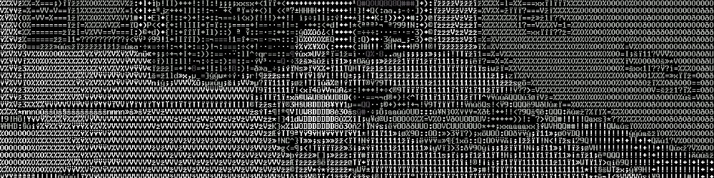
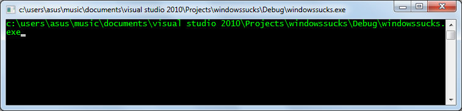
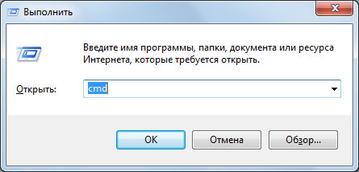
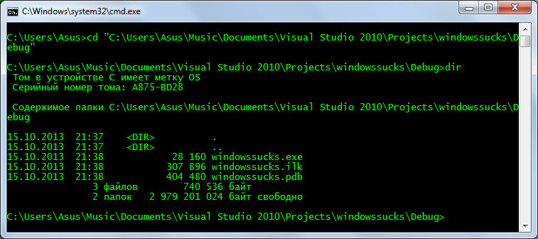
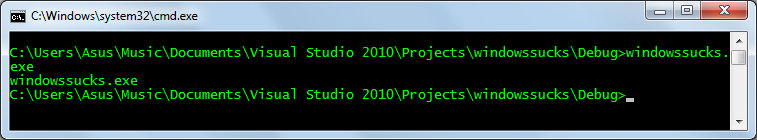
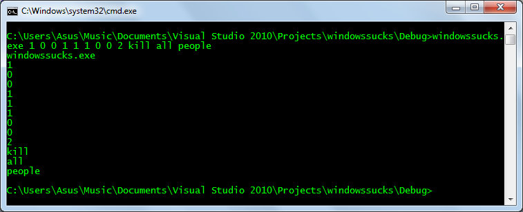
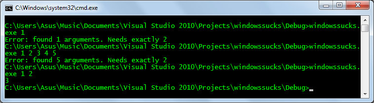

# Параметры командной строки



Си - компилируемый язык.

После сборки программа представляет собой исполняемый файл (мы не рассматриваем создание динамических библиотек, драйверов и т.д.). Наши программы очень простые и не содержат библиотек времени выполнения (Runtime libraries), поэтому могут быть перенесены на компьютер с такой же операционной системой (и подобной архитектурой) и там запущены.

Программа во время запуска может принимать параметры. Они являются аргументами функции `main`. Общий вид функции `main` следующий

```c
void main(int argc, char **argv) {
    ...
}
```

Первым аргументом `argc` является число переданных функции параметров. Второй аргумент – массив строк – собственно сами параметры. Так как параметры у функции могут быть любыми, то они передаются как строки, и уже сама программа должна их разбирать и приводить к нужному типу.

Первым аргументом (`argv[0]`) всегда является имя программы. При этом имя выводится в зависимости от того, откуда была запущена программа.

```c
#include <conio.h>
#include <stdio.h>

void main(int argc, char **argv) {
    printf("%s", argv[0]);
}
```


*Первый аргумент - это имя программы*

Теперь научимся немного работать с командной строкой. Это понадобится для того, чтобы передавать аргументы нашей программе. Сочетание клавиш `Win+R` вызывает окно "Выполнить".

Наберите в нём `cmd` и вы откроете командную строку. Также можно найти `cmd.exe` поиском в меню Пуск. В юникс-подобных операционных системах можно вызвать программу "терминал".


*Выполнить*

Мы не будем изучать сколько-нибудь много команд. Только те, которые понадобятся в работе.

Стандартная для всех операционных систем команда cd осуществляет переход к нужной папке. Существует два зарезервированных имени - . (точка) и .. (две точки). Точка - это имя текущей папки.

```sh
cd .
```

никуда не переходит

`..` обращение к родительской папке

```sh
cd ..
```

переход в родительскую папку

Для перехода по нужному пишется cd адрес. Например, нужно перейти на windows в папку `C:\Windows\System32`

```sh
cd C:\Windows\System32
```

В линуксе если нужно перейти в папку `/var/mysql`

```sh
cd /var/mysql
```

Если путь содержит пробелы, то он пишется в двойных кавычках

```sh
cd "D:\Docuents and Settings\Prolog"
```

Терминал имеет следующие полезные особенности:

+ если нажать стрелку вверх, по появится предыдущая выполненная команда.
+ Если нажать tab, то терминал попытается дополнить строку до известной ему команды, или дополнить путь, перебирая все папки и файлы в текущей папке.

Наберите `cd C:\`

нажимайте `tab` и смотрите, что происходит.

Ещё одна важная команда `dir` на windows и `ls` на linux, выводит на консоль содержимое текущей папки (той папки, в которой вы находитесь в данный момент)

Ваша программа вернула своё полное имя. Перейдите в папку, где располагается ваша программа и посмотрите её содержимое


*Переходим в папку, в которой располагается наша программа и смотрим содержимое*

Теперь, после того, как мы перешли в нашу папку, можно выполнить нашу программу. Для этого наберите её имя.


*Вызов программы из командной строки*

Заметьте - имя изменилось. Так как программа вызывается из своей папки, то выводится относительно имя. Теперь изменим программу и сделаем так, чтобы она выводила все аргументы. которые ей переданы.

```c
#include <conio.h>
#include <stdio.h>
 
void main(int argc, char **argv) {
    int i;
    for (i = 0; i < argc; i++) {
        printf("%s\n", argv[i]);
    }
}
```

Соберите проект. Перед сборкой убедитесь, что программа закрыта. Теперь вызовите программу, передав ей разные аргументы. Для этого напишите имя программы и через пробел аргументы


*Передача аргументов программе*

Давайте теперь напишем программу, которая получает два аргумента числа и выводит их сумму

```c
#include <conio.h>
#include <stdio.h>
#include <stdlib.h>
 
void main(int argc, char **argv) {
    int a, b;
    if (argc != 3) {
        printf("Error: found %d arguments. Needs exactly 2", argc-1);
        exit(1);
    }
    a = atoi(argv[1]);
    b = atoi(argv[2]);
    printf("%d", a + b);
}
```

Соберём и вызовем


*Функция принимает в качестве аргументов два числа*

Таким образом работает большинство программ. Кликая на ярлык, вы вызываете программу, на которую он ссылается. Большинство программ также принимают различные аргументы. Например, можно вызвать браузер firefox из командной строки и передать аргументы
firefox.exe "www.mozilla.org" "learnc.info" и он сразу же откроет в двух вкладках сайты по указанным адресам.

Многие стандартные команды также имеют параметры. В windows принято, что они начинаются с прямого слеша, в юниксе с минуса или двух минусов. Например

```sh
dir /AD
```

выводит только папки, а в терминале linux

```sh
ls -l 
```

выводит все файлы и папки с указанием атрибутов

Для просмотра дополнительных команд windows наберите в командной строке help или смотрите руководство (его легко найти в интернете). Для линукса команд и их опций гораздо больше, а некоторые из них являются самостоятельными языками программирования, так что стоит выучить хотя бы минимальный набор и их опции.

---
[Содержание](#параметры-командной-строки)
