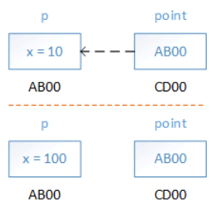

# Передача параметров в функцию


## Содержание

+ [Об аргументах функции](#об-аргументах-функции)

## Об аргументах функции

Практика показывает, что тема передачи аргументов в функции, особенно указателей, вызывает массу проблем. Давайте ещё раз обобщим наши знания и соберём информацию вместе.

Пусть у нас имеется какая-то структура и функция, которая работает с этой структурой.

Если мы передаём в функцию экземпляр структуры, то передаётся копия этой структуры.

```c
#include <stdio.h>
#include <stdlib.h>
 
typedef struct point_tag {
    float x;
    float y;
} point_t;
 
void foo(point_t point) {
    point.x = 100;
}
 
int main() {
    point_t p = { 10.0, 20.0 };
 
    printf("p.x = %.3f\n", p.x);
    foo(p);
    printf("p.x = %.3f", p.x);
 
    _getch();
    return 0;
}
```

В этом коде мы передаём в функцию foo копию переменной p. Значение кладётся на стек при вызове функции, и внутри функции мы можем с ним работать. Но изменяем мы только локальную копию. В main никакие изменения не видны. Проиллюстрируем это:


*Передача копии структуры*

Пусть переменная p имеет адрес AB00. По этому адресу в памяти компьютера располагается экземпляр структуры со значением x = 10. Мы передаём это значение в функцию foo, и локальная копия имеет адрес CD00. Потом мы изменяем значение внутри foo, и оно становится 100, но по тому же адресу CD00, а исходное значение не изменилось.

Мы уже знаем, что для изменения значения нужно передавать указатель. Вот пример, который работает, как мы и ожидаем

```c
#include <stdio.h>
#include <stdlib.h>
 
typedef struct point_tag {
    float x;
    float y;
} point_t;
 
void foo(point_t *point) {
    point->x = 100;
}
 
int main() {
    point_t p = { 10.0, 20.0 };
 
    printf("p.x = %.3f\n", p.x);
    foo(&p);
    printf("p.x = %.3f", p.x);
 
    _getch();
    return 0;
}
```

Проиллюстрируем пример.


*Передача указателя на структуру*

Пусть переменная p имеет адрес AB00. Передача по указателю – это тоже передача значения, просто в данном случае мы передаём адрес переменной. Внутри функции переменная point хранится по адресу CD00. Хранит она адрес переменной p, равный AB00. Далее мы изменяем значение содержимого, на которое ссылается переменная point. Поэтому изменение видно внутри main.

Если мы обозначим аргумент как const, то это защити его от возможного изменения. При попытке присвоить новое значение будет ошибка компиляции.

```c
void foo(const point_t *point) {
    point->x = 100; //compilation error
}
```

Более сложный пример, когда мы хотим изменить не содержимое объекта, а непосредственно сам объект. Типичная ошибка делать вот так

```c
#include <stdio.h>
#include <stdlib.h>
 
typedef struct point_tag {
    float x;
} point_t;
 
void foo(point_t *point) {
    point = malloc(sizeof(point_t));
    point->x = 100;
}
 
int main() {
    point_t *p = malloc(sizeof(point_t));
    p->x = 10;
 
    printf("p.x = %.3f\n", p->x);
    foo(p);
    printf("p.x = %.3f", p->x);
 
    _getch();
    free(p);
    return 0;
}
```

В этом случае изменения объекта не произойдёт, плюс, мы получим утечку памяти. Давайте разберёмся.


*Модификация структуры не приводит к изменению этой структуры*

Пусть переменная p хранится по адресу AB00, а память под структуру была выделена по адресу AB04. p хранит этот адрес. В foo передаётся AB04 (содержимое p). Внутри foo мы локальной переменной point, которая хранится по адресу CD00, присваиваем новое значение СВ04 – адрес, который вернула нам функция malloc. Как видно, внутри main ничего не поменялось. Кроме того, после выхода из функции foo будет удалена переменная point, которая хранит адрес структуры на куче, а сама память не будет очищена.

Для модификации объекта нужно передавать указатель , и в данном случае, для модификации указателя, нужно передать указатель на указатель.

```c
#include <stdio.h>
#include <stdlib.h>
 
typedef struct point_tag {
    float x;
} point_t;
 
void foo(point_t **point) {
    (*point) = malloc(sizeof(point_t));
    (*point)->x = 100;
}
 
int main() {
    point_t *p = malloc(sizeof(point_t));
    p->x = 10;
 
    printf("p.x = %.3f\n", p->x);
    foo(&p);
    printf("p.x = %.3f", p->x);
 
    _getch();
    return 0;
}
```

Нарисуем.


*Указатель на указатель позволяет модифицировать указатель*

Как обычно, p имеет адрес CD00 и хранит адрес CD04, по которому хранится структура. Мы передаём адрес переменной p – это AB00. Внутри foo теперь мы меняем содержимое по адресу AB00, и оно становится равным CD04. Иначе говоря, мы имеем две переменные, которые хранят один и тот же адрес на куче – это p внутри main, и point внутри foo. После выхода из функции локальная переменная point будет удалена, а значение, выделенное на куче, по адресу CD04 не пострадает.

Но заметьте, теперь у нас осталась «висячая» структура на куче по адресу AB04, на неё никто не ссылается и никто её не удаляет!


*Утечка памяти при изменении указателя*

Внимательно следите за такими вещами.

```c
#include <stdio.h>
#include <stdlib.h>
 
typedef struct point_tag {
    float x;    
} point_t;
 
void foo(point_t **point) {
    free(*point);
    (*point) = malloc(sizeof(point_t));
    (*point)->x = 100;
}
 
int main() {
    point_t *p = malloc(sizeof(point_t));
    p->x = 10;
 
    printf("p.x = %.3f\n", p->x);
    foo(&p);
    printf("p.x = %.3f", p->x);
 
    _getch();
    free(p);
    return 0;
}
```

Краткая памятка по использованию разных типов аргументов, на примере структуры point_t

Таб. 1 Памятка по передаче параметров

`foo(point_t)` | Только чтение
-- | --
`foo(point_t*)` | Модификация значения
`foo(const point_t*)` | Только чтение, но при передаче большого объекта расходуется меньше ресурсов
`foo(point_t **)` | Модификация содержимого и самого указателя

---
[Содержание](#содержание)
