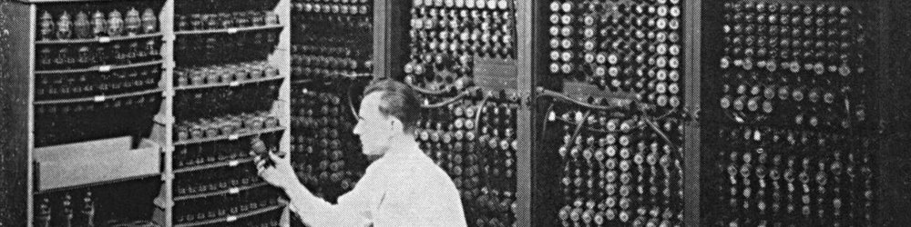

# Битовые операции



## Содержание

+ [Введение](#введение)
+ [Побитовые И, ИЛИ, НЕ, исключающее ИЛИ](#побитовые-и-или-не-исключающее-или)
+ [Операции побитового сдвига](#операции-побитового-сдвига)
+ [Битовые флаги](#битовые-флаги)

## Введение

Язык Си иногда называют макроассемблером за его тягу к железу. Если не использовать оптимизацию, можно даже примерно оценить, в какие конструкции на ассемблере преобразуется код программы. Простота и минимализм языка (простоту языка не путать с простотой программирования на языке) привели к тому, что на многих платформах си остаётся единственным высокоуровневым языком программирования. Без обзора побитовых операций, конечно, изучения языка было бы неполным.

Побитовые операции, как понятно из названия, позволяют оперировать непосредственно с битами. Большое количество примеров использования побитовых операций можно найти, например, в книге Генри Уоррена «Алгоритмические трюки для программистов». Здесь мы рассмотрим только сами операции и примитивные алгоритмы.

---
[Содержание](#содержание)

## Побитовые И, ИЛИ, НЕ, исключающее ИЛИ

ЗАМЕЧАНИЕ: здесь и далее в примерах используются 8-битные числа для упрощения записи. Всё это верно и для любых других чисел.

Напомню для начала, что логические операции И, ИЛИ, исключающее ИЛИ и НЕ могут быть описаны с помощью таблиц истинности

### Логический оператор И

X | Y | X AND Y
-- | -- | --
0 | 0 | 0
0 | 1 | 0
1 | 0 | 0
1 | 1 | 1

### Логический оператор ИЛИ

X | Y | X OR Y
-- | -- | --
0 | 0 | 0
0 | 1 | 1
1 | 0 | 1
1 | 1 | 1

### Логический оператор исключающее ИЛИ

X | Y | X XOR Y
-- | -- | --
0 | 0 | 0
0 | 1 | 1
1 | 0 | 1
1 | 1 | 0

### Логический оператор НЕ

X | NOT X
-- | --
0 | 1
1 | 0

В побитовых (bit-wise) операциях значение бита, равное `1`, рассматривается как логическая истина, а `0` как ложь. Побитовое И (оператор `&`) берёт два числа и логически умножает соответствующие биты. Например, если логически умножить `3` на `8`, то получим 0

```c
char a = 3;
char b = 8;
char c = a & b;
printf("%d", c);
```

Так как в двоичном виде `3` в виде однобайтного целого представляет собой

```sh
00000011
а 8
00001000
```

Первый бит переменной `c` равен логическому произведению первого бита числа `a` и первого бита числа `b`. И так для каждого бита.

```sh
00000011
00001000
↓↓↓↓↓↓↓↓
00000000
```

Соответственно, побитовое произведение чисел `31` и `17` даст `17`, так как `31` это `00011111` , а `17` это `00010001`

```sh
00011111
00010001
↓↓↓↓↓↓↓↓
00010001
```

Побитовое произведение чисел `35` и `15` равно `3`.

```sh
00100011
00001111
↓↓↓↓↓↓↓↓
00000011
```

Аналогично работает операция побитового ИЛИ (оператор `|`), за исключением того, что она логически суммирует соответствующие биты чисел без переноса.

Например,

```c
char a = 15;
char b = 11;
char c = a | b;
printf("%d", c);
```

выведет `15`, так как `15` это `00001111`, а `11` это `00001011`

```sh
00001111
00001011
↓↓↓↓↓↓↓↓
00001111
```

Побитовое ИЛИ для чисел `33` и `11` вернёт `43`, так как `33` это `00100001`, а `11` это `00001011`

```sh
00100001
00001011
↓↓↓↓↓↓↓↓
00101011
```

Побитовое отрицание (оператор `~`) работает не для отдельного бита, а для всего числа целиком. Оператор инверсии меняет ложь на истину, а истину на ложь, для каждого бита. Например,

```c
char a = 65;
char b = ~a;
printf("%d", b);
```

Выведет `-66`, так как `65` это 01000001, а инверсия даст `10111110`
что равно `-66`.

Кстати, вот алгоритм для того, чтобы сделать число отрицательным: для нахождение дополнительного кода числа его надо инвертировать и прибавить к нему единицу.

```c
char a = 107;
char b = ~a + 1;
printf("a = %d, -a = %d", a, b);
```

Исключающее ИЛИ (оператор `^`) применяет побитово операцию `XOR`. Например, для чисел

```c
char a = 12;
char b = 85;
char c = a ^ b;
printf("%d", c);
```

будет выведено `89`, так как `a` равно `00001100`, а `b` равно `01010101`. В итоге получим `01011001`

Иногда логические операторы `&&` и `||` путают с операторами `&` и `|`.

Такие ошибки могут существовать в коде достаточно долго, потому что такой код в ряде случаев будет работать. Например, для чисел `1` и `0`. Но так как в си истиной является любое ненулевое значение, то побитовое умножение чисел `3` и `4` вернёт `0`, хотя логическое умножение должно вернуть истину.

```c
int a = 3;
int b = 4;
printf("a & b = %d\n", a & b);  //выведет 0
printf("a && b = %d\n", a && b);//выведет не 0 (конкретнее, 1)
```

---
[Содержание](#содержание)

## Операции побитового сдвига

Операций сдвига две – битовый сдвиг влево (оператор `<<`) и битовый сдвиг вправо (оператор `>>`).

Битовый сдвиг вправо сдвигает биты числа вправо, дописывая слева нули. Битовый сдвиг влево делает противоположное: сдвигает биты влево, дописывая справа нули. Вышедшие за пределы числа биты отбрасываются.

Например, сдвиг числа `5` влево на `2` позиции

```sh
00000101 << 2 == 00010100
```

Сдвиг числа `19` вправо на `3` позиции

```sh
00010011 >> 3 == 00000010
```

Независимо от архитектуры (big-endian, или little-endian, или middle-endian) числа в двоичном виде представляются слева направо, от более значащего бита к менее значащему. Побитовый сдвиг принимает два операнда – число, над которым необходимо произвести сдвиг, и число бит, на которое необходимо произвести сдвиг.

```c
int a = 12;
printf("%d << 1 == %d\n", a, a << 1);
printf("%d << 2 == %d\n", a, a << 2);
printf("%d >> 1 == %d\n", a, a >> 1);
printf("%d >> 2 == %d\n", a, a >> 2);
```

Так как сдвиг вправо (`>>`) дописывает слева нули, то для целых чисел операция равносильна целочисленному делению пополам, а сдвиг влево умножению на `2`.

Произвести битовый сдвиг для числа с плавающей точкой без явного приведения типа нельзя. Это вызвано тем, что для си не определено представление числа с плавающей точкой. Однако можно переместить число типа float в int, затем сдвинуть и вернуть обратно

```c
float b = 10.0f;
float c = (float) (*((unsigned int*)&b) >> 2);
printf("%.3f >> 2 = %.3f", b, c);
```

Но мы, конечно же, получим не `5.0f`, а совершенно другое число.

Особенностью операторов сдвига является то, что они могут по-разному вести себя с числами со знаком и без знака, в зависимости от компилятора.

Действительно, отрицательное число обычно содержит один бит знака. Когда мы будем производить сдвиг влево, он может пропасть, число станет положительным. Однако, компилятор может сделать так, что сдвиг останется знакопостоянным и будет проходить по другим правилам. То же самое и для сдвига вправо.

```c
unsigned int ua = 12;
signed int sa   = -11;
printf("ua = %d, ua >> 2 = %d\n", ua, ua >> 2);
printf("sa = %d, sa >> 2 = %d\n", sa, sa >> 2);
printf("(unsigned) sa = %u, sa >> 2 = %u\n", sa, sa >> 2);
printf("sa = %d, ((unsigned) sa) >> 2 = %d", sa, ((unsigned) sa) >> 2);
```

В данном случае при первом сдвиге всё работает, как и задумано, потому что число без знака. Во втором случае компилятор VSE2013 оставляет знак. Однако если посмотреть на представление этого числа, как беззнакового, сдвиг происходит по другим правилам, с сохранением самого левого бита. В последней строчке, если привести число со знаком к числу без знака, то произойдёт обычный сдвиг, и мы получим в результате положительное число.

Побитовые операторы и операторы сдвига не изменяют значения числа, возвращая новое. Они также как и арифметические операторы, могут входить в состав сложного присваивания

```c
int a = 10;
int b = 1;
a >>= 3;
a ^= (b << 3);
```

и т.д.

---
[Содержание](#содержание)

## Примеры

### 1. Напишем функции, которые позволяют определять и изменять определённый бит числа

Для того, чтобы узнать, какой бит (1 или 0) стоит на позиции n, воспользуемся логическим умножением.

Пусть имеется число `9`

```sh
00001001
```

Нужно узнать, выставлен ли бит на позиции `3` (начиная с нуля). Для этого умножим его на число, у которого все биты равны нулю, кроме третьего:

```sh
00001001 & 00001000 = 00001000
```

Теперь узнаем значение бита в позиции `6`

```sh
00001001 & 01000000 = 00000000
```

Таким образом, если мы получаем ответ, равный нулю, то на искомой позиции находится ноль, иначе единица. Чтобы получить число, состоящее из нулей с одним битом на нужной позиции, сдвинем `1` на нужное число бит влево.

```c
#include <stdio.h>
#include <conio.h>
#include <limits.h>
 
int checkbit(const int value, const int position) {
    int result;
    if ((value & (1 << position)) == 0) {
        result = 0;
    } else {
        result = 1;
    }
    return result;
}
 
void main() {
    int a = 3;
    size_t len = sizeof(int) * CHAR_BIT;
    size_t i;
 
    for (i = 0; i < len; i++) {
        printf("%d", checkbit(a, i));
    }
 
    _getch();
}
```

Заметьте, что в функции условие записано так

```c
(value & (1 << position)) == 0
```

Потому что без скобок сначала будет вычислено равенство нулю и только потом выполнено умножение.

```c
value & (1 << position) == 0
```

Функцию можно упростить

```c
int checkbit(const int value, const int position) {
    return ((value & (1 << position)) != 0);
}
```

**Функция, которая выставляет бит на n-й позиции в единицу.**

Известно, что логическое сложение любого бита с `1` будет равно `1`. Так что для установки n-го бита нужно логически сложить число с таким, у которого все биты, кроме нужного, равны нулю. Как получить такое число, уже рассмотрено.

```c
int setbit(const int value, const int position) {
    return (value | (1 << position));
}
```

**Функция, которая устанавливает бит на n-й позиции в ноль.**

Для этого нужно, чтобы все биты числа, кроме n-го, не изменились. Умножим число на такое, у которого все биты равны единице, кроме бита под номером n. Например

```sh
0001011 & 1110111 = 0000011
```

Чтобы получить такую маску, сначала создадим число с нулями и одной единицей, а потом инвертируем его.

```c
int unsetbit(const int value, const int position) {
    return (value & ~(1 << position));
}
```

**Функция, изменющая значение n-го бита на противоположное.**

Для этого воспользуемся функцией исключающего или: применим операцию XOR к числу, которое состоит из одних нулей и одной единицы на месте нужного бита.

```c
int switchbit(const int value, const int position) {
    return (value ^ (1 << position));
}
```

Проверка

```c
#include <stdio.h>
#include <conio.h>
#include <limits.h>
 
int checkbit(const int value, const int position) {
    return ((value & (1 << position)) != 0);
}
 
int setbit(const int value, const int position) {
    return (value | (1 << position));
}
 
int unsetbit(const int value, const int position) {
    return (value & ~(1 << position));
}
 
int switchbit(const int value, const int position) {
    return (value ^ (1 << position));
}
 
void printbits(int n) {
    //CHAR_BIT опеределён в библиотеке limits.h
    //и хранит число бит в байте для данной платформы
    size_t len = sizeof(int)* CHAR_BIT;
    size_t i;
    for (i = 0; i < len; i++) {
        printf("%d", checkbit(n, i));
    }
    printf("\n");
}
 
void main() {
    int a = 3;
    size_t len = sizeof(int) * CHAR_BIT;
    size_t i;
 
    printbits(a);
    a = setbit(a, 5);
    printbits(a);
    a = unsetbit(a, 5);
    printbits(a);
    a = switchbit(a, 11);
    printbits(a);
    a = switchbit(a, 11);
    printbits(a);
 
    _getch();
}
```

---
[Содержание](#содержание)

## Битовые флаги

Рассмотрим синтетический пример. Пусть у нас есть три логические переменные, и нам нужно вывести определённое значение в зависимости от всех этих переменных сразу. Очевидно, что может быть $2^3 = 8$ возможных вариантов. Запишем это условие в виде ветвления:

```c
#include <stdio.h>
 
int main() {
    unsigned char a, b, c;
    a = 1;
    b = 0;
    c = 0;
 
    if (a) {
        if (b) {
            if (c) {
                printf("true true true");
            } else {
                printf("true true false");
            }
        } else {
            if (c) {
                printf("true false true");
            } else {
                printf("true false false");
            }
        }
    } else {
        if (b) {
            if (c) {
                printf("false true true");
            }
            else {
                printf("false true false");
            }
        }
        else {
            if (c) {
                printf("false false true");
            }
            else {
                printf("false false false");
            }
        }
    }
 
    _getch();
    return 0;
}
```

Мы получили 8 ветвей. Пусть теперь нам понадобилось добавить ещё одно условие. Тогда число ветвей удвоится, и программа станет ещё сложней для понимания и отладки. Перепишем пример.

Если каждое из наших логических значений сдвинуть на своё число бит влево и логически сложить, то мы получим свою уникальную комбинацию бит в зависимости от значений a, b и c:

```c
#include <stdio.h>
#include <limits.h>
 
void printbits (int n) {
    int i;
    for (i = CHAR_BIT - 1; i >= 0; i--) {
        printf("%d", (n & (1 << i)) != 0);
    }
    printf("\n");
}
 
int main() {
    unsigned char a, b, c;
    unsigned char res;
 
    a = 1; b = 0; c = 0;
    res = c | b << 1 | a << 2;
    printbits(res);
 
    a = 0; b = 1; c = 1;
    res = c | b << 1 | a << 2;
    printbits(res);
 
    a = 1; b = 0; c = 1;
    res = c | b << 1 | a << 2;
    printbits(res);
 
    _getch();
    return 0;
}
```

Используем этот подход к нашей задаче и заменим ветвление на `switch`:

```c
#include <stdio.h>
 
int main() {
    unsigned char a, b, c;
    unsigned char res;
    a = 1;
    b = 0;
    c = 0;
 
    res = c | b<< 1 | a << 2;
    switch (res) {
    case 0b00000000:
        printf("false false false");
        break;
    case 0b00000001:
        printf("false false true");
        break;
    case 0b00000010:
        printf("false true false");
        break;
    case 0b00000011:
        printf("false true true");
        break;
    case 0b00000100:
        printf("true false false");
        break;
    case 0b00000101:
        printf("true false true");
        break;
    case 0b00000110:
        printf("true true false");
        break;
    case 0b00000111:
        printf("true true true");
        break;
    }
 
    _getch();
    return 0;
}
```

Этот метод очень часто используется для назначения опций функций в разных языках программирования. Каждый флаг принимает своё уникальное название, а их совместное значение как логическая сумма всех используемых флагов. Например, библиотека `fcntl`:

```c
char *fp = "/home/ec2-user/file.txt";
int flag = O_RDWR | O_CREAT | O_TRUNC | O_APPEND;
int fd = open(fp, flag, 0644);
```

Здесь флаг `O_RDWR` рaвен

```sh
00000000000000000000000000000010
```

`O_CREAT` рaвен

```sh
00000000000000000000000100000000
```

`O_TRUNC` равен

```sh
00000000000000000000001000000000
```

и `O_APPEND`

```sh
00000000000000000000000000001000
```

---
[Содержание](#содержание)
