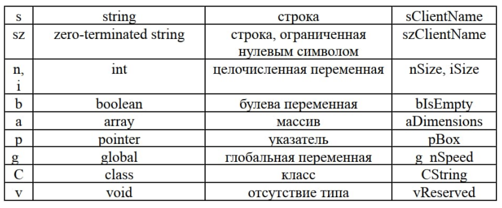
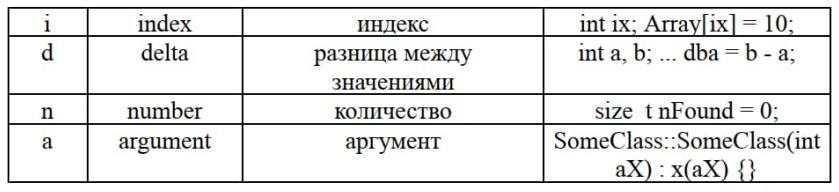
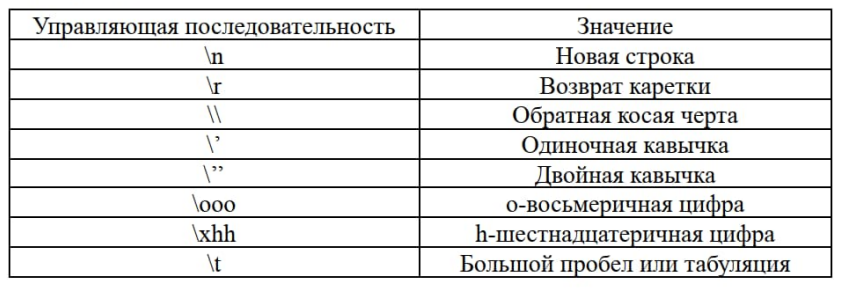
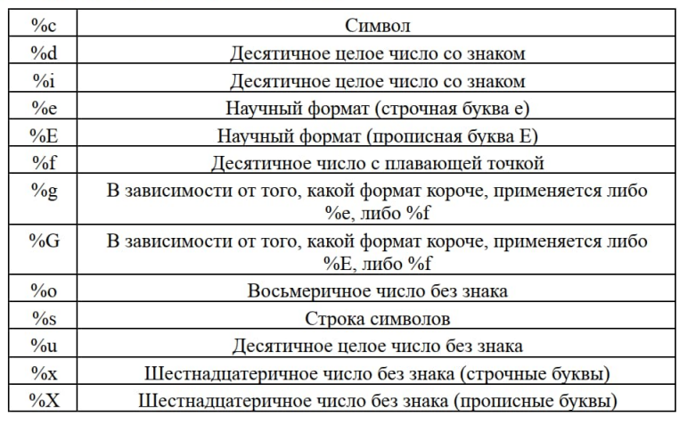
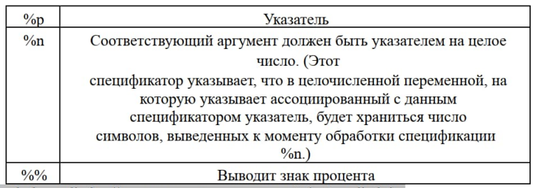

# Прикладной курс C++ для инженеров в среде QT

## Предисловие

Всё находится в памяти.

Память правильно называется адресным пространством.

У каждой запущенной программы есть своя собственная виртуальная память, как будто собственная оперативка.

Объём у нее фиксированный, например, у 32 битных программ — это 4 гб, у 64 битных до 16 эксабайт (максимально возможных).

Когда программа обращается к какому-то адресу, процессор смотрит, этому адресу соответствует часть физической памяти?<br>
Если да, то туда и обращается, если нет, то приостанавливает исполнение программы и отправляет соответствующее уведомление операционной системе.<br>
Операционная система решает, что делать, например, если этому адресу ничего не соответствует, потому что соответствующая страница была выгружена в так называемый файл подкачки (это файл, в который ОС выгружает неиспользованные данные чтобы освободить место для используемых данных), то ОС подгружает эту страницу обратно в оперативку, регистрирует её по тому месту, куда программа обратилась и возобновляет выполнение программы.<br>
Если в этом месте ничего нет, потому что программа там ничего не выделяла, то ОС завершает работу программы с ошибкой.<br>
Есть и другие варианты развития событий, но все остальное тоже происходит логично, хотя пока мы не изучили базовые понятия их объяснение будет за рамками понимания начинающего — мы изучим всё, что нужно позже.

*Важный факт: один и тот же адрес в адресном пространстве разных
программ может соответствовать разному адресу физической памяти.*

## Из чего состоит C++

Язык C++ состоит из токенов (аналог слов).

**Токены** (`tokens`) состоят из символов (`characters`), бывают буквенными, цифровыми и знаковыми. Токены собираются в предложения, программисты называют предложения (`statements`) заявлениями или утверждениями. А после, заявления формируют программу.

*Важный Факт: программистам приходится работать с высоким уровнем
абстракций, поэтому в разных источниках встречаются разные определения одного и того же понятия, но в разном контексте. Программа = функция = метод = процедура = инструкции = классы = операторы = скрипты.*

Чтобы научиться программировать на С++, нужно знать примерно 73 токена (есть ещё некоторое количество синонимов к стандартным токенам, придуманные для бюрократической чистоты, но при этом программистами часто не используются) и так же мы можем придумывать свои, так называемые, идентификаторы.

*Токены делятся на операторы, ключевые слова, идентификаторы, пунктуаторы и литералы.*

**Операторы** (`operator`) — инициируют процесс вычислений и выглядят как символы.

**Ключевые слова** (`keywords`) — помогают программе понять, как считывать информацию, в каком формате ее воспринимать, в какой последовательности исполнять (код исполняется сверху вниз, но есть возможность перескакивать выше или ниже по коду).

**Идентификаторы** (`identifiers`) - токены придуманные программистом могут содержать буквы и цифры, должны начинаться с буквы или с `_`, идентификаторы используют для возможности через них вызывать заранее описанную сущность (заранее описанный кусок кода разнообразного функционала — по сути объект в памяти).

**Пунктуаторы** (`punctuators`) — знаки препинания. Используются для верстки кода, чтобы было понятно, что с чем читать и как интерпретировать.

**Литералы** (`literals`) — нужны чтобы вставить конкретное значение в код. Например, `true` и `false` (`boolean`), которые будут поняты как `1` и `0`. Литералом может быть цифра (`numeric`), символ (`character`) или даже строка (`string`), например, чтобы вывести «Hello World», мы используем литерал в формате строки. То есть строка текста, которую нужно вывести — это тоже литерал. Мы можем придумывать свои литералы (например, стандартные километры можно конвертировать в мили).

Еще нужно выучить 7 **типов конструкций** с правилами их построения. Много времени уйдёт на то, чтобы начать думать абстракциями — мы не привязываемся к железу (нет вкл/выкл лампочки или мотора), но есть процессы, которые ссылаются на механизмы виртуальных черных ящиков изучать каждый из которых нецелесообразно (это могут быть драйвера или библиотеки — сказать однозначно сложно).

**Заявления** (`statement`) — это «типы конструкций», их делят на:

+ **Декларации** (`declaration statement`) - выделяем память и называем её, чтобы потом обращаться к этой памяти по придуманному имени.
+ **Нулевые** (`null statement`)- просто требуются, когда писать ничего не нужно, но нужно соблюсти порядок. Используется. когда несколько раз повторяется блок (в **цикле**). Все, что нужно делать в теле, уже происходит в условии.
+ **Выражения** (`expression statement`) - функция, которая принимает некоторое количество значений на вход и после исполнения дает значение на выходе.
+ **Составные** (`compound statement`) - используются, когда нужно использовать сразу несколько заявлений, как единый блок.

Важный факт: внутри составных заявлений находится свое пространство
имен, определяемое областью видимости {`scope`}: когда мы используем фигурные скобки `{}`, объявленные идентификаторы (придуманные программистом), могут иметь значение, отличающееся от значения этого же идентификатора вне фигурных скобок, вне составного утверждения.

+ **Заявления о выборе** (`selection statement`) - выполняют тест, потом одну часть кода, если результат истинный (ненулевой), и другую часть кода, если результат теста ложный (нулевой).
+ **Итерации** (`iteration statement`) - выполняют тест и повторяют выполнение кода, пока результат теста истинный (ненулевой).
+ **Заявления о прыжках** (`jump statement`) - управление последовательностью исполнения кода.

## Заключение

По умолчанию код исполняется сверху вниз — это **следование**.

Если есть условие исполнения кода, то в зависимости от ситуации мы исполняем одну или другую часть кода — это **ветвление**.

Если какую-то часть кода нужно повторять до получения определённого
результата — это **цикл**.

## О среде разработки (редакторе) Qt Creator

Мы можем писать код в командной строке windows, но это не удобно — попробуйте сами! Для этого нужно зажать клавиши `win + r` и в открывшемся окне написать `cmd`, а потом нажать ок.

Дальше вам понадобится создать файл — сделать это, и всё остальное из необходимого вы можете путём написания команд в консоли, при желании их можно «загуглить».

В Qt Creator напротив, писать команды не нужно — есть кнопки. удобный интерфейс для отладки, инструмент дополнения кода (дописывает недостающее за вас) и инструменты для проверки ошибок. Так же в редакторе Qt уже есть все стандартные библиотеки языка и библиотеки Qt (библиотеки Qt и редактор Qt Creator это разные вещи).

В среде разработки Qt программа создается в окне Редактора. Здесь мы пишем **исходный код**.

Дальше происходит этап **компиляции**.

Программа автоматически **линкуется**, и мы получаем `*.exe` файл.

Файл запускается (зеленый треугольник внизу слева), или запускается с отладчиком (остановка в тех местах, где нужно посмотреть промежуточное состояние исполнения программы), или просто собирается в исполнительный файл `*.ехе` (молоточек).

В папке проекта появляется несколько файлов:

+ `*.pro` — файл проекта;
+ `*.срр` — исходный код программы;
+ `*.h` — код заголовочных файлов;
+ `*.ui` — файл, содержащий форму (графическое исполнение окна исполняемой программы);
+ `*.user` - конфигурация самого редактора для данного проекта;

После компиляции. в отдельной папке, которая создается рядом с
проектом:

+ `*.о` — объектные файлы, содержащие фрагменты машинного кода для последующей сборки.

Также в папке вы можете увидеть файлы Makefile, Makefile.Debug и Makefile.Release.

Makefile — это скрипт (алгоритм) исполнения всего, что происходит на этапе сборки программы.

В видеоматериалах вы найдёте примеры по данной теме.

Длц желающих изучать материал или часть материала углублено, есть вторая часть методички — далее по тексту.

## 1. Из чего состоит код

Программа на С++ состоит из набора инструкций. Каждая инструкция (statement) выполняет определенное действие.

Текст программы на языке C++ состоит из маркеров и пробелов. Токен — это наименьший элемент на C++, который имеет значение для компилятора.

Средство синтаксического анализа C++ распознает следующие виды токенов:

+ **Ключевые слова** — это предварительно определенные зарезервированные идентификаторы, имеющие специальные значения.<br>
Их нельзя использовать в качестве идентификаторов в программе.

+ **Идентификаторы** — это последовательность символов, используемая для обозначения одного из следующих элементов:
  + Имени объекта или переменной
  + Имени класса, структуры или объединения
  + Имени перечисленного типа
  + Члена класса, структуры, объединения или перечисления
  + Функции или функции члена класса
  + Имени определения типа (typedef)
  + Имени метки
  + Имени макроса
  + Параметра макроса
+ **Числовые, логические литералы и константы указателей**
+ **Строковые и символьные литералы**
+ **Пользовательские литералы**
+ **Инструкции** – инструкция (оператор, statement) заставляет программу выполнять какое-либо действие.
+ Символы пунктуации

Маркеры обычно разделяются пробелом, что может быть одним или
несколькими:

+ Пустые значения
+ Символы горизонтальной и вертикальной табуляции
+ Символы перевода строки
+ Веб-каналы форм
+ Комментарии

## 1.1. Ключевые слова

Актуальный список ключевых слов:

+ alignas
+ alignof
+ asm
+ auto
+ bool
+ break
+ case
+ catch
+ char
+ char16_t
+ char32_t
+ class
+ const
+ constexpr
+ const_cast
+ continue
+ decltype
+ default
+ delete (для управления памятью, для функций)
+ do
+ double
+ dynamic_cast
+ else
+ enum
+ explicit
+ export
+ extern (как спецификатор объявления, в спецификации привязки, для шаблонов)
+ false
+ float
+ for
+ friend
+ goto
+ if
+ inline (для функций, для пространств имен, для переменных)
+ int
+ long
+ mutable
+ namespace
+ new
+ noexcept
+ nullptr
+ operator
+ private
+ protected
+ public
+ register
+ reinterpret_cast
+ return
+ short
+ signed
+ sizeof
+ static
+ static_assert
+ static_cast
+ struct
+ switch
+ template
+ this
+ thread_local
+ throw
+ true
+ try
+ typedef
+ typeid
+ typename
+ union
+ unsigned
+ using (для переопределения имени, для псевдонима пространства имен, для псевдонима типа)
+ virtual (для функций, для базовых классов)
+ void
+ volatile
+ wchar_t
+ while

Маркеры `and`, `and_eq`, `bitand`, `bitor`, `compl`, `not`, `not_eq`, `or`, `or_eq`, `xor` и `xor_eq` альтернативные вариантов написания `&&` , `&=` , `&` , `|` , `~` , `!` , `!=` , `||` , `|=` , `^` и `^=` , соответственно. Стандарт не рассматривает их как ключевые слова, но они являются ключевыми словами для всех целей, их невозможно переопределить или использовать для обозначения чего-либо другого, кроме операторов, которые они представляют.

## 1.2. Идентификаторы

Имя переменной (или функции, типа или другого типа элемента) называется идентификатором. С++ дает большую гибкость для именования идентификаторов по вашему желанию. Однако есть несколько правил,которые при именовании идентификаторов необходимо соблюдать:

+ идентификатор не может быть ключевым словом (ключевые слова зарезервированы);
+ идентификатор может состоять только из букв (нижнего или верхнего регистра), цифр и символов подчеркивания. Это означает, что имя не может содержать другие символы (кроме подчеркивания) или пробельные символы (пробелы или табуляции);
+ идентификатор должен начинаться с буквы (нижний или верхний регистр) или символа подчеркивания, он не может начинаться с цифры;
+ С++ чувствителен к регистру и, таким образом, различает строчные и прописные буквы (`nvalue` отличается от `nValue` и от `NVALUE`).

Следующие символы можно использовать в качестве любого символа идентификатора:

>_ a b c d e f g h i j k l m n o p q r s t u v w x y z A B C D E F G H I J K L M N O P Q R S T U V W X Y Z

Следующие символы могут быть любым символом в идентификаторе, кроме первого:

>1 2 3 4 5 6 7 8

Имена идентификаторов, начинающиеся с заглавной буквы, обычно используются для определяемых пользователем типов (таких как структуры, классы и перечисления).

Если имя переменной или функции состоит из нескольких слов, существует два распространенных соглашения: разделение слов подчеркиванием (называемое `snake case`, «змеиная нотация») и написание последующих слов с заглавной буквы (называемое `camelCase`, «верблюжья нотация», поскольку заглавные буквы выступают, как горбы на верблюде).

```cpp
int variable_name; // (разделены подчеркиванием / snake case) int
myVariableName; // (с заглавными буквами / CamelCase)
```

Но существует и еще одно соглашение, благодаря которому можно писать более читаемый код в сжатые сроки.

Еще во времена разработки первых версий DOS, доктор Чарльз Симонии представил соглашение об именах идентификаторов, в котором для указания функционального назначения объекта, представленного идентификатором, используется добавление префикса к имени идентификатора.

Данная система является широко используемым внутренним стандартом фирмы Microsoft. Причиной для этого является то, что префиксы к именам делают просмотр исходных текстов и спецификаций более простым.

Название **"Венгерская нотация"** появилось из-за того, что имена переменных как бы написаны на иностранном языке, и сам доктор Симонии родом из Венгрии.

При введении нового идентификатора в программу, хороший программист учитывает следующие факторы:

+ Мнемоническое значение: идентификатор должен легко запоминаться.
+ Смысловое значение: роль идентификатора должна быть ясна из его названия.
+ Преемственность: часто рассматривается как чисто эстетическая идея, но все же, похожие объекты должны иметь похожие идентификаторы.
+ Скорость решения: придумывание, ввод и редактирование идентификатора не должны занимать слишком много времени, идентификатор не должен быть слишком длинным.

Данное соглашение об идентификаторах обеспечивает удобную технологию для формирования имен, удовлетворяющих вышеупомянутым критериям.

Основной идеей является передача основных характеристик идентификатора как части в его названии.

**Предлагаются следующие правила обозначения:**

1) Описание характеристики идентификатора входит в идентификатор.<br>
Удобной пунктуацией является указание характеристики перед названием, с разделением их (началом названия с большой буквы в Си, например: `rowFirst`: `row` - характеристика, `First` - название).
2) Название отличают идентификаторы, имеющие один и тот же тип и существующие в одном контексте. Контекстом может являться как система в целом, так и блок, процедура, структура данных в зависимости от среды программирования. Если существует стандартное название, оно должно быть использовано. Выбор должен быть максимально простым, так как требуется уникальность идентификатора только в пределах определенного контекста.
3) Простые типы названы короткими тегами, которые выбраны программистом. Такие теги должны быть интуитивно понятны большинству программистов.

**Пример префиксов, задающих тип:**



**Пример семантических префиксов:**



## 1.3. Литералы

**Литерал** — это элемент программы, который непосредственно представляет значение. Например, есть литералы для создания символа, строки, вещественных чисел, и т.д.

```cpp
'x';  // character
"some"; // c-style string
7.2;  // float
74u;  // unsigned int
74l;  // long
0xF8;   // hexadecimal number
```

Литералы можно использовать во многих контекстах, но наиболее часто они используются для инициализации именованных переменных и для передачи аргументов в функции.

**Целочисленные литералы** начинаются с цифры и не имеют дробных частей или экспонент. Целочисленные литералы можно указать в десятичной, двоичной, восьмеричной или шестнадцатеричной форме.

Чтобы указать *десятичный* целочисленный литерал, начинайте спецификацию с любой цифры, кроме нуля. Пример:

```cpp
int i = 157; // Decimal literal
```

Чтобы указать *восьмеричный* целочисленный литерал, начинайте спецификацию с нуля, за которым следует ряд цифр в диапазоне от 0 до 7.

Цифры 8 и 9 при указании восьмеричного литерала будут ошибками. Пример:

```cpp
int i = 0377 // Octal literal
```

Чтобы указать *шестнадцатеричный* целочисленный литерал, начните спецификацию с 0х или 0Х (регистр «х не важен), за которым следует последовательность цифр в диапазоне от 0 до 9 и a (или A) до f (или F).

Шестнадцатеричные цифры от a (или A) до f (или F) представляют собой значения в диапазоне от 10 до 15. Пример:

```cpp
int i = 0х3fff; // Hexadecimal literal
```

*Двоичный* литерал можно задать с помощью префикса 0B или 0b и последовательности, состоящей из 1 и О:

```cpp
auto x = 0B001101 // int
```

Чтобы указать тип без знака, используйте либо `u` суффикс, либо `U`.
Чтобы указать тип long, используйте либо суффикс `l`, либо `L`.

Для указания 64-разрядного целочисленного типа используется суффикс `LL` или `ll`. Пример:

```cpp
unsigned val_1 = 328u; // Unsigned value long
val_2 = 0x7FFFFFL; // Long value specified unsigned
long val_3 = 0776745ul; // Unsigned long value auto
val_4 = 108LL: // signed long long
auto val_4 = 0x8000000000000000ULL << 16; // unsigned long long
```

Литералы с плавающей запятой задают значения, которые должны иметь дробную часть. Эти значения содержат десятичные разделители `.` и могут содержать экспоненты. Литералы с плавающей запятой имеют значащим, который указывает значение числа. Они имеют показатель степени, который указывает величину числа. И имеют необязательный суффикс, указывающий тип литерала. Значащим указывается как последовательность цифр, за которыми следует точка, за которой следует дополнительная последовательность цифр, представляющая дробную часть числа. Пример:

```cpp
18.46
38.
```

Если указан показатель степени, он задает порядок числа в виде степени 10. Пример:

```cpp
18.46e0 // 18.4
18.46e1 // 184.
```

Показатель степени можно указать с помощью `e` или `E` , который имеет то же значение, за которым следует необязательный знак (`+` или `-`) и последовательность цифр. Если указан показатель степени, десятичная точка в конце целых чисел не требуется, например `18E0`

Литералы с плавающей запятой по умолчанию имеют тип `double`.

Используя суффиксы или `OR` `fl` (`FL`) литерал можно указать как float или long double.

Хотя long double и double имеют одинаковое представление, они имеют разные типы. Например, можно использовать перегруженные функции, такие как:

```cpp
void func (double);
void func (long double);
```

**Логические литералы**. Логические значения представляют собой два литерала: `true` и `false`.

```cpp
bool t = true;
bool f = false;
```

**Литерал ссылочного типа**, адрес в памяти — обычно, числовые литералы, указывающие на ячейку в памяти.

С++ вводит `nullptr` литерал для указания нулевого инициализированного указателя. В переносимом коде `nullptr` следует использовать вместо целочисленного типа нуля или макросов, таких как `NULL` или аналог, например `NIL`, `None`, `Nothing` — ссылка никуда не ведёт либо объект отсутствует.

**Строковый литерал** представляет последовательность символов, которые вместе образуют строку с завершающим нулем. Символы должны быть заключены в двойные кавычки.

В С++ поддерживаются различные типы строк и символов, а также доступны различные способы выражения значений литералов каждого из этих типов. В исходном коде содержимое символьных и строковых литералов выражается с помощью кодировки. Универсальные имена символов и позволяют представить любую строку, используя только основную кодировку исходного кода. Необработанные строковые литералы позволяют не использовать escape - символы и могут применяться для выражения всех типов строковых литералов.

```cpp
const char *narrow = "abcd";
```

**Символьный литерал** состоит из символьной константы. Он представляется символом, заключенным в одинарные кавычки.

Существует пять типов символьных литералов:

+ Обычные символьные литералы пша char, например 'а'
+ Символьные литералы UTF-8 типа char (char8_t в `с++ 20`), например `u8'а'`
+ Расширенные символьные литералы типа `wchar_t`, например `L'a'`.
+ Символьные литералы UTF-16 типа `char16_t`, например `u'а'`
+ UTF-32 символьные литералы типа `char32_t`, например `U'a'`.

Символ, используемый для символьного литерала, может быть любым символом, за исключением символов обратной косой черты ( `\` ), одинарной кавычки (`'`) или новой строки.

Зарезервированные символы можно указывать с помощью ecape-последовательности.

Символьные литералы кодируются по-разному в соответствии с их префиксом.

+ Символьный литерал без префикса является обычным символьным литералом. Значение обычного символьного литерала, содержащего один символ, или универсальное имя символа, которое может быть представлено в наборе символов выполнения, имеет значение, равное числовому значению его кодировки в наборе символов выполнения.
+ Символьный литерал, начинающийся с `L` префикса, является литералом расширенных символов. Значение литерала расширенных символов, содержащего один символ, или ecape-последовательность или универсальное имя символа, имеет значение, равное числовому значению его кодировки в наборе расширенных символов выполнения, если только символьный литерал не имеет представления в наборе расширенных символов выполнения, в этом случае значение определяется реализацией.
+ Символьный литерал, начинающийся с `u8` префикса, является символьным литералом UTF8. Значение символьного литерала UTF-8, содержащего один символ, или универсальное имя символа, имеет значение, равное значение его кодовой точки ISO 10646, если оно может быть представлено в одной единице кода UTF-8 (соответствующее элементам управления С0 и основному регистру символов латиницы). Если значение не может быть представлено одной единицей кода UTF-8, программа неправильно сформирована.
+ Символьный литерал, начинающийся с `u` префикса, является символьным литералом UTF 16. Значение символьного литерала UTF-16, содержащего один символ, ecape-последовательность или универсальное имя символа, имеет значение, равное значению его кодовой точки ISO 10646, если оно может быть представлено одной единицей кода UTF-16 (соответствующей базовой многоязыковой плоскости). Если значение не может быть представлено одной единицей кода UTF-16, программа неправильно сформирована.
+ Символьный литерал, начинающийся с `U` префикса, является символьным литералом UTF32. Значение символьного литерала UTF-32, содержащего один символ, или ecape-последовательность универсальное имя символа, имеет значение, равное значению кодовой точки ISO 10646. Символьный литерал в кодировке UTF-32, содержащий более одного символа, или ecape-последовательность универсального имени символа, имеет неправильный формат.

Примеры управляющих последовательностей:



Существует три вида ecape-последовательностей: простая, восьмеричная и шестнадцатеричная.

+ Восьмеричная ecape-последовательность — это обратная косая черта, за которой следует последовательность из одной до трех восьмеричных цифр. Восьмеричная ecape-последовательность завершается на первом символе, который не является восьмеричной цифрой, если он встречается раньше, чем третья цифра. Наибольшее возможное восьмеричное значение — `\377`.
+ Шестнадцатеричная ecape-последовательность — это обратная косая черта, за которой следует символ `x`, за которым следует последовательность из одной или нескольких шестнадцатеричных цифр. Начальные нули пропускаются. В обычном или U8 символьном литерале самое высокое шестнадцатеричное значение — `0xFF`. В расширенном символьном литерале с префиксом `L` или `u` максимальное шестнадцатеричное значение — `0xFFFF`. В расширенном символьном литерале с префиксом `U` максимальное шестнадцатеричное значение — `0xFFFFFFFF`

```cpp
#include <iostream>
using namespace std;

int main() {
  cout << "Hello\tWorld\n\n"
  return 0
}
```

После компиляции представленного кода получаем:

```cpp
Hello World
```

Обратная косая черта (`\`) — это символ продолжения строки, когда он помещается в конец строки. Если символ обратной косой черты требуется использовать как символьный литерал, необходимо ввести две косые черты подряд (`\\`)

```cpp
#include <iostream>
using namespace std;

int main() {
  char backslash = '\\';
  return 0
}
```

Новый стандарт предлагает средства для создания пользовательских литералов. Существует две категории пользовательских литералов: сырые литералы (**raw**) и литералы для встроенных типов (**cooked**).

Стоит, однако, заметить, что С++ позволяет создавать только литералы-суффиксы. Иными словами, создать литералы префиксы (как, например, `0х`), или префиксно-суффиксные (как `""`) — не получится.

Например, предположим, что у вас есть Distance класс. Вы можете определить литерал для километра, а другой — для миль, и порекомендовать пользователю явно указать единицы измерения, написав: `auto d = 42.0_km` или `auto d =42.0_mi`. Нет преимуществ в производительности или недостатков для пользовательских литералов; они предназначены в первую очередь для удобства или для выведения типа во время компиляции.

Начнем с литералов для встроенных типов. Чтобы создать литерал для численных типов необходимо воспользоваться одной из двух сигнатур:

```cpp
// сигнатура литерала для целочисленных типов
OutputType operator "" _suffix(unsigned long long);
// сигнатура литерала для вещественных типов
OutputType operator "" _suffix(long double);
```

Использование литерала будет осуществляется следующим образом:

```cpp
42_suffix; // OutputType operator "" _suffix(unsigned long long);
42.24_suffix; // OutputType operator "" _suffix(long double);
```

Обратите внимание на сигнатуры:

+ Литерал для целых чисел в качестве аргумента принимает `unsigned long long`.
+ Литерал для вещественных чисел в качестве аргумента принимает `long double`.

Сигнатура сырого литерала выглядит следующим образом:

```cpp
OutputType operator "" _suffix(const char* literalString);
```

Этот тип литералов приходит на помощь тогда, когда входное число надо разобрать посимвольно. Т.е. в этом случае число передается в оператор как строка.

## 1.4. Символы пунктуации

Символы пунктуации в С++ имеют синтаксическое и семантическое значение для компилятора, однако сами по себе не указывают на операцию, которая позволяет получить значение. Некоторые символы пунктуации (по отдельности или в сочетании) могут также быть операторами С++ или иметь значение для препроцессора.

К символам пунктуации относятся следующие:

>! % ^ & * ( ) - + = { } | ~ [ ] \ ; ' " < > ? , . / #

## 1.5. Комментарии

Сразу стоит обратить внимание на то, что комментарии обязательны. Чтобы не винить себя в будущем, стоит серьезно отнестись к их написанию, насколько бы легким код ни казался сейчас.

**Комментарий** — это текст, который предназначен для программистов и не обрабатывается компилятором. Обычно комментарии используются для создания заметок к коду для дальнейшего использования. <br>
Компилятор обрабатывает их как пробел. Комментарии можно использовать для тестирования, чтобы сделать определенные строки кода неактивными.

Комментарии в C++ записываются одним из следующих способов:

+ Символы `/*` (косая черта и звездочка), за которыми следует любая последовательность символов, включая переводы строки, после чего ставятся символы `*/` Это тот же синтаксис, который используется в ANSI С.
+ Символы `//` (две косые черты), за которыми следует любая последовательность символов. Символ перевода строки, непосредственно перед которым нет обратной косой черты, завершает комментарий, оформленный таким способом. Поэтому такие комментарии часто называют однострочными.

Символы, используемые для оформления комментариев (`/*`, `*/` и `//`), не имеют специального значения внутри символьной константы, строкового литерала, или комментария. Однако вложение комментариев, оформленных первым способом, не допускается.

В С++ существуют всего два типа комментариев:

+ **Однострочные комментарии** - используется для комментирования в рамках одной строки

```cpp
int main() { // функция main
}
```

Структура данного комментария выглядит следующим образом: сначала мы начинаем комментарий с двух слешей `//` после которых следует любой текст до конца строки.

В данном примере мы добавили пояснение к стандартной функции main. В своих же программах вы можете использовать более развернутое описание для каждой из функций (ведь не всегда можно понять назначение функции лишь по ее названию).

+ **Многострочные комментарии** - нужны для комментирования больших (или не очень) участков текста. Главное отличие многострочных комментариев — это возможность закомментировать
сразу несколько строк

```cpp
#include <iostream>
using namespace std;

int main() {

  /*
  Функция main.
  Автоматически вызывается
  вместе с программой
  */
  return 0;
}
```

Многострочный комментарий начинается с `/*`. После идет любой текст, который и будет комментарием. Заканчивается комментарий на символах `*/`. Посредством комментирования можно описать работу программы в целом и пояснить отдельные строки кода.

```cpp
/*
Программа lesson.cpp
выводит на экран сообщение
Hello!
I am new program
*/
#include <iostream>
using namespace std

// функция main

int main() { 
  cout << "Hello!" << endl; // Первая строка сообщения
  cout << "I am new program" << endl; // Вторая строка программы
  return 0; // возвращаем код 0
}
```

## 1.6. Область

При объявлении программного элемента, такого как класс, функция или переменная, его имя может быть ”видимым” и использоваться в определенных частях программы. Контекст, в котором отображается имя, называется его областью действия. Например, если объявить переменную x внутри функции х она будет видна только в теле этой функции. У вас могут быть другие переменные с одним и тем же именем в программе; пока они находятся в разных областях, они не нарушают правило одного определения и не вызывают ошибку.

Существует шесть видов областей:

+ **Глобальная область**. Глобальное имя — это объявление, объявленное вне любого класса, функции или пространства имен. Однако в С++ даже эти имена существуют с неявным глобальным пространством имен. Область глобальных имен расширяется с точки объявления до конца файла, в котором они объявляются. Для глобальных имен видимость также регулируется правилами компоновки, которые определяют, является ли имя видимым в других файлах программы.
+ **Область пространства имен**. Имя, объявленное в пространстве имен вне любого класса или определения перечисления или блока функции, видимо от его точки объявления до конца пространства имен.<br>
Пространство имен может быть определено в нескольких блоках для
разных файлов.
+ **Локальная область**. Имя, объявленное внутри функции, или лямбда-выражения, включая имена параметров, имеет локальную область. Они часто называются ”локальными”. Они видны только от их точки объявления до конца функции или тела лямбда-выражения.
+ **Область класса**. Имена членов класса имеют область класса, которая расширяется по всему определению класса независимо от точки объявления. Доступность членов класса дополнительно контролируется с помощью `public` `private` `protected` ключевых слов.
+ **Область инструкции**. Имена, объявленные в `if` `while` операторе или `switch` видимы до конца блока инструкции.
+ **Область действия функции**. Метка имеет область видимости функции, что означает, что она видна в теле функции, даже до ее точки объявления. Область функции позволяет писать инструкции `goto` `cleanup`, например перед `cleanup` объявлением метки.

В С++ каждое имя имеет свою область видимости, вне которой оно не существует. Область может быть определена многими способами: она может быть определена пространством имен, функциями, классами и просто `{}`.

Таким образом, пространство имен, глобальное или иное, определяет область видимости. Глобальное пространство имен относится к использованию `::`, и считается, что символы, определенные в этом пространстве имен, имеют глобальную область видимости. По умолчанию символ существует в глобальном пространстве имен, если он не определен внутри блока, начинающегося с ключевого слова `namespace`, или он является членом класса или локальной переменной функции:

```cpp
int a; // a определено  в глобальном пространстве имен
//это означает что его область действия глобальна, оно существует повсюду
```

```cpp
namespace N
{
  int a; // а определено в неглобальном пространстве имен под названием 'N'
  // вне N его не существует
}
```

Также обратите внимание, что имя может быть скрыто внутренней областью видимости, определяемой пространством имен, функцией или классом.

Таким образом, имя а внутри пространства имен N скрывает имя а в глобальном пространстве имен. Таким же образом имя в функции и классе скрывает имя в глобальном пространстве имен.

## 1.7. Функция main и printf

Каждая программа на языке С++ должна иметь как минимум одну функцию - функцию `main()`. Именно с этой функции начинается выполнение приложения. Ее имя `main` фиксировано и для всех программ на Си всегда одинаково.

Функция также является блоком кода, поэтому ее тело обрамляется фигурными скобками, между которыми определяется набор инструкций.

В частности, при создании первой программы использовалась следующая
функция `main`:

```cpp
#include <iostream> // подключаем заголовочный файл iostream
int main() // определяем функцию main
{ // начало функции
  std::cout << "Hello World!"; // выводим строку на консоль
  return 0; // выходим из функции
} // коней функции
```

`Main` функция не имеет объявления, так как она встроена в язык.

И наконец для того, чтобы выводить информацию на экран, обратимся к
**printf**.

Функция форматированного вывода `printf` получает в качестве аргументов строку формат и аргументы, которые необходимо вывести в соответствии с форматом, и возвращает число выведенных символов.

Функция `printf()` записывает в поток `stdout` свои аргументы в соответствии с форматной строкой `format`.

Строка `format` может содержать элементы двух видов. К первому относятся символы, подлежащие выводу на экран. Ко второму виду — спецификаторы формата, определяющие способ представления аргументов на экране.

Спецификаторы формата начинаются со знака процента, за которым следует код формата. Количество аргументов должно точно совпадать с количеством спецификаторов формата, причем их порядок следования должен быть одинаковым.

Функция `printf()` возвращает число реально выведенных символов. Если функция возвратит отрицательное значение, то это будет свидетельствовать о наличии ошибки.

Спецификаторы формата функции printf():





```cpp
#include <stdio.h>  // подключаем заголовочный файл stdio.h
int main()          // определяем функцию main
{                   // начало функции
  printf("Hallo World!"); // выводим строку на консоль
}                   // конец функции
```

Представленный код будет выводить надпись "Hello World".

Так как надпись выводится всего на долю секунды, попробуем ее задержать, подключив еще одну библиотеку:

```cpp
#include <stdio.h>  // подключаем заголовочный файл stdio.h
#include <conio.h>  // подключаем заголовочный файл conio.h
int main()          // определяем функцию main
{                   // начало функции
  printf("Hallo World!"); // выводим строку на консоль
  getch();          // позволяет считать символ с компьютера
}                   // конец функции
```

Таким образом выведенное изображение будет оставаться на экране до тех пор, пока не будет нажата какая-либо клавиша на клавиатуре.

```cpp
#include <stdio.h>
int main() {
  int a = 1000;
  printf("a = %d; a*3 = %d!", a, a * 3);
}
```

Здесь с помощью `%d` мы добавили целое число п произвели над ним
математическое действие.

```cpp
#include <stdio.h>
int main() {
  printf("Hello!\n");
  int a =2022;
  printf("year%d", a);
}
```

Здесь мы используем все ту же переменную а, но с помощью `printf` мы ее вывели как «year».

Спецификатор преобразования `%g` или `%G` указывает, что функции `printf()` необходимо выбрать один из спецификаторов: `%f` или `%e`. В результате `printf()` выберет тот спецификатор преобразования, который позволяет сделать самый короткий вывод.

Если нужно, чтобы при выборе экспоненциального формата буква `Е` отображалась на верхнем регистре, используйте спецификатор преобразования `%G`; в противном случае используйте спецификатор преобразования `%g`.

```cpp
#include <stdio.h>

int main(void) {
  double f;
  for(f = 1.0; f < 1.0e+10; а = а * 10);
  printf("%g ", f);
  return 0;
}
```

```sh
1 10 100 1000 10000 100000 1e+006 1e+007 1e+008 1e+009
```

Целые числа без знака можно выводить в восьмеричном или шестнадцатеричном формате, используя спецификатор преобразования `%о` или `%х`. Так как в шестнадцатеричной системе для представления чисел от 10 до 15 используются буквы от A до F, то эти буквы можно выводить на верхнем или на нижнем регистре. Как показано ниже, в первом случае используется спецификатор преобразования `%Х`, а во втором — спецификатор преобразования `%х`:

```cpp
#include <stdio.h>

int main(void) {
  unsigned num;
  for (num = 0; num < 16; num++) {
    printf("%o ", num);
    printf("%x ", num);
    printf("%X\n", num);
  }

  return 0;
}
```

```sh
0 0 0
1 1 1
2 2 2
3 3 3
4 4 4
5 5 5
6 6 6
7 7 7
10 8 8
11 9 9
12 a A
13 b B
14 c C
15 d D
16 e E
17 f F
```

Функция `printf()` является мощным инструментом для вывода чисел и чего-нибудь еще, хранимого в переменных. При незначительном изучении сложность может быть развернута в простые возможности, включающие `width` (ширина поля вывода), `precision` (точность), `signage` (управление выводом знака), `justification` (выравнивание) и `fill` (заполнение пустых мест поля вывода). Если распознать и понять эти возможности, то `printf()` становится удобным и надежным помощником при выводе значений на печать.

## Глоссарий

**Инструкция или оператор** (`statement`) — наименьшая автономная часть языка программирования; команда или набор команд. Программа обычно представляет собой последовательность инструкций.

**Литерал** — запись в исходном коде компьютерной программы, представляющая собой фиксированное значение. Литералами также называют представление значения некоторого типа данных.

**Управляющая последовательность** (исключённая последовательность, экранированная последовательность, от англ. escape sequence) — совокупность идущих подряд значащих элементов, в группе теряющих для обрабатывающего механизма свое индивидуальное значение с одновременным приобретением этой группой нового значения. Образование управляющих последовательностей представляет собой логическое кодирование. В большинстве случаев этим термином обозначают соответствующие последовательности текстовых символов.

**printf** — обобщённое название семейства функций или методов стандартных или широко известных коммерческих библиотек, или встроенных операторов некоторых языков программирования, используемых для форматного вывода — вывода в различные потоки значений разных типов, отформатированных согласно заданному шаблону

**stdio.h** (от англ. standard input/output header — стандартный заголовочный файл ввода-вывода) - заголовочный файл стандартной библиотеки языка Си, содержащий определения макросов, константы и объявления функций и типов, используемых для различных операций стандартного ввода и вывода.

**Conio.h** (от англ. console input-output — консольный ввод-вывод) — этот заголовочный файл объявляет несколько библиотечных функций для работы с «консольным вводом и выводом» программы.
