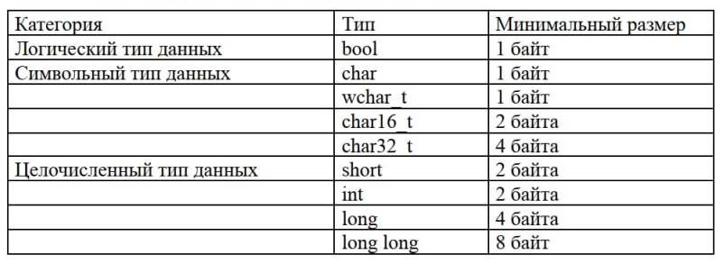
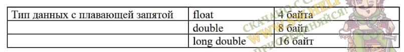
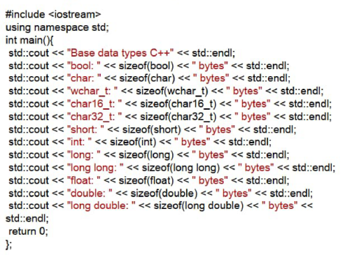
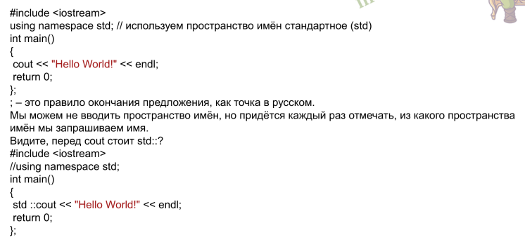
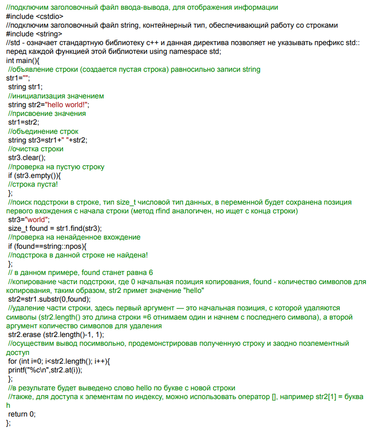

# 02. Что есть в коде?

## Простые типы данных

В С++ имеется небольшое количество простых типов данных, причем они являются числовыми.

Простые данные можно разделить на несколько видов:

+ целочисленные;
+ вещественные;
+ символьные;
+ логические.

Целочисленные данные могут быть представлены в знаковой и беззнаковой форме.

Беззнаковые целые числа представляются в виде последовательности битов в диапазоне от 0 до 2n-l, где п-количество занимаемых битов.

Знаковые целые числа представляются в диапазоне -2n-l...+2п-1-1. <br>
При этом старший бит данного отводится под знак числа (0 соответствует положительному числу, 1 — отрицательному).

Целочисленный тип для представления целых чисел — это тип данных `int`.<br>
Благодаря приставкам `short`, `long`, `unsigned` появляется некоторое разнообразие типов данных `int`, различающихся размером занимаемой памяти и (или) диапазоном принимаемых значений.

*Приставки целочисленных типов* Данных:

+ `short` — приставка укорачивает тип данных, к которому применяется, путём уменьшения размера занимаемой памяти;
+ `long` — приставка удлиняет тип данных, к которому применяется, путём увеличения размера занимаемой памяти;
+ `unsigned` (без знака) — приставка увеличивает диапазон положительных значений в два раза, при этом диапазон отрицательных значений в таком типе данных храниться не может.

**Вещественный тип** предназначен для представления действительных чисел.

Вещественные числа представляются в разрядной сетке машины в нормированной форме.

Нормированная форма числа предполагает наличие одной значащей цифры (не 0) до разделения целой и дробной части. Такое представление умножается на основание системы счисления в соответствующей степени. Например, число 12345,678 в нормированной форме можно представить как:

$12345,678 =  1,2345678 * 10^4$

Число 0,009876 в нормированной форме можно представить как:
$0,009876 = 9,876 * 10^{-3}$

В двоичной системе счисления значащий разряд, стоящий перед разделителем целой и дробной части, может быть равен только 1. В случае если число нельзя представить в нормированной форме (например, число 0), значащий разряд перед разделителем целой и дробной части равен 0.

**Символьный тип** хранит код символа и используется для отображения символов в различных кодировках. Символьные данные задаются в кодах и,по сути, представляют собой целочисленные значения. Для хранения кодов символов в языке Си используется тип `char`.

Тип данных `char` — это целочисленный тип данных, который используется для представления символов. То есть, каждому символу соответствует определённое число из диапазона [0;255]. Тип данных `char` также ещё называют символьным типом данных, так как графическое представление символов в С++ возможно благодаря `char`.

Для представления символов в C++ типу данных `char` отводится один байт, в одном байте — 8 бит, тогда возведем двойку в степень 8 и получим значение 256 — количество символов, которое можно закодировать. Таким образом, используя тип данных `char` можно отобразить любой из 256 символов.

**Логический** тип применяется в логических операциях, используется при алгоритмических проверках условий и в циклах и имеет два значения:

+ истина — `true`
+ ложь — `false`

В программе должно быть дано объявление всех используемых данных с указанием их имени и типа. Описание данных должно предшествовать их использованию в программе.

Язык с++ гарантирует только их минимальный размер:





Фактический размер переменных может отличаться на разных архитектурах, поэтому для его определения используют оператор `sizeof`.

**Оператор sizeof** — это унарный оператор (с одним операндом), который вычисляет и возвращает размер определенной переменной или определенного типа данных в байтах.

Напишем программу, которая отобразит реальные размеры разных типов данных на той архитектуре, где она будет скомпилирована и запущена:

+ Создадим проект в QT, при создании выберем «Проект без Qt — Приложение на языке С++»
+ В main.cpp запишем следующий код:



```cpp
#include <iostream>

using namespace std;

int main() {

  cout << "Base data types C++" << endl;
  cout << "bool: " << sizeof(bool) << " bytes" << endl;
  cout << "char: " << sizeof(char) << " bytes" << endl;
  cout << "wchar_t: " << sizeof(wchar_t) << " bytes" << endl;
  cout << "char16_t: " << sizeof(char16_t) << " bytes" << endl;
  cout << "char32_t: " << sizeof(char32_t) << " bytes" << endl;
  cout << "short: " << sizeof(short) << " bytes" << endl;
  cout << "int: " << sizeof(int) << " bytes" << endl;
  cout << "long: " << sizeof(long) << " bytes" << endl;
  cout << "long long: " << sizeof(long long) << " bytes" << endl;
  cout << "float: " << sizeof(float) << " bytes" << endl;
  cout << "double: " << sizeof(double) << " bytes" << endl;
  cout << "long double: " << sizeof(long double) << " bytes" << endl;

  return 0;
}
```

```sh
Base data types C++
bool: 1 bytes
char: 1 bytes
wchar_t: 2 bytes
char16_t: 2 bytes
char32_t: 4 bytes
short: 2 bytes
int: 4 bytes
long: 4 bytes
long long: 8 bytes
float: 4 bytes
double: 8 bytes
long double: 16 bytes
```

## Директивы (команды) препроцессора

Препроцессор читает текст и выполняет команды путём подмены текста.

Всего существует 12 директив. Пока что рассмотрим З из них:

`#include` — вставляет текст из указанного файла (библиотеки)

`#define` — задаёт макроопределение (макрос) или символическую константу (заменяем кусок кода простым названием, который препроцессор сам заменяет дальше по коду)

`#undef` — отменяет предыдущее определение (используется крайне редко)

`#` — команды препроцессора начинаются с этого символа (те, которых 12 штук).

Используя команду препроцессора, мы можем включить библиотеку `iostream` (input output stream) — библиотека ввода-вывода:

```cpp
#include <iostream>
```

Примечание: Директивы занимают всю строку - это значит, что символы `;` `{}` и всё остальное мы в этой строчке не пишем, иначе это будет частью директивы и ничего не сработает.

## Библиотеки. Заголовочные файлы

Стандартные С++ библиотеки представляют собой наборы функций, констант, классов, объектов и шаблонов, которые расширяют язык С++, предоставляя базовую функциональность для выполнения различных задач, таких как:

+ классы для взаимодействия с операционной системой
+ контейнеры данных
+ манипуляторы для работы с этими данными
+ наиболее используемые алгоритмы.

Все элементы стандартных библиотек C++ распределены по различным заголовочным файлам (заголовкам), которые являются основным способом подключения к программе типов данных, структур, прототипов функций, перечисляемых типов и макросов, используемых в другом модуле. По умолчанию используется расширение `.h`; иногда для заголовочных файлов языка С++ используют расширение `.hpp`.

Прежде чем ваша программа сможет использовать какую-нибудь библиотеку функций, она должна включить соответствующий заголовок.

Для этого, в заголовочном файле программы необходимо добавить `#include` `<имя библиотеки>` если библиотека расположена в системе, либо `#include` `"имя библиотеки.h"` (или `#include` `"имя библиотеки.hpp"`), если файл расположен вместе с исходниками программы.

**Примечание:** ничего не случится, если всё будет помечено (`<`) или (`"`), но если будет помечено соответствующе скорость компиляции будет выше.

Также можно включить библиотеку непосредственно в файл исходного кода программы, аналогичным образом.

Файлы с одинаковым названием могут быть в разных местах одновременно:

+ одни находятся в папке проекта, а другая их версия в системной папке, мы можем запросить одну из них по необходимости.

Разберем простейшую демонстрационную программу "Hello World!". Она автоматически генерируется в окне QT, если при Создании проекта выбрать "Проект без QT — Приложение на языке С++"



```cpp
#include <iostream>

using namespace std;

int main() {

  cout << "Hello World!"<< endl;
  
  return 0;
}

```ch
Hello World!
```

`;` — это правило окончания предложения, как точка в русском.

Мы можем не вводить пространство имён, но придётся каждыЙ раз отмечать, из какого пространства имён мы запрашиваем имя.

Видите, перед `cout` стоит `std::`?

```cpp
#include <iostream>

// using namespace std;

int main() {
  
  std::cout << "Hello World!" << std::endl;

  return 0;
}
```

Также мы превратили `using namespace std` в комментарий, используя два слэша `//` после этих символов компилятор ничего не читает (пропускает), но только в рамках одной строки. Это удобно использовать, когда надо временно «выключить» кусок кода.

**int main()** — главная функция и с неё начинается исполнение программы. Её вызывает система и то, что получит система это `int` (целочисленный тип данных).

**{}** — эти символы отделяют блоки кода и определяют локальное пространство имён. Это начало тела функции и конец тела функции, когда мы будем объявлять переменные, мы поговорим о локальных пространствах имён и картинка сложится.

**return 0** — это команда закончить текущую функцию и вернуть значение вызывающей функции. Конкретно для функции **main** в консоли будет написано (завершился с кодом 0).

**Стандартная Библиотека** включает в себя коллекцию классов и функций, написанных на базовом языке. Наибольшей частью стандартной библиотеки С++ является библиотека `STL` (Standard Template Library).

Библиотека STL содержит пять основных видов компонентов:

+ **контейнер** (`container`): управляет набором объектов в памяти;
+ **итератор** (`iterator`): обеспечивает для алгоритма средство доступа к содержимому контейнера;
+ **алгоритм** (`algorithm`): определяет вычислительную процедуру;
+ **функциональный объект** (`function object`): инкапсулирует функцию в объекте для использования другими компонентами;
+ **адаптер** (`adaptor`): адаптирует компонент для обеспечения различного интерфейса.

Из определения контейнера следует, что любая пользовательская структура данных является контейнером. В нашем случае контейнеры - стандартные структуры данных, такие как список (`list`), вектор (`vector`), словарь (map) и многие другие.

Формальные требования к контейнерам довольно обширны, но основным является правило доступа к элементам. Доступ к элементам контейнера осуществляется через специальные объекты — итераторы (см. ниже). Вы можете не знать, как располагаются элементы контейнера в памяти, однако вы точно знаете, что итераторы можно перебрать последовательно, и каждый из них предоставит доступ к элементу.

Также `STL` предлагает ряд классов и функций (функторов), которые преобразуют интерфейс к нужному.

Ниже приведены стандартные библиотеки языка программирования С++, а
также нестандартные функции:

+ **bitset** — это специальный класс-контейнер, который предназначен для хранения битовых значений (элементы этого контейнера могут иметь значения: 0 и/или 1, истина или ложь).<br>
Класс `bitset` очень похож на обычный массив, но, в отличии от массива, под каждый элемент объекта типа `bitset` отводится всего один бит, то есть пространство в памяти, которое занимают битовые маски максимально оптимизировано. Что позволяет использовать память в восемь раз меньше, чем наименьший элементарный тип данных в С++ — `char`. Что очень бывает полезно при оперировании с большим количеством переменных-дискретных сигналов (например, при связи с ПЛК)
+ Заголовочный файл `cctype` содержит функции обработки символов. <br>
Эта библиотека объявляет набор функций для выполнения различных классификаций и некоторых операций преобразования отдельных символов.<br>
Все функции, определённые в заголовочном файле `cctype` принимают в качестве аргумента значение типа `int` (эквивалент одного символа) и возвращают целое число, которое является эквивалентом символа, либо значением, которое представляет логическое значение:
  + целочисленное значение 0 - ложь, и
  + целочисленное значение, отличное от 0 - истина.
+ `fstream` — заголовочный файл из стандартной библиотеки С++, включающий набор классов, методов и функций, которые предоставляют интерфейс для чтения/записи данных из/в файл. Для манипуляции с данными файлов используются объекты, называемые потоками (`stream`).<br>
Функции, включенные в данный файл, позволяют производить чтение из файлов как побайтово, так и блоками, и записывать так же. В комплект включены все необходимые функции для управления последовательностью доступа к данным файлов, а также множество вспомогательных функций.
+ Заголовочный файл `cstdio` обеспечивает выполнение операций ввода/вывода.<br>
Операции ввода/вывода в С++ могут быть выполнены, с использованием Стандартной библиотеки ввода/вывода (`cstdio` в С++, и `stdio.h` в Си). Эта библиотека использует так называемые потоки для работы с физическими устройствами, такими как клавиатуры, принтеры, терминалы или с любыми другими типами файлов, поддерживаемых системой.
+ Заголовочный файл `csignal` - Си библиотека для обработки сигналов. <br>
Некоторые работают в среде программирования, где используются сигналы для информирования о запущенных процессах и возникновении определенных событий. Появление этих событий может быть связано с ошибками выполнения программного кода, например, неправильное использование арифметических операций, или возникновение исключительных ситуаций, таких как запрос на прерывание программы.
+ Заголовочный файл `ctime` (`time.h`). Эта библиотека содержит функции для работы со временем и датой в С++.
+ Библиотека `cmath` определяет набор функций для выполнения общих математических операций и преобразований.
+ `Conio.h` — заголовочный файл, используемый в старых компиляторах, работающих в операционных системах MS-DOS, для создания текстового интерфейса пользователя. Тем не менее, он не является частью языка программирования Си, стандартной библиотеки языка Си, ISO С или требуемой стандартом POSIX. Этот заголовочный файл объявляет несколько библиотечных функций для работы с «консольным вводом и выводом» программы.
+ `alloc.h` - эта функция не определена стандартом ANSI С. Функция `farcoreleft()` возвращает число байт памяти, остающейся свободной в куче.

Рассмотрим в качестве примера работу с заголовочным файлом `<string>` который реализует работу с одноименным классом и служит для гораздо более удобной работы со строками, нежели нуль-терминированные Си строки.

Напишем демонстрационную программу, в которой будут использованы наиболее часто используемые возможности класса `string`.



```cpp
// подключим заголовочный файл ввода-вывода, для отображения информации
#include <cstdio>

// подключим заголовочный файл string, контейнерный тип, обеспечивающий работу
// со строками
#include <string>

// std - означает стандартную библиотеку с++ и данная директива позволяет не
// указывать префикс std:: перед каждой функцией этой библиотеки
using namespace std;

int main() {
  // объявление строки (создается пустая строка) равносильно записи string
  // str1="";
  string str1;

  // инициализация значением
  string str2 = "hello world!";

  // присвоение значения
  str1 = str2;

  // объединение строк
  string str3 = str1 + " " + str2;

  // очистка строки
  str3.clear();

  // проверка на пустую строку
  if (str3.empty()) {
    // строка пуста!
  };

  // поиск подстроки в строке, тип size_t числовой тип данных, в переменной
  // будет сохранена позиция
  //  первого вхождения с начала строки (метод rfind аналогичен, но ищет с конца
  //  строки)

  str3 = "world";
  size_t found = str1.find(str3);

  // проверка на ненайденное вхождение
  if (found == string::npos) {
    // подстрока в данной строке не найдена!
  };

  // в данном примере, found станет равна 6
  // копирование части подстроки, где 0 начальная позиция копирования, found -
  // количество символов для
  // копирования, таким образом, str2 примет значение "hello"

  str2 = str1.substr(0, found);

  // удаление части строки, здесь первый аргумент — это начальная позиция, с
  // которой удаляются символы (str2.length() это длина строки =6 отнимаем один
  // и начнем с последнего символа), а второй аргумент количество символов для
  // удаления

  str2.erase(str2.length() - 1, 1);
  // осуществим вывод посимвольно, продемонстрировав полученную строку и заодно
  // поэлементный доступ

  for (int i = 0, total = str2.length(); i < total; ++i) {
    printf("%c\n", str2.at(i));
  };

  // в результате будет выведено слово hello по букве с новой строки
  // также, для доступа к элементам по индексу, можно использовать оператор [],
  // например str2[1] = буква h
  return 0;
};
```

```sh
h
e
l
l
o
```
