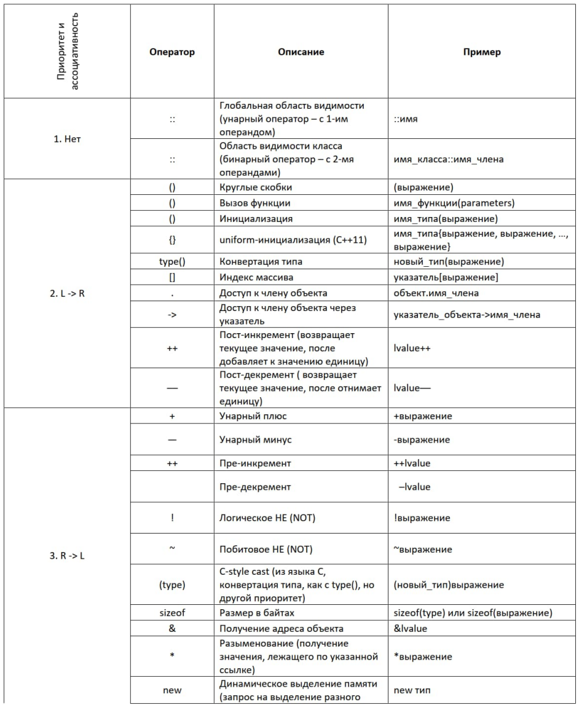
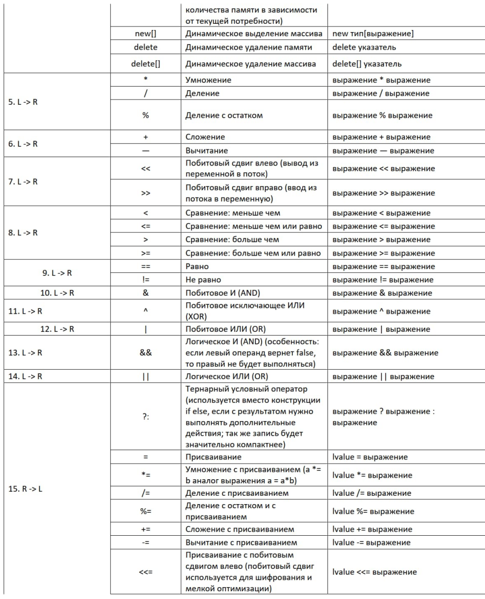
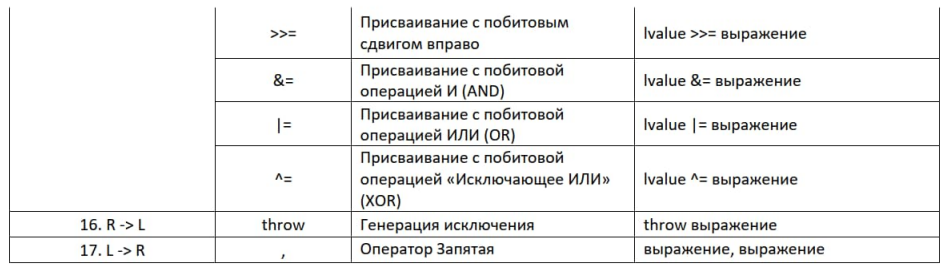

# 07.Файловая система

Мы изучили достаточное для целей курса количество теоретического материала. Для эффективной работы осталось вооружить вас списками и таблицами, которые вы сможете использовать как шпаргалки.

## Литералы

Когда мы передаем системе какие-то значения, мы должны быть уверены, что система правильно интерпретирует наши данные. Для этих целей к значению прибавляют префиксы и постфиксы – это составные части литерала, как приставка и окончание слова в правилах русского языка.

Префикс (располагается слева от значения; бывают только системные, свои придумать нельзя) – указывает на систему счисления для цифр и кодировку для текста.

Пример с числом 44853:

```cpp
44853; //без префикса означает десятичную систему исчисления
0127465; //префикс 0 означает восьмеричную систему исчисления
0xAF35; //префикс 0x означает шестнадцатеричную систему исчисления
0b1010111100110101; //префикс 0b означает бинарную систему исчисления
```

Постфикс (располагается справа от значения) – указывает тип данных. Поскольку типы данных можно придумать свои, то и постфикс можно определить свой.

Пример:

```cpp
23455; //без постфикса используется тип int
214748364754; //если значение не помещается в тип int, используется long long
24568U; //постфикс U или u определяет unsigned литерал
34254L; //постфикс L или l определяет long литерал
69424LL; //постфикс LL или ll определяет long long литерал
45322ULL; //постфикс ULL или ull определяет unsigned long long литерал
36'000'000; //Литералы можно разделять для читаемости (компилятор автоматически вырежет) одинарными кавычками, даже так: 36'000.12'3e2'2;
```

Дробные литералы, варианты записи:

```cpp
123.; 123.0; //Должны иметь разделитель точку (отделяет целую часть от дробной).
1.e2; 1.23e2; //Могут иметь суффикс e (отделяет экспоненциальные часть/мантиссу (10^)/показатель степени)
1.e2L; 1.23e2L; //Могут иметь постфикс L или l (определяет long double литерал)
```

**Символьные литералы:**

Для того, чтобы машина понимала символьные литералы, используют таблицы соответствия символов и кодировок. Таблица с необходимыми для написания кода символами называется ASCII, а расширенная, для вставки текста – Unicode.

ASCII – таблица кодировки (первые 128 символов стандарта Unicode совпадают, а еще 128 символов локализации отличаются). есть общая таблица и таблица локализации по стране (для России (cp866 – code page 866)).

Unicode – стандарт кодирования символов, включающий в себя знаки почти всех письменных языков мира

```cpp
'a'; //Один символ является char
'ab'; 'abc'; 'abcd'; //Литерал от 2 до 4 символов является int
u8'a'; //Символьные литералы UTF-8 типа char ( char8_t в c++ 20)
L'a'; //Расширенные символьные литералы типа wchar_t
u'a'; //Символьные литералы UTF-16 типа char16_t
U'a'; //UTF-32 символьные литералы типа char32_t
```

Escape последовательности 2 и более символов заменяется заменяется на соответствующее значение:

```cpp
'\x9abc'; //шестнадцатеричная запись
'\567'; //восьмеричная запись
'\u0041'; //4-значная кодовая точка Юникода
'\U00000041'; //8-значная кодовая точка Юникода
'\n'; //новая строка
'\r'; //возврат каретки
'\t'; //горизонтальная табуляция
'\v'; //вертикальная табуляция
'\b'; //BACKSPACE
'\"'; //двойная кавычка
'\0'; //нуль-символ
'\f'; //Смена страницы
'\a'; //оповещение (колокольчик)
'\''; //одинарная кавычка
'\\'; //обратная косая черта
```

Для разделения и переноса текста в коде, для удобства просмотра, используют такую форму записи:

```cpp
"hello" "world"; // – операция склеивания объектов линейной структуры
 "hello \
world";// – многострочная запись
```

**Литералы – ключевые слова:**

```cpp
true, false; // Булевы константы ИСТИНА и ЛОЖЬ
nullptr; // Литерал указателя, указывает на нулевой (недопустимый) адрес
```

Пример создания своего постфикса, если в программе нужно переводить мили в километры:

```cpp
long double operator "" _mi(long double val)
{
  const auto km_per_mile = 1.609344L;
  return km_per_mile * val;
};
```

## Операторы

Операторы бывают простые и специальные.

+ Простые:
  + присвоение (assignment),
  + увеличение и уменьшение числа на единицу (increment decrement),
  + арифметические (arithmetic),
  + логические (logical),
  + сравнение (comparison),
  + доступ к члену (member access),
  + другие (other).

**Ассоциативность** – очередность вычисления выражений справа и слева от оператора.
**Приоритет** – очередность исполнения операторов относительно друг друга.





## Домашнее задание

Повторить программу из симулятора датчика, регулятора и ШИМ, как в видео, 1 в 1. Затем, сделать вторую программу, которая открывает полученный файл и анализирует его.

1. Определяет максимальный выбег перерегулирования за уставку.<br>
Т. е. когда температура первый раз превысила уставку нужно определить, какое отклонение в плюс и в минус было максимальным от этого момента до конца работы программы.
2. Определяет количество разворотов тренда.<br>
Т. е. когда контролируемая величина (температура) меняет характер изменения. Т. е. если росла и стала падать — это засчитывается за 1 разворот тренда. Если падала и стала расти — это ещё 1.
3. Определить время выхода на уставку, Для этого необходимо взять точки разворота тренда из пункта 2 и определить, в какой наиболее ранний момент разница между верхней точкой перелома и нижней стала меньше 3-х С.
4. Результат нужно выводить в консоль.
