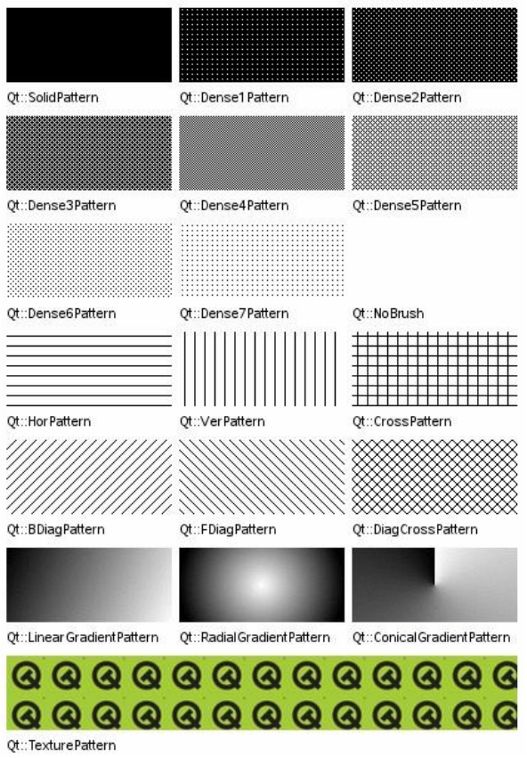

# Рисование в QT. Работа с графикой

В Qt имеется возможность рисовать различные графические элементы. Для этого используется класс `QPainter`. Он может рисовать всё: от простых линий до сложных геометрических фигур по типу секторов, дуг окружностей, многоугольников и т. д.

Рисование объектов на виджетах может производится в методе перерисовки

```cpp
paintEvent(QPaintEvent *);
```

Который всегда вызывается при создании виджета, а также всякий раз, когда нужно перерисовать его внешний вид (например, мы растянули/сжали окно, и вместе с этим изменили размеры нашего виджета).

## Подготовка

Для начала подключим в заголовочный файл:

```cpp
#include <QPainter>
```

Затем, в редакторе форм расположим в окне компоновку (горизонтальную или вертикальную это не важно), и преобразуем ее в QFrame (ПКМ на компоновке → `Преобразовать в` → `Qframe`), для удобства, изменим имя объекта в свойстве `objectName` на «`screen`»

В дальнейшем отрисовка графики и будет происходить на этом виджете.

Определим этот слот в заголовочном файле

```cpp
private slots:
    void paintEvent(QPaintEvent *event);
```

И в файле исходнике опишем этот слот:

```cpp
//отрисовка экрана
void MainWindow::paintEvent(QPaintEvent *event){
};
```

В дальнейшем, последующий код работы с графикой будет размещаться в этом слоте.

## Объявим объекты

```cpp
QPainter painter(this);
```

*Примечание:* параметр указывает на устройство отрисовки и this означает, что работа объекта будет распространяться на область MainWindow

```cpp
QPen pen;
```

`QPen` определяет, как должен `QPainter` рисовать линии и контуры фигур. Имеет следующие основные методы:

**setColor(QColor color)** - задает нужный цвет линии.

*Примечание 1:* цвет в Qt представлен классом `QColor` по умолчанию цвет задается в цветовом пространстве RGB (R красная составляющая от 0 до 255, где 255 максимальная интенсивность, G зеленая составляющая и B - синяя) с альфа-каналом (прозрачность), если параметр альфа канала не указывается, то по умолчанию ему присваивается значение 255 — полная не прозрачность,

```cpp
QColor::QColor ( int r, int g, int b, int a = 255 )
```

Например, установка цвета пера (`pen`) в зеленый цвет:

```cpp
pen.setColor(QColor(0,255,0));
```

*Примечание 2:* также в Qt есть несколько цветовых констант для более быстрой установки одного из основных цветов:

+ QColor:
  + `Qt::white`,
  + `Qt::black`,
  + `Qt::red`,
  + `Qt::darkRed`,
  + `Qt::green`,
  + `Qt::darkGreen`,
  + `Qt::blue`,
  + `Qt::darkBlue`,
  + `Qt::cyan`,
  + `Qt::darkCyan`,
  + `Qt::magenta`,
  + `Qt::darkMagenta`,
  + `Qt::yellow`,
  + `Qt::darkYellow`,
  + `Qt::gray`,
  + `Qt::darkGray`,
  + `Qt::lightGray`,
  + `Qt::color0` (нулевой пиксель),
  + `Qt::color1` (не-нулевой пиксель) и
  + `Qt::transparent` (чистый прозрачный цвет (т.е., `QColor(0, 0, 0, 0)`)),
  
цвета color0 и color1 это специальные цвета для рисования битовых карт на `QBitmaps`

**setWidth(int width)** — задает толщину линий в виде целого числа.

**setStyle()** - устанавливает стиль линии.

*Примечание:* может принимать следующие значения констант

+ `Qt::SolidLine` - сплошная линия,
+ `Qt::DashLine` пунктирная,
+ `Qt::DotLine` линия из точек,
+ `Qt::DashDotLine` пунктир точка,
+ `Qt::DashDotDotLine` две точки пунктир и
+ `Qt::CustomDashLine` свой вариант начертания и для его использования необходимо определить собственный шаблон:
  + `QPen::setDashPattern ( const QVector<qreal> & pattern )`

Шаблон должен быть задан чётным числом положительных значений, где значения с номерами 1, 3, 5... - это длины штрихов, а с номерами 2, 4, 6... длины пропусков.

*Например:*

```cpp
QPen pen;
QVector<qreal> dashes;
qreal space = 4;
dashes << 1 << space << 3 << space << 9 << space << 27 << space << 9 << space;
pen.setDashPattern(dashes);
```

Образец линии пера задается в единицах толщины пера;

**setCapStyle()** - устанавливает стиль окончаний определяет, как будут отрисовываться окончания линий.

*Примечание:* может принимать следующие константные значения:

+ `Qt::SquareCap` - определяет квадратное окончание и закрывает конечную точку другой линии на половину от ширины.
+ Стиль `Qt::FlatCap` определяет квадратное окончание и не закрывает конечную точку другой линии.
+ А `Qt::RoundCap` определяет скруглённое окончание.

По умолчанию стоит `Qt::SquareCap`.

**SetJointStyle()** - стиль соединений определяет, как будет происходить соединение двух линий.

*Примечание:* может принимать следующие константные значения:

+ `Qt::BevelJoin` - определяет, что линии будут соединяться напрямую.
+ Стиль `Qt::MiterJoin` расширяет линии до пересечения под углом.
+ А стиль `Qt::RoundJoin` соединяет линии дугой, вписанной в угол между линиями.

По умолчанию используется `Qt::BevelJoin`.

**setBrush ( const QBrush &brush )** - устанавливает кисть, используемую пером для заполнения форм (иными словами заливка областей сформированных QPen)

*Примечание:* объект класса `QBrush` имеет два наиболее часто используемых метода:

+ `setColor()` (метод аналогичен подобному в QPen) и
+ `setStyle()` - который задает стиль заполнения области (по умолчанию стоит Qt::NoBrush, т. е. По умолчанию заполнение областей не производится), может принимать следующие значения:



Рассмотрим еще один важный метод QPainter

**QPainter::setViewport( int x, int y, int width, int height );** - установка пространства для отображения графики.

*Примечание:* Для чего он нужен? По умолчанию, без объявления пространства вывода, QPainter будет работать со всей областью окна, а не только ранее объявленного фрейма `srceen`, что приведет к выводу графики и за пределами `screen`, мы бы могли конечно учитывать координаты фрейма и вносить корректировки при выводе, однако установка области вывода избавит нас от подобных манипуляций.

Установим область вывода внутри `screen`:

```cpp
painter.setViewport(ui->screen->geometry().x(), ui->screen->geometry().y(), ui->screen->geometry().width(), ui->screen->geometry().height());
```

## Методы рисования примитивов QPainter

Рассмотрим наиболее часто используемые методы рисования

**drawPoint ( int x, int y )** - рисует точку по координатам x,y

*Примечание:* также для указания координат можно использовать класс `QPoint` задание координат которой осуществляется методами `setX(int x)` и `setY(int y)`

Также, существует метод `drawPoints ( const QPolygon &points )` который выводит несколько точек. Принимает объект класса `QPolygon` наиболее простая аналогия `Qvector<QPoint>` и имеет схожие методы записи/считывания элементов (например `push_back()`).

**drawLine ( int x1, int y1, int x2, int y2 )** - рисует линию начиная от `x, y` до `x1, y1` также координаты могут быть заданы двумя `QPoint`

*Примечание:* методом `drawLines ( QPolygon &points )` можно вывести несколько линий, в полигоне точки будут обрабатываться парами первая точка начало линии, вторая конец, третья точка начало второй линии… и.т.д.

**drawRect ( int x, int y, int width, int height )** - рисует прямоугольник от `x, y` с шириной `width` и высотой `height`

**drawPolygon ( const QPolygon & points, Qt::FillRule fillRule = Qt::OddEvenFill )** - рисует многоугольник.

*Примечание:* метод принимает объект класса `QPolygon` (т.е. массив точек). Второй параметр `FillRule` - определяет, какой метод должен быть использован, чтобы заполнить контуры и многоугольники.<br>
Может принимать значение `Qt::OddEvenFill` (Определяет, что область заполняется используя правило нечетности. С этим правилом, мы определяем находится ли точка внутри заполняемой области используя следующий метод. Рисуется горизонтальная линия от точки до места, находящегося вне заполняемой области, и подсчитывается количество пересечений этой линии с границами заполняемой области. Если количество пересечений нечетно, значит, точка находится внутри области.<br>
Это режим по умолчанию.) и `Qt::WindingFill` (Определяет, что область заполняется используя правило ненулевой кривой. С этим правилом, мы определяем находится ли точка внутри заполняемой области используя следующий метод. Рисуется горизонтальная линия от точки до места, находящегося вне заполняемой области. Определяем направление линии в каждой точке пересечения или вверх или вниз.<br>
Порядок кривой определяется путем суммирования направлений каждого пересечения. Если количество не нулевое, значит, точка находится внутри области. Этот режим заполнения, в большинстве случаев, может также рассматриваться как пересечение закрытых областей.)

**drawEllipse ( int x, int y, int width, int height )** - выводит эллипс где x,y — верхние левые координаты прямоугольника в который вписан эллипс, с шириной width и высотой height (разумеется, если ширина=высоте, то будет окружность)

*Примечание:* вместо x, y можно использовать `QPoint`

**drawArc ( int x, int y, int width, int height, int startAngle, int spanAngle )** - выводит дугу аналогичен `drawEllipse` плюс принимает значения начального угла и конечного.

**drawChord ( int x, int y, int width, int height, int startAngle, int spanAngle )** - выводит хорду, аналогичен drawArc но начало и конец дуги соединяются прямой.

**drawPie ( int x, int y, int width, int height, int startAngle, int spanAngle )** - выводит сектор круга, аналогичен `drawArc` но начало и конец дуги соединяются линиями от центра

**drawText ( int x, int y, int width, int height, int flags, const QString & text, QRect *boundingRect = 0 )** - вывод текста.

*Примечание:* параметры координат обычны, параметр `flags` может принимать следующие (наиболее часто используемые) значения:

+ `Qt::AlignLeft` - выравнивание по левому краю.
+ `Qt::AlignRight` - выравнивание по правому краю.
+ `Qt::AlignJustify` - заполнение текстом всего доступного пространства.
+ `Qt::AlignTop` - выравнивание по верхнему краю.
+ `Qt::AlignBottom` - выравнивание по нижнему краю.
+ `Qt::AlignCenter` - центрирование в обоих измерениях.

параметр `text` — содержит строку для вывода,

`boundingRect` - (если не null) устанавливается равным тому, каким должен быть ограничивающий прямоугольник, чтобы охватить весь текст. Это может быть полезно, чтобы узнать, помещается ли весь текст в необходимую область.

**setFont ( const QFont & font )** - устанавливает шрифт для метода `drawText`

*Примечание:* использует объект класса `QFont ( const QString & family, int pointSize = -1, int weight = -1, bool italic = false )`, где

+ `family` имя шрифта в системе, например "Times",
+ `pointSize` - размер шрифта,
+ `weight` — толщина шрифта константы
  + `Qfont::Light`,
  + `Qfont::Normal`,
  + `Qfont::DemiBold`,
  + `Qfont::Bold`,
  + `Qfont::Black`,

где `Light` самое тонкое начертание, а `Black` — самое жирное и `italic` — написание курсивом или нет

## Преобразования и трансформации

При отрисовке сцены часто необходимо прибегнуть к преобразованиям нарисованных объектов или групп объектов. Рассмотрим основные способы как это сделать.

**QPainter::save()** - сохраняет текущее состояние, это необходимо, чтобы после преобразований легко вернуться к прежним настройкам (системы координат, масштабирования, поворота координат...)

**QPainter::translate ( const QPoint & offset )** - осуществляет изменение положения нулевой точки системы координат, это необходимо, например хотим повернуть нарисованный объект, но вращение будет рассчитываться от центра координат, поэтому перед тем как вращать объект (систему координат) необходимо задать центр вращения.

**QPainter::scale ( qreal sx, qreal sy )** - масштабирование системы координат, увеличивает или уменьшает масштаб. По горизонтали (sx) и вертикали (sy)

**QPainter::rotate ( qreal angle )** - вращение системы координат на угол angle, если значение положительное, то вращение по часовой стрелке на угол в градусах, если отрицательное — против часовой.

**QPainter::restore ()** - метод обратный от `save()`, восстанавливает состояния на момент вызова метода `save()`

## Пример работы с QPainter

А теперь, напишем не сложную программу для закрепления материала, пусть, программа выводит на экран несколько геометрических объектов (квадрат, круг, многоугольник) при этом будут рассмотрены механизмы установки цвета контуров, заливки, эффекта прозрачности а также поворот фигуры

**На экране создания формы:**

1. размещаем на форме вертикальную компоновку, ПКМ на свободном месте формы → `скомпоновать по вертикали`
2. ПКМ на вертикальной компоновке → `преобразовать в QFrame`
3. в свойстве `objectName` объекта QFrame напишем `screen`

**В заголовочном файле:**

+ подключить библиотеку

```cpp
#include <QPainter>
```

+ создать секцию и описать слот отрисовки

```cpp
private slots:
    void paintEvent(QPaintEvent *event);
```

**В файле исходнике:**

+ описать функцию отрисовки

```cpp
//отрисовка экрана
void MainWindow::paintEvent(QPaintEvent *event){
    //инициализируем пэйнтер
    QPainter painter(this);
    //объект перо
    QPen pen;
    //объект кисть (заливка)
    QBrush brush;
    
    //ограничим вывод пэйнтера пределами виджета QFrame::screen
    painter.setViewport(ui->screen->geometry().x(),ui->screen->geometry().y(),ui->screen->geometry().width(),ui->screen->geometry().height());
    
    //нарисуем квадрат без заливки, со сторонами синего цвета
    pen.setColor(QColor(0,0,255));
    pen.setWidth(1);
    
    //применим настройки пера для пэйнтера
    painter.setPen(pen);
    
    //выведем фигуру
    painter.drawRect(0,0,100,100);
    
    //нарисуем круг частично перекрывающий квадрат с заливкой желтого цвета и окружностью черного, при этом половинной прозрачности
    pen.setColor(QColor(0,0,0,127));
    pen.setWidth(1);
    brush.setColor(QColor(255,255,0,127));
    brush.setStyle(Qt::SolidPattern);
    
    //применим настройки кисти для пэйнтера
    painter.setBrush(brush);
    painter.setPen(pen);
    painter.drawEllipse(50,50,100,100);
    
    //нарисуем многоугольник, в виде подобия стрелки, красного цвета заливки и черными контурами и развернем его на 30 градусов по часовой стрелке
    pen.setColor(QColor(0,0,0));
    pen.setWidth(1);
    brush.setColor(QColor(255,0,0));
    brush.setStyle(Qt::SolidPattern);
    painter.setBrush(brush);
    painter.setPen(pen);

    //зададим точки стрелки
    QPolygon polygon;
    polygon.push_back(QPoint( 20,20));
    polygon.push_back(QPoint(0,-20));
    polygon.push_back(QPoint(20,20));
    polygon.push_back(QPoint(0,0));
    
    //сохраним параметры сцены
    painter.save();
    
    //сместим центр координат на свободное место
    painter.translate(50,200);
    
    //повернем сцену
    painter.rotate(30);
    
    //отрисуем стрелку
    painter.drawPolygon(polygon);
    
    //восстановим состояние сцены
    painter.restore();
};
```

## Домашнее задание

1. Самостоятельно повторить программу из примера и попробовать разные настройки. Скидывать это ДЗ не обязательно.
2. Сделать программу, которая рисует окружность с заливкой в центре окна, и другую подобную окружность на некотором расстоянии от неё. Вторая окружность движется по кругу вокруг первой. Как планета вокруг своей звезды.<br>

Данное задание, как и вообще тема, не слишком большие по объёму, однако, именно сейчас нужно закрепить вот этот навык. В качестве дополнительных заданий, если вы хотите потренироваться в данной теме ещё, могу дать следующие доп. задания, чисто на практику:

1. Сделайте программу, которая реализует функцию справочника. Список фамилий в алфавитном порядке. По клику на каждую фамилию видно информацию об этом человеке, день рождения, контактные данные, может, какие-то личные заметки. Можно добавить подгружаемую фотографию.
2. Сделайте программу, которая отображает аналоговые часы с тремя стрелками и циферблатом. Стрелки показывают актуальное нынешнее время, обновляются раз в секунду.
