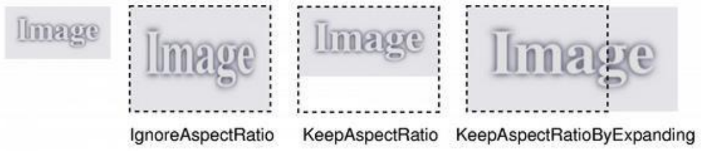

# 14. Работа с изображениями в QT

При работе с графикой часто возникает необходимость в загрузке, обработке, отображении и записи изображений. Для этих целей в Qt существует несколько классов работы с ними, такие как `QImage` и `QPixmap` они предлагают схожий функционал, но существуют отличия, когда лучше применять один класс, а когда другой:

1. Если вы планируете манипулировать изображением, изменять его, изменять пиксели на нем и т.д. используйте `QImage`;
2. Если вы планируете рисовать одно и то же изображение на экране несколько раз, преобразуйте его в формат `QPixmap`.

Кроме того, одним из важных отличий является то, что вы не можете создавать или управлять `QPixmap` чем-либо, кроме основного потока графического интерфейса. Однако вы можете создавать `QImage` экземпляры и управлять ими в фоновых потоках, а затем преобразовывать их после передачи обратно в поток графического интерфейса.

*Примечание:* Важно в промышленных условиях: `QPixmap` хранится на видеокарте, выполняющей отображение. Но не `QImage`. Поэтому, если у вас есть сервер, на котором выполняется приложение, и клиентская станция, выполняющая отображение, это очень важно с точки зрения использования сети. При использовании `Pixmap` перерисовка заключается в отправке по сети только команды на перерисовку (несколько байтов). С `QImage` он заключается в отправке всего изображения (около нескольких МБ).

## Загрузка изображений

Загрузка изображений из файла производится методом `load()`, например, для `QImage`:

```cpp
bool QImage::load ( const QString & fileName, const char * format = 0 )
```

Метод принимает имя файла для загрузки, а также необязательный параметр `format` — который может принимать значения формата файла, поддерживаются следующие форматы:

Format | Description | Qt's support
--- | --- | ---
BMP | Windows Bitmap | Read/write
GIF | Graphic Interchange<br>Format (optional) | Read
JPG | Joint Photographic<br>Experts Group | Read/write
JPEG | Joint Photographic<br>Experts Group | Read/write
PNG | Portable Network Graphics | Read/write
PBM | Portable Bitmap | Read
PGM | Portable Graymap | Read
PPM | Portable Pixmap | Read/write
XBM | X11 Bitmap | Read/write
XPM | X11 Pixmap | Read/write

Если параметр формата не указан, то метод сам определит, с чем работает.

Метод возвращает `true` в случае успешной загрузки изображения и `false`, если загрузка не удалась (например, неизвестный формат).

Класс `QPixmap` имеет аналогичный метод:

```cpp
bool QPixmap::load(const QString &fileName, const char *format = nullptr)
```

## Преобразование из QImage в QPixmap и обратно

При необходимости, возможно преобразовывать `QPixmap` в `QImage`, например, если требуется передать информацию куда-то вне основного потока графического интерфейса:

```cpp
QImage Qpixmap::toImage();
```

Вернет `null image` если преобразование не удастся.

Также есть и обратное преобразование, из `QImage` в `QPixmap`:

```cpp
QPixmap QPixmap::fromImage(const QImage &image, Qt::ImageConversionFlags flags = Qt::AutoColor)
```

*Примечание:* параметр `flags` позволяет принудительно задать тип входного изображения (глубина цвета, смешение альфа-канала и т.п.), по умолчанию метод сам определит, как действовать.

## Сохранение изображений

Для метода `QImage`:

```cpp
bool QImage::save(const QString &fileName, const char *format = nullptr, int quality = -1) const
```

*Примечание:* если `format = 0`, тогда метод использует формат, исходя из расширения файла в параметре `fileName`, параметр `quality` может принимать значения от 0 до 100 (0 сильно сжатые файлы малого размера, 100 качественные не сжатые файлы большого размера) при значении -1 будет использоваться значение по умолчанию.

Метод вернет `true` в случае успешного сохранения файла.

Класс `QPixmap` имеет аналогичный метод с такими же параметрами.

Вывод изображений:

Используя `QPainter`, мы можем выводить и `QImage` методом:

```cpp
void QPainter::drawImage(int x, int y, const QImage &image, int sx = 0, int sy = 0, int sw = -1, int sh = -1, Qt::ImageConversionFlags flags = Qt::AutoColor);
```

где `x`, `y` координаты верхней левой точки для вывода (на виджет), `sx`, `sy` координаты верхней левой точки изображения с которой начнется вывод (по умолчанию = 0), `sw`, `sh` ширина и высота участка для вывода (по умолчанию полный размер).

Вывод QPixmap:

```cpp
void QPainter::drawPixmap(int x, int y, const QPixmap &pixmap, int sx, int sy, int sw, int sh)
```

Параметры аналогичны выводу QImage.

## Методы модификации изображений

Методы, одинаковые и в `QImage` и `QPixmap`, поэтому будут рассматриваться без указания конкретного класса, кроме случаев, когда это необходимо.

```cpp
copy ( int x, int y, int width, int height );
```

Метод копирует прямоугольную область изображения, возвращая новый объект, содержимым которого будет содержимое этой области.

*Например:*

```cpp
QImage result_image = input_image.copy(0,0,100,100);
```

При выводе изображений, возможна ситуация, когда изображение не умещается на экране и нам нужно целиком вместить его на экран, для этого служит следующий метод:

```cpp
scaled ( int width, int height, Qt::AspectRatioMode aspectRatioMode = Qt::IgnoreAspectRatio, Qt::TransformationMode transformMode = Qt::FastTransformation );
```

Метод, используя параметры `width` и `height`, возвращает объект, масштабированный до этих размеров. `AspectRatioMode` может принимать 3 значения:

+ `Qt::IgnoreAspectRatio` (значение по умолчанию) размер свободно масштабируется, пропорции не сохраняются.
+ `Qt::KeepAspectRatio` размер масштабируется до большего прямоугольника, сохраняя пропорции и
+ `Qt::KeepAspectRatioByExpanding` - размер масштабируется до меньшего прямоугольника, сохраняя пропорции:



**transformMode** - данный параметр определяет, должно ли быть преобразование изображения (например, масштабирование) сглаженным или нет, может принимать одно из двух значений:

+ `Qt::FastTransformation` - преобразование выполняется быстро, без сглаживания;
+ `Qt::SmoothTransformation` изображение преобразуется, используя билинейную фильтрацию.

*Например:*

```cpp
QImage result_image = input_image.scaled(400, 200 , Qt::KeepAspectRatio, Qt::SmoothTransformation);
```

## Манипуляции с пикселями

**Примечание:** эти методы есть только у `QImage`!

В некоторых задачах, требуется получить доступ до пикселей изображения. Для считывания информации используется метод:

```cpp
pixel ( int х, int y )
```

Возвращает цвет пикселя типа `QRgb` по координатам `х`, `у`.

*Примечание:* быстрый способ получить из `QRgb` -> `QColor` можно воспользовавшись методом

```cpp
QColor::fromRgba ( QRgb rgba )
```

Для изменения значения пикселей используется метод:

```cpp
setPixel ( int х, int y, uint index_or_rgb )
```

Устанавливает значение пикселя согласно номеру в таблице цветов (если изображение 8-бит или монохромное) иначе принимает значение типа QRgb.

## Режим композиции

Определяет способ взаимодействия новых выводимых пикселей с пикселями, уже присутствующими на устройстве рисования. По умолчанию используется режим «source over», при котором новые пиксели рисуются поверх существующих.

Также, один из часто используемых режимов — альфа-смешивание, при котором происходит наложение альфа каналов исходного и смешиваемого изображения.

Константа | Значение | Описание
--- | --- | ---
`QPainter::CompositionMode_SourceOver` | 0 | Режим по умолчанию. Для смешивания пикселей на приемнике используется альфа-компонент источника.
`QPainter::CompositionMode_DestinationOver` | 1 | Для смешивания пикселей используется альфа-компонент приемника. Данный режим является инверсией режима `CompositionMode_SourceOver`.
`QPainter::CompositionMode_Clear` | 2 | Пиксели приемника полностью очищаются, то есть считаются полностью прозрачными, вне зависимости от источника.
`QPainter::CompositionMode_Source` | 3 | На выходе пиксели источника. (То есть обычное копирование, подобно `SourceOver`, когда пиксели источника непрозрачны).
`QPainter::CompositionMode_Destination` | 4 | На выходе пиксели приемника. Означает, что смешивание не производит никаких действий. Данный режим является инверсией режима `CompositionMode_Source`.
`QPainter::CompositionMode_SourceIn` | 5 | На выходе пиксели источника, в которых альфа-компонента уменьшена на альфа-компоненту приемника.
`QPainter::CompositionMode_DestinationIn` | 6 | На выходе пиксели приемника, в которых альфа-компонента уменьшена на альфа-компоненту источника. Данный режим является инверсией режима `CompositionMode_SourceIn`
`QPainter::CompositionMode_SourceOut` | 7 | На выходе пиксели источника, в которых альфа-компонента уменьшена на инверсию альфа-компоненты приемника.
`QPainter::CompositionMode_DestinationOut` | 8 | На выходе пиксели приемника, в которых альфа-компонента уменьшена на инверсию альфа-компоненты источника. Данный режим является инверсией режима `CompositionMode_SourceOut`.
`QPainter::CompositionMode_SourceAtop` | 9 | Пиксели источника смешиваются с пикселями приемника, пиксели источника ложатся сверху, при этом альфа-компонента пикселей источника уменьшается на альфа-компоненту пикселей приемника.
`QPainter::CompositionMode_DestinationAtop` | 10 | Пиксели приемника смешиваются с пикселями источника, пиксели приемника ложатся сверху, при этом альфа-компонента пикселей приемника уменьшается на альфа-компоненту источника. Данный режим является инверсией режима `CompositionMode_SourceAtop`.
`QPainter::CompositionMode_Xor` | 11 | Пиксели источника, альфа-компонента которых уменьшена на инверсию альфа-компоненты пикселей приемника, сливаются с пикселями приемника, альфа-компонента которых уменьшена на инверсию альфа-компоненты пикселей источника.

Пример исходного изображения по альфа-маске:

```cpp
QImage source,alpha;

// [инициализация отрисовщика, для отрисовки непосредственно в объект QImage

QPainter painter(&source);

//установка режима: на выходе пиксели приемника, в которых альфа компонента уменьшена на альфа-компоненту источника.

painter. setCompositionMode (QPainter::CompositionMode_DestinationIn);

//выполнение композиции
painter.drawImage(0, 0, alpha);
```

## Демонстрационная программа

Пусть программа выводит изображение земного шара, используя различные приемы, создает видимость трехмерного объекта, также пусть она вращается, имеет атмосферу, освещение, и вид огней городов в области тени.

**В редакторе формы:**

+ Расположим в окне программы компоновку, преобразуем ее в `QFrame`, зададим имя `screen`, активируем компоновку окна программы по вертикали, в свойствах окна зададим имя программы `Earth`.
+ Удалим виджеты меню и строки состояния.
+ У `centralWidget` установим в свойствах:
  + `LayoutLeftMargin = 0`,
  + `LayoutTopMargin = 0`,
  + `LayoutRightMargin = 0`,
  + `LayoutBottomMargin = 0`,
  + `LayoutSpacing = 0` для того, чтобы виджет `screen` занимал всю область окна.
+ У виджета `screen` установим в свойствах:
  + `LayoutLeftMargin = 0`,
  + `LayoutTopMargin = 0`,
  + `LayoutRightMargin = 0`,
  + `LayoutBottomMargin = 0`,
  + `LayoutSpacing = 0`

**В заголовочном файле:**

+ Подключим необходимые библиотеки:

```cpp
#include <QPainter>
#include <QTimer>
```

**В разделе `public` опишем глобальные переменные и объекты:**

```cpp
QTimer *timer_cycle;

//размер планеты 
int planet_size;

//насколько увеличивается шапка атмосферы
int atmosphere_up_size;

//скорость вращения планеты
double speed_planet_rotation;

//счетчик вращения планеты
double planet_rotation=0;

//скорость вращения атмосферы
double speed_atmosphere_rotation;

//счетчик вращения атмосферы
double atmosphere_rotation=0;

//звездный фон
QImage star_background;

//текстурная карта планеты
QImage planet_texture;

//маска альфа смешивания планеты
QImage planet_alpha;

//итоговый объект планеты
QImage planet;

//тень планеты
QImage planet_shadow;

//текстурная карта ночных огней городов
QImage planet_lights_texture;

//маска альфа-смешивания ночных огней городов
QImage planet_lights_alpha;

//итоговый объект ночных огней городов
QImage planet_lights;

//текстурная карта атмосферы
QImage planet_atmosphere_texture;

//маска альфа-смешивания атмосферы
QImage planet_atmosphere_alpha;

//итоговый объект атмосферы
QImage planet_atmosphere;
```

**В разделе `private slots` опишем слоты:**

```cpp
void paintEvent(QPaintEvent *event);
void cycle(); 
```

**В файле исходника:**

```cpp
MainWindow::MainWindow(QWidget *parent): QMainWindow(parent), ui(new Ui::MainWindow) {
    ui->setupUi(this);
    // установим значения параметров отображения
    speed_planet_rotation = 2.5; //< скорость вращения планеты
    speed_atmosphere_rotation = 2.9; // <скорость вращения атмосферы планеты
    planet_size = 500; //< размер планеты, диаметр
    atmosphere_up_size = 6; //<увеличение диаметра под шапку атмосферы
    
    // загрузка звездного фона
    star_background.load("img/star_background.jpg");
    
    // загрузка текстурной карты планеты
    planet_texture.load("img/planet_texture.png");

    // загрузка маски альфа-смешивания планеты
    planet_alpha.load("img/planet_alpha.png");

    // масштабируем маску альфа-смешивания планеты под заданный размер планеты
    planet_alpha = planet_alpha.scaled(planet_size, planet_size, Qt::IgnoreAspectRatio, Qt::SmoothTransformation);
    
    // загрузка тени планеты
    planet_shadow.load("img/planet_shadow.png");
    
    // масштабируем тень планеты под заданный размер планеты
    planet_shadow = planet_shadow.scaled(planet_size, planet_size, Qt::IgnoreAspectRatio, Qt::SmoothTransformation);
    
    // загрузка текстурной карты ночных огней городов
    planet_lights_texture.load("img/planet_lights_texture.png");
    
    // масштабируем текстурную карту ночных огней городов под размер текстурной карты планеты
    planet_lights_texture=planet_lights_texture.scaled(planet_texture.width(),planet_texture.height() , Qt::IgnoreAspectRatio,Qt::SmoothTransformation);
    
    // загрузка маски альфа-смешивания ночных огней городов
    planet_lights_alpha.load("img/planet_lights_alpha.png");
    
    // масштабируем маску альфа-смешивания ночных огней городов под заданный размер планеты
    planet_lights_alpha=planet_lights_alpha.scaled(planet_size,planet_size,Qt::IgnoreAspectRatio,Qt::SmoothTransformation);

    // загрузка текстурной карты атмосферы
    planet_atmosphere_texture.load("img/planet_atmosphere_texture.png");

    // масштабируем текстурную карту атмосферы под заданный размер текстурной карты планеты
    planet_atmosphere_texture=planet_atmosphere_texture.scaled(planet_texture.width(),planet_texture.height(),Qt::IgnoreAspectRatio,Qt::SmoothTransformation);

    // загрузка маски альфа-смешивания атмосферы
    planet_atmosphere_alpha.load("img/planet_atmosphere_alpha.png");

    // масштабируем маску альфа смешивания атмосферы под заданный размер планеты + увеличенный размер шапки атмосферы
    planet_atmosphere_alpha = planet_atmosphere_alpha.scaled(planet_size+atmosphere_up_size*2, planet_size+atmosphere_up_size*2,Qt::IgnoreAspectRatio,Qt::SmoothTransformation);

    // инициализация объекта таймера
    timer_cycle = new QTimer();
    
    // соединим сигнал таймера со слотом обновления экрана
    connect(timer_cycle, SIGNAL(timeout()), this, SLOT(cycle()));

    // запустим таймер
    timer_cycle->start(20);
};

void MainWindow::cycle() {
    // копирование участка текстуры в соответствии с позицией счетчика вращения планеты
    planet = planet_texture.copy(planet_rotation, 0, planet_texture.height(), planet_texture.height());

    // масштабируем итоговое изображение планеты до заданного размера
    planet = planet.scaled(planet_size,planet_size,Qt::IgnoreAspectRatio,Qt::SmoothTransformation);

    // копирование участка текстуры огней городов в соответствии с позицией счетчика вращения планеты
    planet_lights = planet_lights_texture.copy(planet_rotation, 0, planet_lights_texture.height(), planet_lights_texture.height());

    // масштабируем итоговое изображение огней городов до заданного размера планеты
    planet_lights = planet_lights.scaled(planet_size,planet_size,Qt::IgnoreAspectRatio, Qt::SmoothTransformation);

    // копирование участка текстуры атмосферы в соответствии с позицией счетчика вращения атмосферы
    planet_atmosphere = planet_atmosphere_texture.copy(atmosphere_rotation, 0, planet_atmosphere_texture.height(), planet_atmosphere_texture.height());

    // масштабируем итоговое изображение атмосферы до заданного размера планеты + увеличение размера на размер шапки атмосферы
    planet_atmosphere = planet_atmosphere.scaled(planet_size+atmosphere_up_size*2,planet_size + atmosphere_up_size*2,Qt::IgnoreAspectRatio,Qt::SmoothTransformation);

    // инициализируем рисовальщик для преобразования итогового изображения планеты
    QPainter painter(&planet);
    
    // установим режим композиции альфа-смешивания - прозрачный цвет альфа-маски скопируется  на итоговое изображение
    painter.setCompositionMode(QPainter::CompositionMode_DestinationIn);

    // отрисовка в объект итогового изображения планеты альфа маски
    painter.drawImage(0, 0, planet_alpha);

    // инициализируем рисовальщик для преобразования итогового изображения ночных огней планеты
    QPainter painter2(&planet_lights);

    // установим режим композиции альфа-смешивания - прозрачный цвет альфа-маски скопируется на итоговое изображение
    painter2.setCompositionMode(QPainter::CompositionMode_DestinationIn);

    // отрисовка в объект итогового изображения огней планеты альфа маски
    painter2.drawImage(0, 0, planet_lights_alpha);
    
    // инициализируем рисовальщик для преобразования итогового изображения атмосферы планеты
    QPainter painter3(&planet_atmosphere);

    // установим режим композиции альфа-смешивания - прозрачный цвет альфа-маски скопируется на итоговое изображение
    painter3.setCompositionMode(QPainter::CompositionMode_DestinationIn);

    // отрисовка в объект итогового изображения атмосферы планеты альфа маски
    painter3.drawImage(0, 0, planet_atmosphere_alpha);

    // увеличим счетчик вращения планеты на величину скорости
    planet_rotation += speed_planet_rotation;
    
    // если значение счетчика выходит за рамки размера текстуры то обнулить счетчик
    if (planet_rotation+planet_texture.height() >= planet_texture.width()) planet_rotation=0;

    // увеличим счетчик вращения атмосферы планеты на величину скорости
    atmosphere_rotation += speed_atmosphere_rotation;

    // если значение счетчика выходит за рамки размера текстуры то обнулить счетчик
    if (atmosphere_rotation+planet_atmosphere_texture.height() >= planet_atmosphere_texture.width()) atmosphere_rotation=0;

    // обновим экран
    update();
};

// отрисовка экрана void
MainWindow::paintEvent(QPaintEvent *event){
    QPainter painter(this);

    // установим границы отображения для рисовальщика
    painter.setViewport(ui->screen->geometry().x(), ui->screen->geometry().y(), ui->screen->geometry().width(), ui->screen->geometry().height());
    
    // масштабируем звездный фон
    star_background=star_background.scaled(ui->screen->geometry().width(), ui->screen->geometry().height(),Qt::IgnoreAspectRatio,Qt::SmoothTransformation);

    // и выведем его на экран
    painter.drawImage(0,0,star_background);
    
    // запомним состояние сцены
    painter.save();

    // сместим начало координат сцены к центру виджета screen
    painter.translate(ui->screen->geometry().width()/2, ui->screen->geometry().height()/2);

    // выводим изображение планеты
    painter.drawImage( planet_size/2, planet_size/2,planet);

    // вывод атмосферы
    painter.drawImage((planet_size+atmosphere_up_size)/2,(planet_size+atmosphere_up_size) / 2, planet_atmosphere);

    // вывод тени планеты
    painter.drawImage( planet_size/2, planet_size/2,planet_shadow);
    
    //вывод ночных огней
    painter.drawImage( planet_size/2, planet_size/2,planet_lights);
    
    //восстановим состояние сцены
    painter.restore();
};
```

Изображения для выполнения программы можно скачать по [ссылке](https://drive.google.com/drive/folders/1-HzmkVW6O8XDuSxQZzaSBT9KuJ5koum6?usp=sharing)

## Домашнее задание

+ Составить программу, используя код и текстуры, который получили в конце лекции.
+ Программа должна двигать полученную планету по окружности. При этом движении освещение планеты должно совпадать с реальностью, если допустить, что источник света находится в центре окружности вращения планеты. Т.е. симуляция освещения планеты, вращающейся вокруг своей звезды.

Видео-демонстрацию требуемой работы программы можно посмотреть в последнем видео данной темы.
