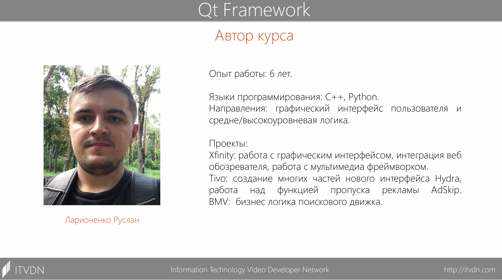

# О курсе

Автор: Руслан Ларионенко

Производство: [ITVDN](https://itvdn.com/ru/video/qt-framework)

Данный видео курс призван обучить основам работы с фреймворком Qt. Программа обучения предусматривает изучение приемов эффективного использования инструментов разработчика Qt и ознакомление с основными компонентами данного фреймворка - как с виджетами графического интерфейса, так и со специальными классами, предоставляющими некоторый специфический функционал (сети, базы данных, графика, звук и другое).

[Источник](https://nnmclub.to/forum/viewtopic.php?t=1723223)

## Описание курса

Курс Фреймворк Qt состоит из 10-ти логически взаимосвязанных уроков, на которых учащиеся получат знания об основных концепциях, которые используются при создании приложений с использованием фреймворка Qt.

На данном курсе учащиеся научатся эффективно использовать инструменты разработчика Qt и ознакомятся с основными компонентами библиотеки Qt, как с виджетами графического интерфейса, так и со специальными классами, предоставляющими некоторый специфичный функционал (сети, базы данных, графика и звук и другие).

## Предварительные требования

+ Знание языка С++

## Целевая аудитория

Курс рассчитан на новичков и программистов среднего уровня, желающих либо получить базовые знания фреймворка Qt, либо закрепить существующие знания с возможностью узнать некоторые новые для себя аспекты Qt.

## По завершении курса Вы сможете

+ Создавать кроссплатформенный приложения с графическим интерфейсом, которые используют разнообразные функции системы (мультимедиа, сеть, работа с графикой и другие).
+ Эффективно использовать функции, специфичные для фреймворка Qt (иерархия объектов, сигналы и слоты, передача объектов в потоки и другие).
+ Развертывать Qt приложение на большинстве поддерживаемых платформ.

## Список уроков курса

+ Урок 1: Обзор фреймворка Qt
  + Что такое Qt?
  + Структура фреймворка.
  + Проекты, использующие Qt.
  + Кроссплатформенность.
  + Как получить Qt?

+ Урок 2: Инструменты разработчика Qt.
  + QtCreator.
  + QtDesigner.
  + QtAssistant.
  + QtLinguist.
  + Qmake.
  + GammaRay.
+ Урок 3: Принципы работы приложений Qt.
  + Типы приложений Qt.
  + QObject.
  + Сигналы и слоты.
  + Многопоточность.
  + Контейнеры Qt.
+ Урок 4: Элементы графического интерфейса Qt Widgets.
  + Основные принципы создания графического интерфейса Qt
  + Дизайнер графического интерфейса QtDesigner
  + Типы виджетов:
    + Виджет главного окна.
    + Базовые.
    + Продвинутые.
    + Абстрактные.
    + Организационные.
+ Урок 5: Менеджеры размещения Qt Widgets и работа со стилями  
  + Что такое менеджер размещения.
  + Типы менеджеров размещения.
  + Тонкая настройка размещения.
  + Стили.  
+ Урок 6: Модель-отображение и работа с графическим отображением Qt Widgets  
  + Концепция модель-отображение(-делегат).
  + Модели.
  + Отображения.
  + Делегаты.
  + Графическое отображение.
+ Урок 7: Язык описания графического интерфейса QML
  + Что такое QML?
  + Основные концепции QML?
    + Компоненты.
    + Связывания.
    + Подключения.
  + Использование JavaScript в QML.
+ Урок 8: Библиотека элементов графического интерфейса Qt Quick
  + Библиотека Qt Quick.
  + Типы компонентов Qt Quick:
    + Визуальные элементы.
    + Размещение элементов.
    + Обработка ввода.
    + Состояния, переходы, анимации.
    + Работа с данными.
    + Другие логические компоненты.
+ Урок 9: Взаимодействие C++ и QML кода  
  + Основная концепция взаимодействия С++ и QML кода.
  + Способы передачи С++ объектов и классов в QML.
  + Доступ к компонентам QML из С++.
  + Концепция модель-отображения для организации взаимодействия между С++ и QML кодом.
+ Урок 10: Развертывание Qt приложений  
  + Способы развертывания Qt приложений.
  + Правила развертывания Qt приложения.
  + Развертывание Qt приложения на ОС для персональных компьютеров.
  + Развертывание Qt приложения на мобильной ОС на примере Android.
