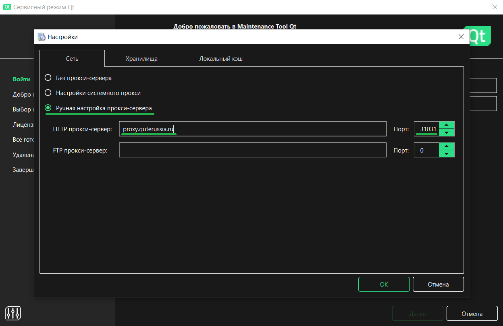

# Обзор фреймворка Qt

## Обзор, цель и назначение урока

Предоставить общее представление о фреймворке Qt и его возможностях. Описать процесс получения Qt и правила его использования в коммерческом и открытом программном обеспечении.
  
Изучив материал данного занятия, учащийся сможет:

+ Понять основные возможности фреймворка Qt.
+ Иметь представлении о правилах использования Qt.
+ Скачать и установить фреймворк Qt и его инструменты для дальнейшей работы.

## Содержание урока

+ [1. Что такое Qt?](#1-что-такое-qt)
+ [2. Кроссплатформенность.](#2-кроссплатформенность)
+ [3. Структура фреймворка.](#3-структура-фреймворка)
+ [4. Проекты, использующие Qt.](#4-проекты-использующие-qt)
+ [5. Как получить Qt?](#5-как-получить-qt)
+ [Резюме](#резюме)
+ [Закрепление материала](#закрепление-материала)
+ [Самостоятельная деятельность учащегося](#самостоятельная-деятельность-учащегося)
+ [Рекомендуемые ресурсы](#рекомендуемые-ресурсы)

## 1. Что такое Qt?

**Qt** – это кроссплатформенный фреймворк для создания приложений. Предоставляет широкий спектр возможностей, достаточный для создания приложений почти любой направлености.

Разрабатывается двумя компаниями: The Qt Company и Qt Project.

Распространяется под коммерческой и открытой(с некоторыми ограничениями) лицензиями.

Основным языком программирования является C++. Существуют привязки к другим языкам.

Наиболее качественным являются привязки к языку программирования Python– PyQt и PySide2.

Возможности Qt

+ Графический интерфейс
+ Сеть
+ Базыданных
+ Мультимедиа
+ 2D/3D графика
+ Вебдвижок
+ Тестирование

---
[Содержание урока](#содержание-урока)

## 2. Кроссплатформенность

+ Desktop
  + Windows
  + macOS
  + Linux
  + FreeBSD
+ Mobile
  + Android
  + IOS
  + Windows
+ Embedded and RTOS
  + Linux
  + QNX
  + VxWorks
  + Windows

---
[Содержание урока](#содержание-урока)

## 3. Структура фреймворка

Qt состоит из набора модулей, каждый из которых предоставляет инструменты для работы с теми или иными технологиями. Эти модули можно условно разделить на следующие группы:

+ **Qt Essentials:** базовые модули которые работают на всех платформах, поддерживают бинарную совместимость для всех версий Qt.
+ **Qt Add-Ons:** предоставляют дополнительный, специфический для конкретной платформы функционал или более высокоуровневый функционал.
+ **Value-Add Modules:** набор модулей для работы со встраиваемыми системами, доступны только под коммерческой лицензией.
+ **Technology Preview Modules:** модули которые находятся в разработке, но доступны для тестирования.

[Модули Qt 5](https://doc.qt.io/qt-5/qtmodules.html)

[Модули Qt 6](https://doc.qt.io/qt-6/qtmodules.html)

---
[Содержание урока](#содержание-урока)

## 4. Проекты, использующие Qt

Qt используется в большом количестве свободного и коммерческого программного обеспечения:

+ **Окружение рабочего стола:** Plasma KDE, LXQt;
+ **3D**: Autodesk Maya, Adobe Fuse CC;
+ **Аудио**: Clementine, Amarok;
+ **Графика**: Krita;
+ **Мессенджеры**: Telegram (Desktop), Skype (старая версии для Linux);
+ **Видео**: VLC media player, Kdenlive;
+ **Карты**: 2GIS, Google Earth;
+ **Удалённый рабочий стол**: Teamviewer;
+ **Наука**: Wolfram Mathematica;
+ Множество встраиваемых систем от умных телевизоров и бортовых компьютеров автомобилей до медицинской аппаратуры и т.п.;
+ И не меньшее множество разнообразного прикладного кроссплатформенного софта (интерфейсы для работы с базами данных на предприятиях и т.п.).

---
[Содержание урока](#содержание-урока)

## 5. Как получить Qt?

Установщик Qt можно скачать с официального сайта по следующей [ссылке](https://www.qt.io/download).

### Как установить Qt (qt5 qt6) в России через онлайн-инсталлятор при блокировке IP-адресов?

[Источник](https://vc.ru/dev/1125830-kak-ustanovit-qt-qt5-qt6-v-rossii-cherez-onlain-installyator-pri-blokirovke-ip-adresov)

1. Скачиваем [онлайн-инсталлятор](https://qt-mirror.dannhauer.de/official_releases/online_installers/)

2. Вводим регистрационные данные

    

3. В левом нижнем углу заходим в настройки

4. Выбираем "Ручная настройка прокси-сервера": `proxy.quterussia.ru` порт `31031`

    
5. Выбираем необходимую конфигурацию - пользуемся!

На 21.11.2024 - работает!

### Qt Maintaince Tool

**Qt Maintaince Tool** – это кроссплатформенное приложения для установки, обновления и удаления разных версий фреймворка Qt, его частей и инструментов разработчика.

Qt Maintaince Tool предоставляет возможность установки предварительных версий фреймворка Qt и инструментов разработчика.

Также Qt Maintaince Tool предоставляет возможность установки фреймворка Qt для сборки приложений под мобильные платформы(например Android x86, ARM64-v8a, ARMv7 или UWP x86, x64 и ARMv7). Сама установка Qt фреймворка не содержит внутри себя SDK(или NDK) других платформ, поэтому SDK(NDK) должен быть установлен отдельно.

### Выводы

+ Фреймворк Qt отлично подходит для создания кроссплатформенных приложений с графическим интерфейсом пользователя.
+ Qt предоставляет огромный набор инструментов, с помощью которых можно создать приложение почти любой направленности без использования сторонних библиотек.
+ Ближайшими конкурентами C++ с Qt является С# с фреймворком .NET и Java.
+ Для создания простых Qt приложений или прототипов можно использовать Qt из языка программирования Python(использую PySide2 или PyQt).

---
[Содержание урока](#содержание-урока)

## Резюме

+ Qt предоставляет инструменты для работы с графическим интерфейсом, сетью, базами данных и др. для большинства современных программных и аппаратных платформ.
+ Qt разделен на модули, каждый из которых предоставляет инструменты для работы с теми или иными технологиями.
+ Qt используется в большом количестве свободного и коммерческого программного обеспечения.
+ Qt можно использовать бесплатно по открытой лицензии с некоторыми ограничениями или купить коммерческую лицензию, которая не накладывает никаких ограничений и предоставляет некоторые дополнительные возможности.

---
[Содержание урока](#содержание-урока)

## Закрепление материала

+ Опишите примеры приложений, в которых можно применить Qt.
+ Назовите несколько примеров модулей Qt.
+ Какие существуют лицензии Qt и чем они отличаются?
+ Какие модули Qt поддерживаются на всех платформах?
+ Можно ли установить несколько версий Qt на одной ОС?

---
[Содержание урока](#содержание-урока)

## Дополнительное задание

Ознакомится со списком существующих модулей Qt на официальном сайте (можно использовать удобную для вас поисковую систему).

---
[Содержание урока](#содержание-урока)

## Самостоятельная деятельность учащегося

### Задание 1

Скачать установщик Qt с официального сайта по открытой лицензии.

### Задание 2

Установить последнюю версию фреймворка Qt и инструмента разработчика Qt Creator для вашей ОС используя установщик.

### Задание 3

Запустить Qt Creator, создать С++ проект (без использования Qt), скомпилировать и запустить приложение.

## Рекомендуемые ресурсы

[Официальный сайт asp.net](http://www.asp.net/) 
[https://www.qt.io/](https://www.qt.io/) 
[http://doc.qt.io/](http://doc.qt.io/) 
[http://doc.qt.io/qt-5/qtmodules.html](http://doc.qt.io/qt-5/qtmodules.html)
