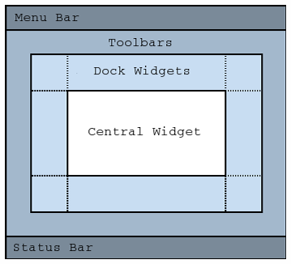

# Элементы графического интерфейса Qt Widgets

## Обзор, цель и назначение урока

Описать основные принципы создания графического интерфейса Qt. Рассмотреть особенности и возможности дизайнера графического интерфейса QtDesigner. Ознакомится с основными типами виджетов и особенностями их применения при создания графического интерфейса.

## Изучив материал данного занятия, учащийся сможет

+ Понять принципы создания графического интерфейса Qt
+ Детальнее понять возможности QtDesigner, которые помогут быстрее создавать графический интерфейс пользователи и наглядно ознакомится с особенностями работы стандартных виджетов

+ Сделать осознанный выбор между использованием STL и/или Qt контейнеров в своем приложении

## Содержание урока

+ [1. Основные принципы создания графического интерфейса Qt](#1-основные-принципы-создания-графического-интерфейса-qt)
+ [2. Дизайнер графического интерфейса QtDesigner](#2-дизайнер-графического-интерфейса-qtdesigner)
+ [3. Типы виджетов](#3-типы-виджетов)
  + [Виджет главного окна](#виджет-главного-окна)
  + [Базовые](#базовые)
  + [Продвинутые](#продвинутые)
  + [Абстрактные](#абстрактные)
  + [Организационные](#организационные)
+ [Выводы](#выводы)
+ [Резюме](#резюме)
+ [Закрепление материала](#закрепление-материала)
+ [Самостоятельная деятельность учащегося](#самостоятельная-деятельность-учащегося)

## 1. Основные принципы создания графического интерфейса Qt

+ Иерархия/дерево виджетов.
+ Связь между дочерними элементами и их родителем:
  + Логическая.
  + Визуальная.
+ Взаимодействие элементов интерфейса и логических модулей через сигналы и слоты.
+ Описание тяжелой логики в отдельные объекты QObject, перемещение их в отдельный поток(и) и взаимодействие с ними через сигналы и слоты.
+ Управление размещением виджетов с помощью менеджеров размещения и других специальных виджетов.
+ Настройка внешнего вида интерфейса при помощи стилей.

---
[Содержание урока](#содержание-урока)

## 2. Дизайнер графического интерфейса QtDesigner

Основное предназначение:

+ Создание интерфейса по принципу “что вижу, то и получаю”.

Возможности, которые будут полезными при создании интерфейса без использования форм:

+ Ознакомление с большинством стандартных виджетов(их внешний вид, иерархия наследования, список свойств, сигналов и слотов).
+ Возможность просмотра влияния параметров виджетов на их внешний вид.

---
[Содержание урока](#содержание-урока)

## 3. Типы виджетов

1. Виджет главного окна.
2. Базовые.
3. Продвинутые.
4. Абстрактные.
5. Организационные.

---
[Содержание урока](#содержание-урока)

### Виджет главного окна

+ [QMainWindow](https://doc.qt.io/qt-6/qmainwindow.html) предоставляет набор элементов интерфейса, стандартных, для главных окон:
  + Панель меню.
  + Панель инструментов.
  + Область для расположение «док» виджетов.
  + Панель статуса.
  + Центральный виджет(не создается без использования форм).
+ Все элементы являются опциональными и их можно удалить.
+ В качестве виджета главного окна приложения не обязательно использовать QMainWindow. Любой виджет можно отобразить как окно (если он не имеет родительского виджета).

---
[Содержание урока](#содержание-урока)

### Базовые

[Widgets Classes](https://doc.qt.io/qt-6/widget-classes.html)

+ Простые виджеты, предназначенные для непосредственного использования. Примеры:
  + Кнопка QPushButton.
  + Текстовая метка QLabel.
  + Флажок QCheckBox.
  + Радиокнопка QRadioButton.
  + Кнопка с выбором элемента QComboBox.
  + Слайдер QSlider.
  + Меню Qmenu.
  + Вкладки QTabBar.
  + Поле ввода QLineEdit.

---
[Содержание урока](#содержание-урока)

### Продвинутые

+ Сложные, составные виджеты. Строятся на основе базовых виджетов и содержат дополнительную логику. Примеры:
  + Календарь QCalendarWidget.
  + Виджет отображения дерева, списка, таблицы QTreeView, QListView, QTableView.
  + Виджет отображения стека «отмены» действий QUndoView.

---
[Содержание урока](#содержание-урока)

### Абстрактные

+ Предоставляют какой-то базовый функционал, но требуют реализации некоторых методов для полноценного использования. Примеры:
  + Абстрактная кнопка QAbstractButton.
  + Абстрактный слайдер QAbstractSlider.
  + Диалог QDialog.
  + Рамка QFrame.

---
[Содержание урока](#содержание-урока)

### Организационные

+ Используются для организации и группировки базовых виджетов:
  + QButtonGroup логическая группировка кнопочных виджетов.
  + QGroupBox визуальное выделение группы виджетов.
  + QStackedWidget виджет с возможностью отображения одного виджета из указанного набора и переключения между ними.
  + QTabWidget виджет с панелью вкладок и самими вкладками.

---
[Содержание урока](#содержание-урока)

## Выводы

+ Интерфейс пользователя Qt строится по иерархическому принципу.
+ Взаимодействие между виджетами и другими модулями приложения осуществляется с помощью сигналов и слотов.
+ Тяжелая логика должна (в большинстве случаев) перемещаться в другие потоки во избежание зависания интерфейса.
+ Qtпредоставляет большой набор готовых виджетов для создания самых разнообразных интерфейсов.
+ При необходимости можно описать внешний вид и поведение виджета с нуля, или использовать существующие виджеты как основу.

---
[Содержание урока](#содержание-урока)

## Резюме

+ Элементы интерфейса пользователя Qt организовываются в иерархическую древовидную структуру. У каждого окна интерфейса существует один корневой элемент у которого может быть любое число дочерних элементов, которые в свою очередь также могут иметь дочерние элементы.
+ Связь между дочерним и родительским элементом является как логической (как между объектами QObject), так и визуальной. Визуальна связь заключается в том, что координаты дочернего элемента устанавливаются относительно его родительского элемента.
+ Дизайнер графического элемента позволяет ускорить создание прототипов графического интерфейса и быстро и наглядно ознакомится с принципами работы и свойствами стандартных виджетов.
+ Qt предоставляет большой набор стандартных виджетов, которые условно можно разделить на следующие типы: виджет главного окна, базовые, продвинутые, абстрактные и организационные. Также Qt предоставляет возможность создавать свои виджеты с нестандартным поведением и внешним видом.

## Закрепление материала

+ Создать проект Qt Widget Application без генерации “формы” интерфейса.
+ С помощью С++ кода добавить в корневой виджет кнопки с текстом “++” и текстовую метки с текстом “0”
+ Настроить взаимодействиями между виджетами так, чтобы при нажатии на кнопку, отображаемое на текстовой метке число увеличивалось на 1.
+ Добавить кнопку сброса значения на текстовой метке в 0
+ Создать кнопку текстом “+N” и рядом с ней виджет ввода числа (Spin box). При нажатии на кнопку, число на текстовой мете должно увеличиваться на значение, указанное в виджете ввода числа.

## Дополнительное задание

Создать несколько кнопок с разными числами на них и написать логику, которая будет при нажатии на каждую кнопку добавлять число, указанное на кнопке к числу, которое указанное на метке. Использовать возможность получения объекта отправителя сигнала в коде слота, который будет добавлять число к текущему значению на текстовой метке.

## Самостоятельная деятельность учащегося

### Задание 1

Создать интерфейс пользователя к UDP сокету, который будет на текстовой метке показывать последнюю полученную дейтаграмму.

### Задание 2

Отображать список полученных дейтаграмм, а не только последнюю.

### Задание 3

Добавить поле ввода текста и кнопку при нажатии на которую дейтаграмма будет отправляется на указанный адрес и порт. Адрес и порт можно указать в коде приложения или добавить возможность указывать эти параметры через интерфейс пользователя.
