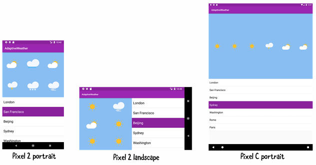
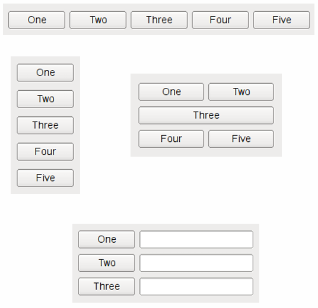

# Менеджеры размещения Qt Widgets и работа со стилями

## Обзор, цель и назначение урока

Ознакомится с концепцией менеджеров размещения. Рассмотреть примеры менеджеров размещения из фреймворка Qt. Разобраться с особенностями, и возможностями менеджеров размещения Qt Widgteds. Рассмотреть возможности настройки стиля приложения.

## Изучив материал данного занятия, учащийся сможет

+ Понять принципы работы менеджеров размещения
+ Узнать об особенностях менеджеров размещения Qt Widgets и применять их для достижение необходимого размещения виджетов
+ Настраивать внешний вид приложения с использованием стилей Qt Widgets

## Содержание урока

+ [1. Что такое менеджеры размещения](#1-что-такое-менеджеры-размещения)
+ [2. Типы менеджеров размещения](#2-типы-менеджеров-размещения)
+ [3. Тонкая настройка размещения](#3-тонкая-настройка-размещения)
+ [4. Стили](#4-стили)
+ [Выводы](#выводы)
+ [Резюме](#резюме)
+ [Закрепление материала](#закрепление-материала)
+ [Самостоятельная деятельность учащегося](#самостоятельная-деятельность-учащегося)

## 1. Что такое менеджеры размещения

[Layout Management](https://doc.qt.io/qt-6/layout.html)

+ Это контейнеры для других виджетов, которые автоматически управляет позициями и размерами виджетов внутри себя.
+ Они позволяют создавать приложения, которые адаптируются под размер и соотношение сторон окна(или экрана для мобильных приложений).

---
[Содержание урока](#содержание-урока)

## 2. Типы менеджеров размещения

+ Основные:
  + Горизонтальный QHBoxLayout.
  + Вертикальный QVBoxLayout.
  + Сеткой QGridLayout.
+ Дополнительные
  + QBoxLayout.
  + QFormLayout.

---
[Содержание урока](#содержание-урока)

## 3. Тонкая настройка размещения

+ Пропуск ячеек с помощью QSpacerItem
+ Настройка "политики" размеров для конкретных виджетов с использованием QSizePolicy:
  + Отдельная настройка размера по горизонтали и вертикали.
  + Настройки зависимости одного размера от другого.
  + Настройка коэффициента растяжения stretch [0 — 255].

---
[Содержание урока](#содержание-урока)

## 4. Стили

[The Style Sheet Syntax](https://doc.qt.io/qt-6/stylesheet-syntax.html)

+ Стили содержат описания параметров внешнего вида виджетов
+ Синтаксис стилей Qt Style Sheet похож на HTML CSS.
+ Стили можно применять как ко всему интерфейсу так и к отдельному виджету.
+ Можно описывать стиль элементов интерфейса в разных их состояниях (например нажатая или отжатая кнопка).
+ Внешний вид виджетов можно изменить используя С++ методы виджетов но использование Qt Style

Sheet позволяет отделить описание стиля от С++ кода.

---
[Содержание урока](#содержание-урока)

## Выводы

+ Менеджеры размещения позволяют динамически адаптировать интерфейс под разные размеры окна.
+ Тонкая настройка менеджеров размещений чаще всего позволяет добиться необходимого результата.
+ Стили Qt позволяют отдельно от С++ кода описать параметры внешнего вида виджетов.

---
[Содержание урока](#содержание-урока)

## Резюме

+ Менеджеры размещения -- это контейнеры для других виджетов, которые управляет позициями и размерами виджетов внутри себя.
+ Существует 3 основных типа менеджеров размещения: горизонтальный, вертикальный и сеткой.
+ Менеджеры размещений Qt позволяют описать правила распределения свободного места между виджетами, которые они содержат с помощью политики размеров (size policy).
+ Стиль всего приложения или отдельных виджетов может быть настроен при помощи Qt Style Sheets, который очень похож на HTML CSS.

---
[Содержание урока](#содержание-урока)

## Закрепление материала

+ Создать проект Qt Widget Application с использованием генерации форм.
+ Указать вертикальный менеджер размещения для центрального виджета.
+ Добавить туда три метки с надписями “красный”, “зеленый” и желтый так чтоб они были расположены по очереди по вертикали и сделать их не активными (“enabled” в свойствах виджета).
+ Сделать так чтобы через каждые несколько секунд следующая метка (начиная с первой) становилась активной (симуляция светофора). И так по кругу.  
+ С помощью Qt Style Sheets указать соответствующие цвета (фона или текста) для каждой текстовой метки.

---
[Содержание урока](#содержание-урока)

## Дополнительное задание

Повторить вышеописанную задачу без использования форм.

---
[Содержание урока](#содержание-урока)

## Самостоятельная деятельность учащегося

### Задание 1

Выбрать какой-то музыкальный или видеопроигрыватель, которым вы пользуетесь и попытаться повторить его интерфейс с использованием стандартных виджетов и менеджеров размещения.

### Задание 2

Использовать size policy для наиболее корректного изменения размеров элементов интерфейса, например, таких как полоса перематывания, которая должна забирать все доступное пространство по горизонтали.

### Задание 3

Добавить какой-то нестандартный стиль вашему приложению на ваше усмотрение.

---
[Содержание урока](#содержание-урока)
