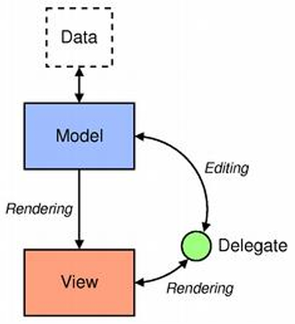
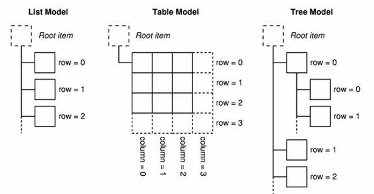
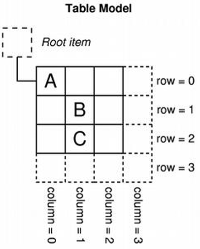

# Модель-отображение и работа с графическим отображением Qt Widgets

## Обзор, цель и назначение урока

Ознакомится с концепцией модель-отображение. Рассмотреть применение этой концепции в Qt приложениях. Разобраться с особенностями создания моделей, отображений и делегатов. Ознакомится с возможностями графического отображения Qt Graphics View.

## Изучив материал данного занятия, учащийся сможет

+ Понять принцип работы концепции модель-отображения.
+ Правильно применять концепцию модель-отображения в своих Qt приложения.
+ Понять основные концепции Qt Graphics View для создания приложений, которые активно используют двухмерную графику.

## Содержание урока

+ [1. Концепция модель-отображение (делегат)](#1-концепция-модель-отображение-делегат)
+ [2. Модель](#2-модель)
+ [3. Отображение](#3-отображение)
+ [4. Делегат](#4-делегат)
+ [5. Графическое отображение](#5-графическое-отображение)
+ [Выводы](#выводы)
+ [Резюме](#резюме)
+ [Закрепление материала](#закрепление-материала)
+ [Самостоятельная деятельность учащегося](#самостоятельная-деятельность-учащегося)

## 1. Концепция модель-отображение (делегат)

+ Разделение логики работы с данными (списки, таблицы, деревья) и пользовательского интерфейс, который будет отображать эти данные.
+ Модель и отображение находятся в синхронизированном состоянии.
+ Для несложных приложений можно использовать простые виджеты списков таблиц и деревьев(QListWidget, QTableWidget, QTreeWidget).



---
[Содержание урока](#содержание-урока)

## 2. Модель

+ Взаимодействие с данными (чтение, запись конкретных элементов, их добавление и удаление) с помощью индексов модели.
+ Предоставление данных в разном виде в зависимости от запрашиваемой "роли".
+ Уведомление об изменении данных.



### Модель. Индекс модели Table Model

```cpp
QModelIndex indexA = model->index(0, 0, QModelIndex());
QModelIndex indexB = model->index(1, 1, QModelIndex());
QModelIndex indexC = model->index(2, 1, QModelIndex());
```



### Модель. Индекс модели Tree Model

```cpp
QModelIndex indexA = model->index(0, 0, QModelIndex());
QModelIndex indexC = model->index(2, 1, QModelIndex());
QModelIndex indexB = model->index(1, 0, indexA);
```


### Модель. Доступ к данным и роли

```cpp
QVariant value = model->data(index, role);
```


### Модель. Классы

+ `QAbstractItemModel`, `QAbstractListModel`, `QAbstractTableModel` абстрактные модели для реализации своей логики работы с данными.
+ `QStandardItemModel` для древовидных данных `QStandardItem`.
+ `QStringListModel` для простого списка строк.
+ `QFileSystemModel` модель для работы с файловой системой.
+ `QSqlQueryModel`, `QSqlTableModel`, `QSqlRelationalTableModel` для работы с базами данных.

---
[Содержание урока](#содержание-урока)

## 3. Отображение

+ Визуальное и логическое описание пространства для расположения элементов данных.
+ Управление позициями и размерами элементов данных в интерфейсе.
+ Логика добавления, удаления или перестановки элементов данных.
+ Выделение элементов.
+ Перемещение между элементамиданных (с помощью клавиатуры например).
+ Предоставление индекса элемента данных в конкретных координатах в отображении.

### Отображение. Классы

+ QListView, QTableView, QTreeView для отображения данных в виде списка, таблицы и дерева соответственно.
+ QAbstractItemView базовый класс для реализации своих отображений.


---
[Содержание урока](#содержание-урока)

## 4. Делегат

+ Описание способа отображения элемента данных.
+ Предоставление виджета редактирования (если это необходимо).
+ Классы делегатов:
  + `QAbstractItemDelegate`.
  + `QItemDelegate`.
  + `QStyledItemDelegate`.


---
[Содержание урока](#содержание-урока)

## 5. Графическое отображение

[Graphics View Framework](https://doc.qt.io/qt-6/graphicsview.html)

+ Графическая сцена QGraphicsScene:
  + Хранение набора графических элементов.
  + Управление состояние элементов(выделение или фокус).
+ Графическое отображение QGraphicsView:
  + Отображение большой двухмерной графической сцены с большим количеством элементов.
  + Перемещение по сцене, ее масштабирование и вращение.
  + Получение доступа к списку элементов в конкретном месте на отображении.
+ Графический элемент QGraphicsItem (и большой набор готовых классов элементов):
  + Описание способа отрисовки элемента.
  + Управление разнообразными параметрами элемента.

---
[Содержание урока](#содержание-урока)

## Выводы

+ Концепция модель-отображение(-делегат) позволяет разделить логику работы с данным и интерфейс пользователя, который отображает эти данные.
+ Графическое отображение позволяет эффективно работать с двухмерными графическими сценами с большим количеством разнообразных элементов.

---
[Содержание урока](#содержание-урока)

## Резюме

+ Концепция модель-отображение-делегат позволяет разделить логику работы с данными (списки, таблицы, деревья) и пользовательский интерфейс. Для несложных приложений лучше использовать простые виджеты списков таблиц и деревьев.
+ Модель отвечает за взаимодействие с данными (чтение и запись) и уведомление об изменениях данных.
+ Отображение визуально и логически описывает пространство для расположения элементов данных и логику добавления, удаления или перестановки элементов данных на стороне графического интерфейса.
+ Делегат описывает способ отображения и редактирования элементов данных через графический интерфейс.
+ Графические отображение Qt Graphics View позволяет работать с двухмерной графикой по концепции модель-отображение.

---
[Содержание урока](#содержание-урока)

## Закрепление материала

+ Создать проект Qt Widget Application.  
+ Создать модель, которая будет управлять списком цветов. Этот список должен хранить как название цвета, так и его HEX (или RGB) представление.
+ Создать делегат, который будет отображать название цвета и квадрат, закрещённый этим цветом.
+ Отобразить список цветов с помощью отображения списка.
+ Отобразить эту сцену в нескольких графических отображения с разными масштабами или поворотами отображения.

---
[Содержание урока](#содержание-урока)

## Дополнительное задание

Добавить возможность добавления новых цветов из графического интерфейса. Например, текстовое поле для ввода названия текста, поле ввода для задания цвета в HEX формате и кнопку для добавления данных в список цветов через модель.

---
[Содержание урока](#содержание-урока)

## Самостоятельная деятельность учащегося

### Задание 1

Создать приложение, которое будет содержать Qt Graphics View. Создать графическую сцену и добавить в нее несколько графических примитивов.  

### Задание 2

Добавить возможность вращения и масштабирования выделенных элементов в графической сцене используя кнопки стрелок.

### Задание 3

Добавить возможность добавления элементов (например, примитива круга) в месте клика мышкой и удаления выбранных элементов со сцены.

---
[Содержание урока](#содержание-урока)
