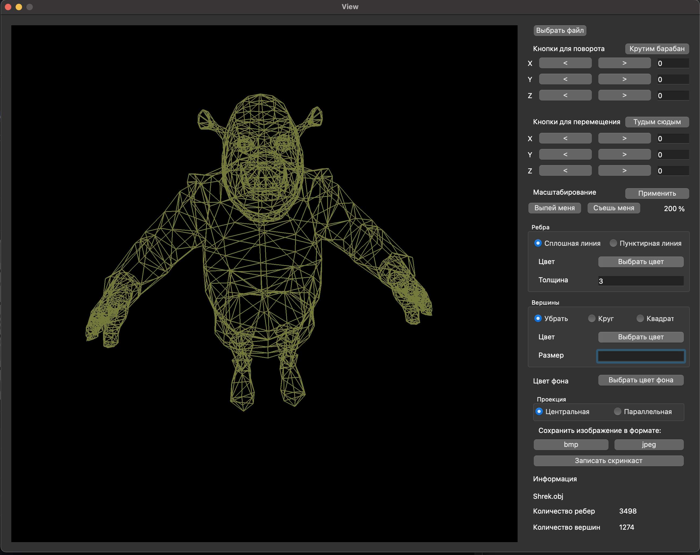

# CPP4_3DViewer_v2.0

====================

[GitHub](https://github.com/pickling-21/cpp_3DViewer)

Программа CPP4\_3DViewer\_v2.0 представляет собой графический инструмент для визуализации каркасных моделей. Она предоставляет интуитивно понятный пользовательский интерфейс для загрузки, манипулирования, масштабирования и сохранения 3D-моделей.

Данное приложение основано на архитектурном шаблоне MVC (Model-View-Controller) для управления данными, представлением и бизнес-логикой. Кроме того, оно использует паттерны Стратегия, Синглтон и Фасад для эффективной реализации различных операций над моделями и сохранения настроек между перезапусками программы.

## Внешний вид

__Программа предоставляет возможность:__

* Загружать каркасную модель из файла формата obj (поддержка только списка вершин и поверхностей);
* Перемещать модель на заданное расстояние относительно осей X, Y, Z;
* Поворачивать модель на заданный угол относительно своих осей X, Y, Z;
* Масштабировать модель на заданное значение.

__Графический пользовательский интерфейс содержит:__

* Кнопку для выбора файла с моделью и поле для вывода его названия;
* Зону визуализации каркасной модели;
* Кнопки и поля ввода для перемещения модели;
* Кнопки и поля ввода для поворота модели;
* Кнопки и поля ввода для масштабирования модели;
* Информацию о загруженной модели - название файла, кол-во вершин и ребер.

__Дополнительные возможности:__

* Программа позволяет настраивать тип проекции (параллельная и центральная);
* Программа позволяет настраивать тип (сплошная, пунктирная), цвет и толщину ребер, способ отображения (отсутствует, круг, квадрат), цвет и размер вершинж;
* Программа позволяет выбирать цвет фона;
* Настройки сохраняются между перезапусками программы;
* Программа позволяет сохранять полученные ("отрендеренные") изображения в файл в форматах bmp и jpeg;
* Программа позволяет записывать небольшие "скринкасты" - текущие пользовательские аффинные преобразования загруженного объекта в gif-анимацию (640x480, 10fps, 5s).

Установка программы

---

В терминале перейдите в папку проекта и запустите __make install.__

Запуск программы

---

В терминале перейдите в папку проекта и запустите __make start.__

Удаление программы

---

В терминале перейдите в папку проекта и запустите __make uninstall.__
